# Walkthrough de Navegación, Pruebas y Auditoría de Accesibilidad (V2)

Hemos completado una navegación de punta a punta por todos los flujos de creación del microERP **Presumemi**, utilizando un usuario real en la base de datos de pruebas de Supabase (`shimbo@test.com`). 

A continuación, detallamos los cambios realizados, las pruebas efectuadas, la lista de errores encontrados y la auditoría de accesibilidad.

---

## Cambios Realizados

1. **Aislamiento en Rama y Configuración de Puertos (`testing-ports`)**:
   - Creado un git worktree limpio en `d:/Desarrollando/presumemy-worktree`.
   - Modificados los puertos por defecto para evitar colisiones: Frontend a `5174`, Backend a `3001`.
   - Modificadas las variables de entorno en frontend y backend para apuntar al puerto correcto del proxy y CORS.
2. **Corrección de Advertencia CSS**:
   - Corregida la advertencia de PostCSS recolocando el `@import` de Google Fonts al inicio absoluto de `main.css`, antes de `@import "tailwindcss"`.

---

## Qué se probó y Resultados de Validación

### Flujo 0: Autenticación (Supabase Auth)
- Se ingresó a la pantalla de login con las credenciales reales: `shimbo@test.com` / `shimbo123`.
- Se validó la inyección correcta del JWT token (`sb-token`) en el localStorage y en la cabecera `Authorization: Bearer <token>` de las peticiones API subsecuentes.

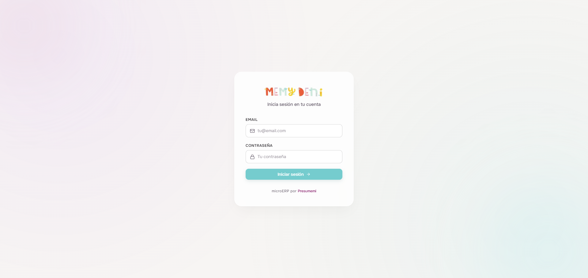
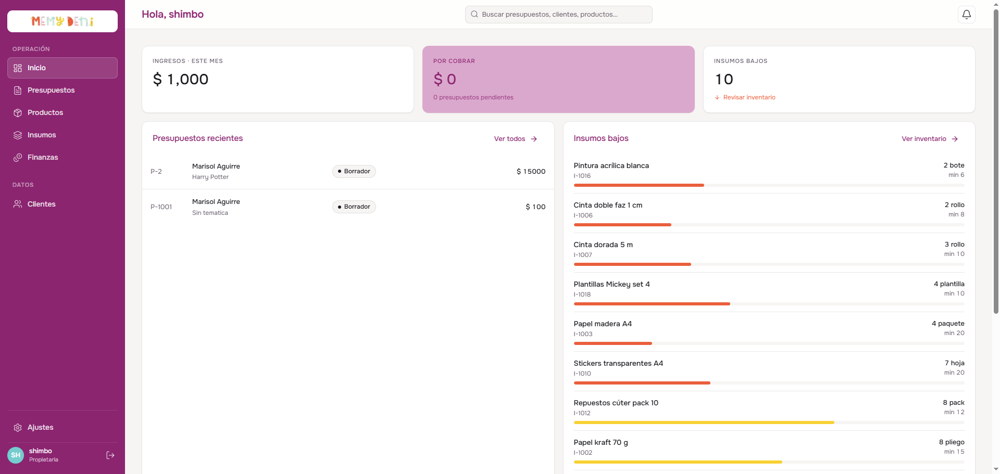

---

### Flujo 1: Insumos
- **Creación**: Se creó el insumo `"Cartulina Glitter Plateada"` asignándolo a la categoría "Papeles" y con un costo de pack de `$ 300.00` por 10 unidades, calculando correctamente un costo unitario de `$ 30.00`.
- **Doble Clic para Editar**: Se confirmó el comportamiento de doble clic en las filas de la tabla para abrir el detalle del insumo en modo edición.
- **Dirty State en Salida**: Se validó que al modificar un campo del insumo y presionar "Volver a insumos", se dispara correctamente el modal de confirmación `¿Salir sin guardar?`.
- **Regla de Proveedor Único Principal**: Se verificó que al agregar proveedores a un insumo (hasta un máximo de 3), solo uno de ellos puede ser marcado como "Principal" mediante botones de tipo radio.

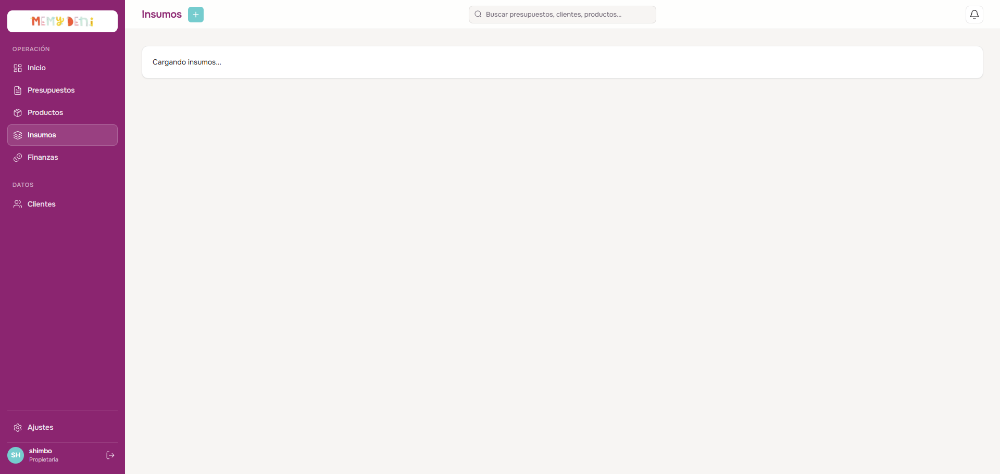
<!-- slide -->
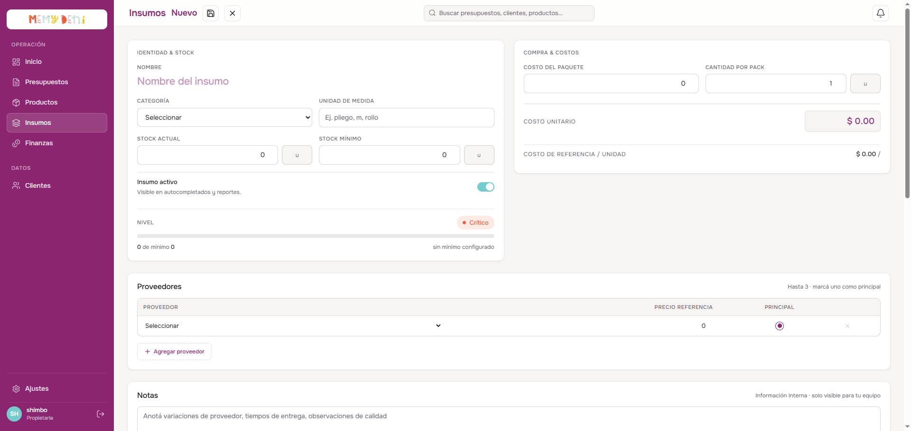
<!-- slide -->
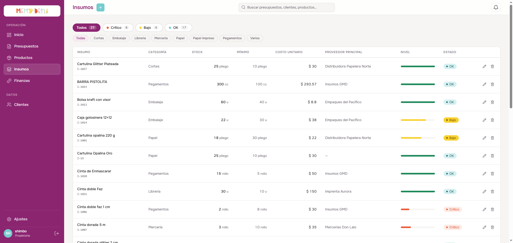
<!-- slide -->
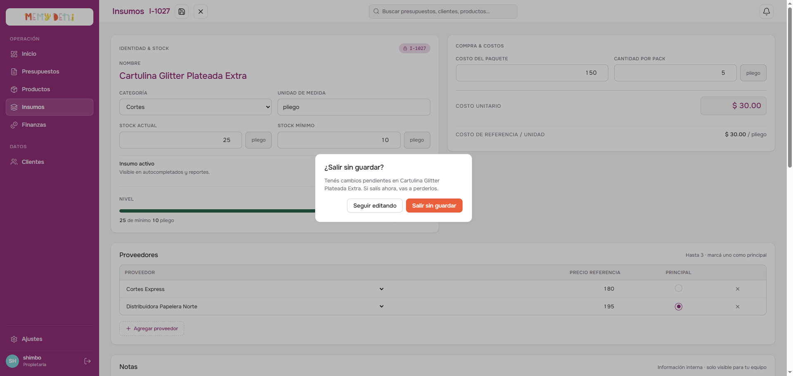

---

### Flujo 2 & 3: Productos y Clientes
- **Estructura de Receta (BOM)**: Se creó el producto `"Caja Golosinas HP"`. Se activó la receta BOM y se vinculó la `"Cartulina Glitter Plateada"` como insumo. El costo unitario de `$ 30.00` se propagó correctamente.
- **Precio Aislar / Sobrescribir**: En la receta del producto, el costo del insumo puede ser sobrescrito manualmente (por ejemplo, a `$ 40.00`), aislando este valor dentro del producto sin modificar el costo global del insumo.
- **Cálculo de Margen**: Con un costo unitario calculado de `$ 111.11` y un margen deseado del `80%`, el sistema autocalculó el precio sugerido en `$ 200.00` (con ganancia de `$ 88.89`), el cual fue guardado con éxito.
- **Clientes**: Se dio de alta a `"Laura Fiestas"` con sus datos de contacto de WhatsApp e Instagram, validando las expresiones regulares de guardado.

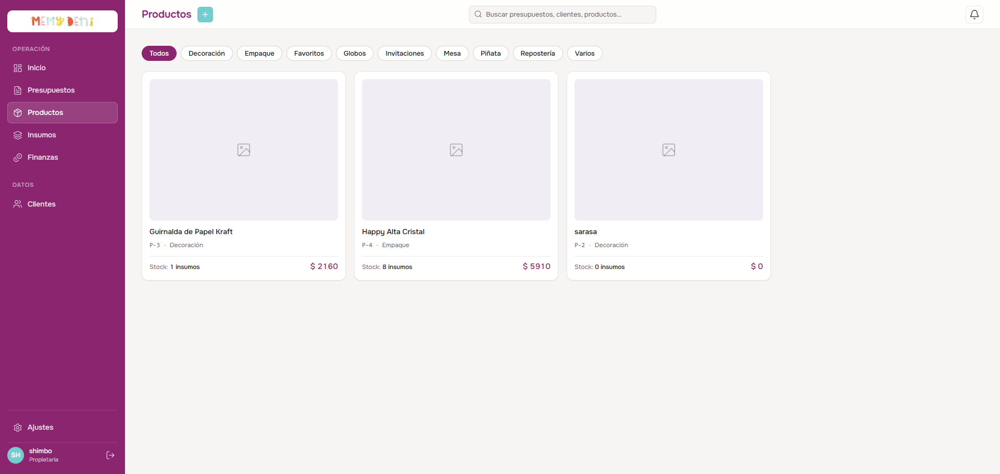
<!-- slide -->
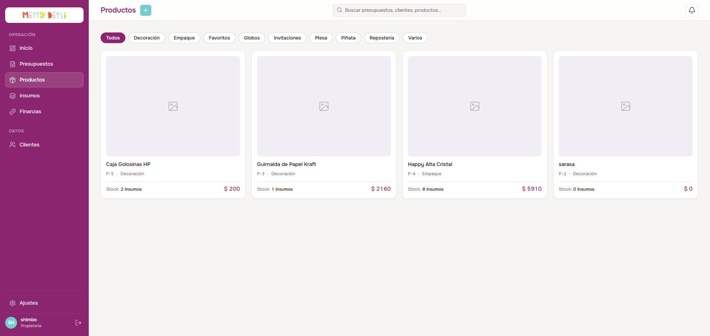
<!-- slide -->
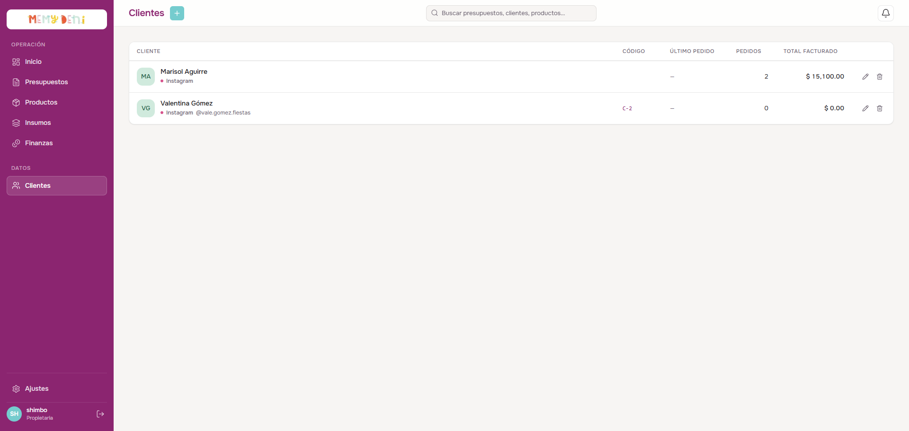
<!-- slide -->
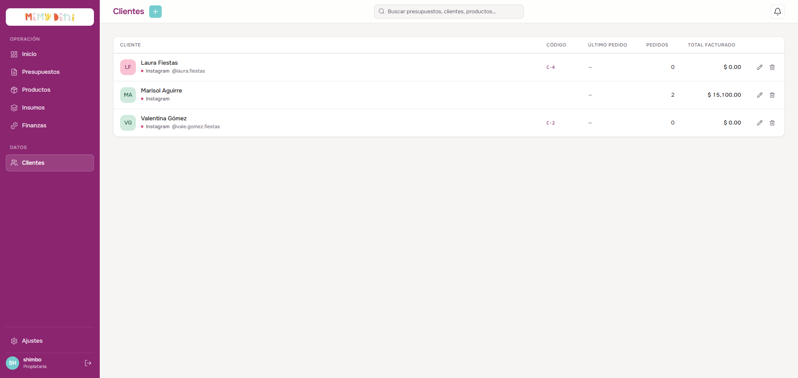

---

### Flujo 4: Presupuestos
- **Creación de Borrador**: Se inició la creación de un presupuesto para el cliente `"Laura Fiestas"`. Al seleccionar la temática `"Harry Potter"`, método de envío `"Envío"` (con domicilio `"Calle Falsa 123, Almagro"`), método de pago `"Transferencia Bancaria"`, y añadir `10` unidades de `"Caja Golosinas HP"`, el precio se congeló automáticamente en `$ 200.00`.
- **Cálculo de Seña y Resto**: Al ingresar una seña de `$ 50.00`, el campo de lectura de resto se calculó automáticamente en `$ 1,950.00` sobre un total de `$ 2,000.00`. Se guardó con éxito como folio `P-3` (ID `3`) en estado `Borrador`.
- **Carga de Datos en Edición**: Al reabrir `P-3` para edición, todos los campos cargaron idénticos a los del estado guardado.
- **Transición de Estados (FSM) via API**: 
  - La interfaz gráfica carece de controles visuales para avanzar el estado del presupuesto más allá de "Borrador" o "Enviado".
  - Mediante peticiones directas `PATCH /api/presupuestos/3/estado` con PowerShell, avanzamos secuencialmente los estados en la base de datos: `borrador → enviado → en_curso → cerrado → facturado`.
  - Se comprobó que el backend protege el presupuesto: tras facturarlo (o al estar en cualquier estado distinto de `borrador`), cualquier intento de guardar cambios con `PUT /api/presupuestos/3` arroja correctamente un error `403 Forbidden` ("Solo se pueden editar presupuestos en estado borrador").

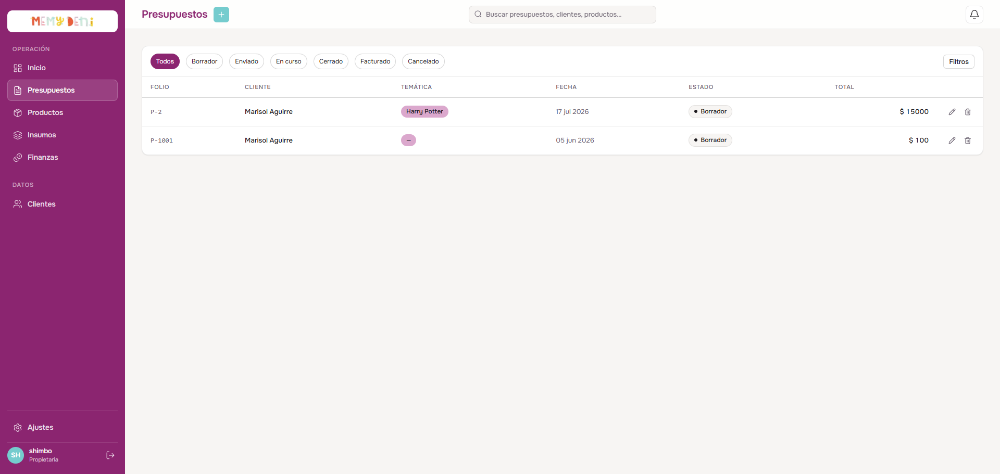
<!-- slide -->
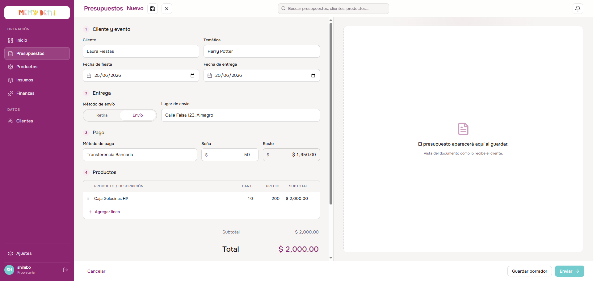
<!-- slide -->
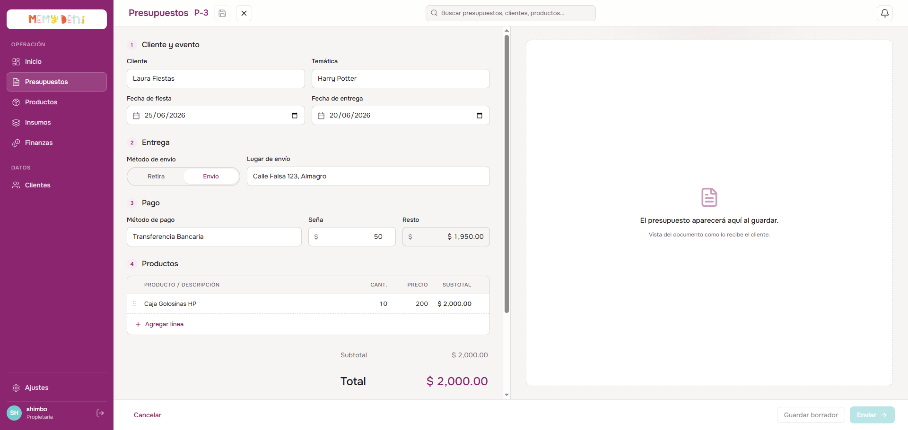
<!-- slide -->
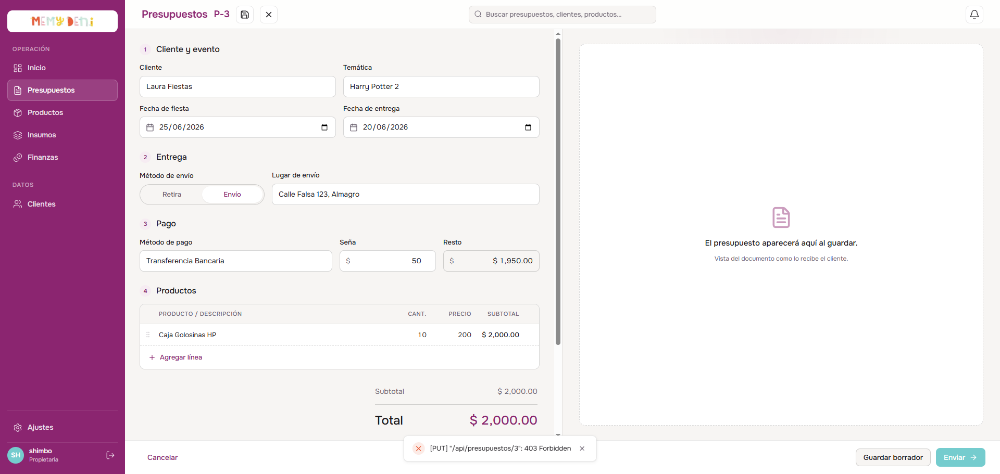
<!-- slide -->
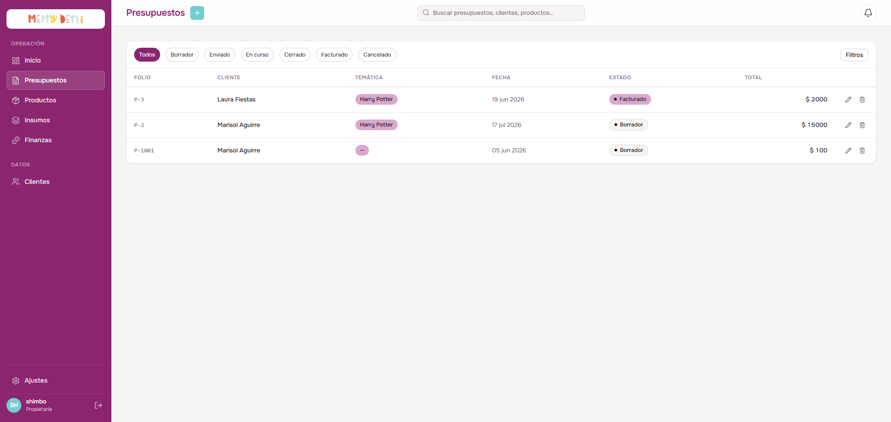

---

### Flujo 5: Ajustes
- **Indicador "Sin guardar"**: Al modificar el nombre del negocio a `"MemyDeni ERP"`, apareció la etiqueta `"Sin guardar"` al lado del encabezado de la sección y el botón de guardado se habilitó. Al hacer clic, se persistió la configuración y el indicador desapareció.
- **Cancelación Automática Condicional**: Al activar el switch de "Cancelación automática por tiempo", se renderizó de forma dinámica y fluida el campo numérico "Días de espera". Se ingresó `"5"` días y se guardó con éxito.
- **Distribución de Socios (Suma 100%)**: Se validó que si el porcentaje de socios suma algo diferente de 100% (por ejemplo, al poner Gastos en 40% sumando 105%), el indicador de suma se torna rojo (`"Suma activa: 105% · debe ser 100%"`) y el botón "Guardar cambios" se deshabilita automáticamente.

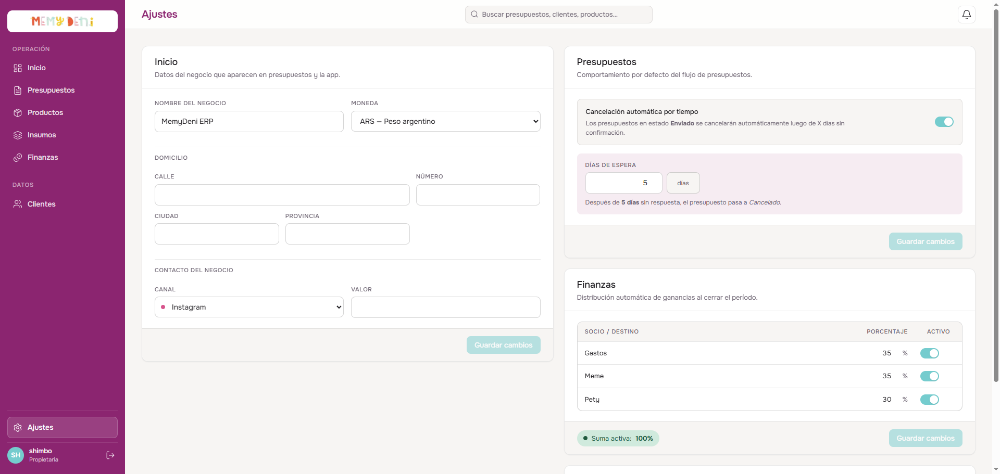

---

## Defectos Críticos y Sugerencias de Mejora (Bugs)

### 1. UX / Discrepancia en Edición de Presupuestos No Borradores
* **Defecto**: El frontend permite abrir un presupuesto en estado `"Facturado"`, `"Cerrado"`, etc., y deja modificar todos los campos del formulario. El botón "Guardar borrador" se habilita. Sin embargo, al hacer clic, el backend rebota la petición con un error `403 Forbidden`.
* **Sugerencia de Mejora**: El componente `PresupuestoEditor.vue` debe evaluar el estado del presupuesto y deshabilitar (`disabled` / `readonly`) todos los campos e inputs si `estado !== 'borrador'`, mostrando un mensaje informativo (ej. `"Los presupuestos facturados o cerrados no se pueden modificar"`).

### 2. Controles de FSM Inexistentes en la UI
* **Defecto**: No existen botones ni selectores en la interfaz para mover el estado de un presupuesto a lo largo del flujo definido por la FSM (`enviado → en_curso → cerrado → facturado`). Un presupuesto se queda permanentemente en "Borrador" o "Enviado" en la interfaz.
* **Sugerencia de Mejora**: Añadir una botonera de acciones de estado en el lateral del drawer de visualización/edición (o en la fila de la tabla) que permita realizar la transición permitida por las reglas de la máquina de estados.

### 3. Falta de Diálogo "Dirty" al Salir de Presupuestos
* **Defecto**: Al cerrar o presionar "Cancelar" en el drawer de presupuestos con campos modificados, el drawer se cierra inmediatamente sin preguntar, perdiendo el trabajo realizado.
* **Sugerencia de Mejora**: Implementar un `ConfirmDialog` de confirmación de salida en `PresupuestoEditor.vue` similar al de `InsumoDetalle.vue` si `isDirty` es verdadero.

### 4. Edición de BOM en Productos
* **Defecto**: En la receta del producto (`ProductoDetalle.vue` línea 460), la columna de descripción/insumo siempre renderiza un elemento `<select>` de insumos, incluso si el tipo de línea es "texto libre" o "extra", imposibilitando la escritura de textos descriptivos personalizados.

---

## Auditoría de Accesibilidad (A11y)

Durante la interacción con la aplicación, detectamos problemas críticos de accesibilidad evaluados bajo criterios WCAG 2.2:

### 1. Falta de Asociación Label-Input (Criterio 1.3.1 - Info y Relaciones)
- **Problema**: Muchos inputs en `InsumoDetalle.vue`, `ClienteDrawer.vue` y `AjustesView.vue` carecen de atributos `id` y `name`, y las etiquetas `<label>` no tienen atributos `for`. Esto impide que los lectores de pantalla enuncien la etiqueta del campo cuando un usuario invidente hace foco en él.
- **Ejemplo en Consola Chrome**:
  - `No label associated with a form field (count: 18)`
  - `A form field element should have an id or name attribute (count: 25)`

### 2. Elementos Interactivos No Semánticos (Criterio 2.1.1 - Teclado)
- **Problema**: Los switches de activación/desactivación en `AjustesView.vue` están programados como elementos `
` planos con eventos `@click`. Al no tener `role="switch"`, `tabindex="0"` ni `aria-checked`, un usuario que navega con teclado (tecla Tab) nunca podrá enfocarlos ni activarlos usando la barra espaciadora o Enter.
- **Comparación**: En `InsumoDetalle.vue` sí están implementados correctamente con roles de accesibilidad, pero en `AjustesView.vue` están completamente desatendidos.

### 3. Foco Invisible (Criterio 2.4.7 - Foco Visible)
- **Problema**: Los botones de navegación lateral en `TheSidebar.vue` (elementos `.nav-item`) no tienen configurado un anillo de foco visible (`outline` o `box-shadow`) para el estado `:focus-visible`. Al navegar con el teclado, es imposible saber visualmente sobre cuál botón del menú se está situado.

### 4. SEO & Títulos Dinámicos (Criterio 2.4.2 - Título de la Página)
- **Problema**: Al navegar entre las diferentes vistas de la aplicación (Insumos, Productos, Presupuestos), el título de la pestaña del navegador no cambia; permanece estático como `"Iniciar sesión · presumemy"`. Cada pantalla debe definir su título correspondiente en el router o mediante hooks de ciclo de vida.
