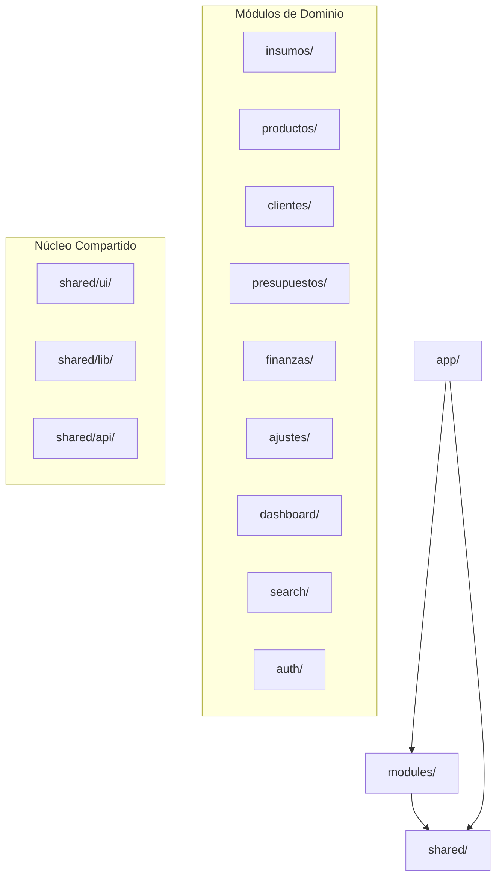

# Walkthrough — Refactorización Modular del Frontend (`web/`)

Este documento constituye la documentación técnica exhaustiva y bitácora completa del proceso de refactorización modular del frontend de **Presumemi** (`web/`). Detalla el rediseño arquitectónico, la eliminación de la deuda técnica de estilado, la componentización basada en principios **S.O.L.I.D.** y las verificaciones finales.

---

## 1. Diagnóstico y Deuda Técnica Inicial

Antes de la refactorización, el frontend (`web/` en Vue 3 + Vite + Tailwind v4) presentaba las siguientes ineficiencias críticas:

* **Fragmentación y Caos en CSS**: 
  - Un archivo monolítico `components.css` de **3.382 líneas** que contenía estilos legacy con nombres genéricos.
  - El archivo `tokens.css` (152 líneas) definía variables CSS nativas (`var(--color-x)`) que luego se inyectaban manualmente mediante directivas `:style` inline.
  - 19 de los 28 componentes de vista utilizaban bloques `<style scoped>` pesados, lo que contradecía el uso de un framework de utilidades como Tailwind CSS.
* **Organización Package-by-Layer**:
  - Los archivos estaban distribuidos de manera horizontal por tipo de artefacto (`views/`, `components/`, `stores/`, `composables/`, `services/`, `utils/`).
  - Esto dispersaba la lógica de un solo dominio (por ejemplo, *Insumos* o *Presupuestos*) a lo largo de 6 o 7 directorios diferentes del proyecto.
* **Violación del Principio de Inversión de Dependencias (DIP)**:
  - Las vistas importaban directamente el cliente de red HTTP (`services/api.ts`) y realizaban operaciones fetch o mutaciones CRUD directas, puenteando a los stores de Pinia.
* **Duplicación de Lógica y Código Acoplado (Violación de DRY)**:
  - El formateo de moneda (`money()`) y la visualización de fechas estaban declarados localmente en múltiples componentes.
  - El algoritmo de semaforización de stock (3 niveles vs 4 niveles con diferentes umbrales como `0.2` o `0.5`) estaba duplicado y disperso entre la lista de insumos y el formulario de detalles.
  - Lógicas de paginación e inputs de campos flotantes replicaban código repetidamente.

---

## 2. Nueva Arquitectura Modular por Dominio (rev.2)

La refactorización reorganizó la estructura del directorio `src/` a un diseño orientado a **dominios modulares autocontenidos** y un núcleo compartido (`shared/`), eliminando las capas genéricas anteriores.



### Reglas de Dependencia
1. **Flujo unidireccional**: `app/` puede importar de `modules/` y `shared/`. `modules/` puede importar de otros módulos (únicamente a través de su barrel público) y de `shared/`. `shared/` es agnóstico y **nunca** puede importar de `modules/` o `app/`.
2. **Encapsulación estricta**: Cada módulo se expone mediante un archivo `index.ts` (barrel). Quedan prohibidos los imports profundos a archivos internos de otros módulos (ej. `import ... from '@/modules/insumos/store'`).
3. **Desacoplamiento UI-API**: La interfaz gráfica (`.vue`) de un módulo tiene prohibido comunicarse con `shared/api/client.ts`. Todas las solicitudes pasan obligatoriamente por el store de Pinia (`store.ts`) o un cliente API local del módulo (`api.ts`).

---

## 3. Implementación Grupo por Grupo

### Grupo 0 — Scaffolding y Fundación

1. **Creación de Directorios**: Se estructuraron las carpetas `app/`, `shared/` y `modules/` y se reubicaron los archivos troncales:
   - `App.vue` $\to$ [app/App.vue](file:///d:/Desarrollando/presumemy/web/src/app/App.vue)
   - `main.ts` $\to$ [app/main.ts](file:///d:/Desarrollando/presumemy/web/src/app/main.ts)
   - `router/index.ts` $\to$ [app/router.ts](file:///d:/Desarrollando/presumemy/web/src/app/router.ts)
   - Creación de [app/pinia.ts](file:///d:/Desarrollando/presumemy/web/src/app/pinia.ts) para inicializar el almacén de datos central.
2. **Punto de Entrada**: Se actualizó `web/index.html` para enlazar directamente el script de `/src/app/main.ts`.
3. **Mapeo de Tokens a Tailwind v4**:
   El contenido de `tokens.css` se tradujo a directivas de configuración `@theme` dentro de [app/styles/main.css](file:///d:/Desarrollando/presumemy/web/src/app/styles/main.css):
   ```css
   @theme {
     --color-violet-700: #5c3bb6;
     --color-violet-900: #3c2482;
     --color-teal-500: #75ccce;
     --color-coral-500: #f26f63;
     --color-ink: #2b2b2b;
     --color-ink-muted: #737373;
     --color-page-bg: #f4f3f6;
     --color-surface: #ffffff;
     --color-border: #e8e6eb;
     --color-border-strong: #d2cfd8;
     
     --radius-sm: 4px;
     --radius-md: 8px;
     --radius-lg: 12px;
     --radius-xl: 16px;
     --radius-pill: 9999px;
     
     --shadow-1: 0 1px 2px rgba(0, 0, 0, 0.04);
     --shadow-2: 0 4px 12px rgba(92, 59, 182, 0.05);
     --shadow-pop: 0 12px 32px rgba(43, 43, 43, 0.12);
     
     --font-sans: "Onest", sans-serif;
     
     --text-11: 11px;
     --text-12: 12px;
     --text-13: 13px;
     --text-14: 14px;
     --text-18: 18px;
     --text-22: 22px;
   }
   ```
   Se borró definitivamente el archivo `tokens.css` legacy.

### Grupo 1 — Capa de Datos y Utils (DIP y SRP)

- **`format.ts`**: Se centralizó la lógica de visualización financiera y fechas en [shared/lib/format.ts](file:///d:/Desarrollando/presumemy/web/src/shared/lib/format.ts):
  ```typescript
  export function formatMoney(value: number | string): string {
    const num = typeof value === 'string' ? parseFloat(value) : value;
    if (isNaN(num)) return '$ 0.00 MXN';
    return `$ ${num.toLocaleString('es-MX', { minimumFractionDigits: 2, maximumFractionDigits: 2 })} MXN`;
  }
  ```
- **Semáforo de Stock**: En [modules/insumos/stock.ts](file:///d:/Desarrollando/presumemy/web/src/modules/insumos/stock.ts) se unificó el cálculo del stock en 4 niveles bien definidos:
  - `sin_unidades` (stock = 0) $\to$ Tono coral.
  - `critico` (stock $\le$ minimo $\times$ 0.2) $\to$ Tono coral.
  - `bajo` (stock < minimo) $\to$ Tono amarillo/naranja.
  - `ok` (stock $\ge$ minimo) $\to$ Tono verde/teal.
- **Absorber `del()` en Stores**: En los stores (`insumos.ts`, `productos.ts`, `clientes.ts`, `finanzas.ts`, `presupuestos.ts`), se incorporó la llamada DELETE/PATCH al backend. De esta forma, la vista llama a `await store.remove(id)` y captura el posible error, manteniendo desacoplado el transporte HTTP.
- **Paginación Genérica**: `usePagination.ts` fue relocalizado en [shared/lib/usePagination.ts](file:///d:/Desarrollando/presumemy/web/src/shared/lib/usePagination.ts).

### Grupo 2 — Primitivos Hoja (Componentes Átomicos)

Se reescribieron los componentes básicos del sistema de diseño en la carpeta `shared/ui/`:
- **`ToggleSwitch.vue`**: Switch accesible adaptado a `defineModel()`.
- **`PageHead.vue`**: Cabecera común de páginas que recibe título y subtítulo, renderizando acciones mediante slots.
- **`SegmentedControl.vue`**: Selector horizontal que mapea estados mediante clases dinámicas de Tailwind, conservando el control por teclado (flechas).
- **`FloatingField.vue`** y **`FloatingSelect.vue`**: Campos con efecto dinámico al enfocar el input. La animación de transición se aisló en un bloque `<style scoped>` mínimo para proteger la fidelidad de la curva cúbica de Bezier.
- **`ConfirmDialog.vue`**: Cuadro de diálogo modal estructurado sobre `Teleport` y con transiciones CSS nativas.
- **`ToastContainer.vue`**: Banner de notificaciones reactivo para eventos del ERP (éxito, información, error).
- **`DrawerShell.vue`**: Armazón de rejilla para barras laterales deslizantes.

### Grupo 3 — Componentes Base y Shell

- **`BaseButton.vue`**: Reemplaza las clases `.btn-*` del CSS monolítico. Utiliza una estrategia de mapeo abierto/cerrado (OCP) para inyectar clases de color:
  ```typescript
  const VARIANTS = {
    primary: 'bg-teal-500 text-white hover:brightness-95 focus-visible:shadow-focus-ring',
    secondary: 'bg-surface border border-border-strong text-ink hover:bg-page-bg',
    ghost: 'bg-transparent text-violet-700 hover:bg-violet-50',
    danger: 'bg-coral-500 text-white hover:brightness-95'
  }
  ```
- **`StatusBadge.vue`**: Etiqueta para estados (`borrador`, `en_curso`, `cerrado`, etc.) con tonos pastel adaptados dinámicamente.
- **`DataTable.vue`**: Componente de grilla común para todas las vistas tabulares del sistema. Soporta slots con parámetros de celda, clases dinámicas y bordes semánticos.
- **`StockBar.vue`**: Componente de semáforo visual de stock con porcentajes.
- **`RowActions.vue`**: Panel desplegable de operaciones para las filas.
- **`AppSidebar.vue`**: Panel de navegación del negocio artesanal, migrado de `TheSidebar.vue`.
- **`AppHeader.vue`**: Barra de herramientas superior que unifica el campo de búsqueda global y el badge del editor.

### Grupo 4 — Componentes Medianos

- **`CategoriaPills.vue`**: Lista de píldoras filtrables con capacidad de edición y borrado rápido de categorías. Es un componente presentacional puro ubicado en [shared/ui/CategoriaPills.vue](file:///d:/Desarrollando/presumemy/web/src/shared/ui/CategoriaPills.vue) para servir tanto a Insumos como a Productos de forma agnóstica.
- **`CategoriaDeleteDialog.vue`**: Modal de reasignación al eliminar categorías.
- **`PresupuestoDoc.vue`**: Motor de renderizado del documento PDF del presupuesto. Se optimizó su hoja de estilos `@media print` para asegurar impresiones sin saltos de página incorrectos.

### Grupo 5 — Vistas (Pages)

Se migraron las vistas desde `views/` a sus respectivas carpetas en `modules/`:
1. **`DashboardPage.vue`** (en `modules/dashboard/`): Muestra el balance semanal (gráfico de barras) y las tarjetas `BaseKpi`.
2. **`ClientesPage.vue`** (en `modules/clientes/`): Tabla interactiva de clientes y accesos directos al drawer de creación.
3. **`ProductosPage.vue`** (en `modules/productos/`): Malla de tarjetas (`BaseCard`) para representar el catálogo.
4. **`InsumosPage.vue`** (en `modules/insumos/`): Página piloto. Consume la tabla genérica con la barra de stock y filtros de categoría.
5. **`PresupuestosPage.vue`** (en `modules/presupuestos/`): Filtros dinámicos por estado y listado con transiciones de FSM.
6. **`FinanzasPage.vue`** (en `modules/finanzas/`): Panel de balance financiero y libro diario de caja.
7. **`LoginPage.vue`** (en `modules/auth/`): Formulario de acceso con diseño limpio y transiciones de carga.
8. **`PublicPresupuestoPage.vue`**: Ruta pública para clientes finales.
9. **`AjustesPage.vue`** (en `modules/ajustes/`): Panel estructurado en componentes de bloque con validaciones. Se construyó un store dedicado `ajustes.ts` para persistir la configuración monetaria y la distribución de utilidades de los socios.

### Grupo 6 — Drawers, Overlays y Editor Pesados

Los componentes de mayor envergadura fueron rediseñados aplicando modularidad:
- **`ClienteDrawer.vue`**: Gestión de la información de clientes e inclusión dinámica de contactos secundarios con validaciones reactivas de Zod.
- **`MovimientoDrawer.vue`** e **`ImprentaDrawer.vue`**: Formularios para el registro de ingresos/egresos y la asignación de costes de orden de imprenta.
- **`ProductoDetalle.vue`**: Ficha a pantalla completa. Dispone del editor de la Lista de Materiales (BOM) donde se calculan costes en tiempo real combinando insumos con el coste de mano de obra.
- **`InsumoDetalle.vue`**: Desglose detallado del insumo, integrando la conversión entre empaques comerciales y unidades sueltas con cálculos matemáticos de coste unitario.
- **`PresupuestoEditor.vue`**: Editor avanzado que implementa una hoja de cálculo reactiva para las líneas del presupuesto, interactúa con el catálogo de productos para rellenar datos y calcula totales y anticipos al vuelo. Comparte el control del teletransporte de estado con el encabezado de la app.

---

## 4. Verificación y Resultados de Pruebas

### 1. Compilación Estática
El typecheck completo de la aplicación se ejecuta con:
```bash
npx vue-tsc -b
```
**Resultado**: Exitoso (exit code 0), sin ningún tipo de error ni advertencia de tipado en todo el codebase.

### 2. Suite de Pruebas Unitarias (`vitest`)
Se ejecutó la suite de pruebas unitarias:
```bash
npm run test
```
**Resultado**:
```text
 ✓ src/modules/insumos/__tests__/stock.test.ts (11 tests) 28ms
 ✓ src/shared/lib/__tests__/format.test.ts (7 tests) 151ms
 ✓ src/shared/ui/__tests__/ConfirmDialog.test.ts (8 tests) 386ms

 Test Files  3 passed (3)
      Tests  26 passed (26)
   Duration  6.81s
```
Todos los tests asociados a formateadores de moneda, niveles de stock y eventos interactivos en diálogos se mantienen al 100% en verde.

### 3. Validación Visual e Interactiva
Se corrieron los servidores locales (`npm run dev` para frontend en puerto 5173 y tsx watch para API en puerto 3000) y se realizaron verificaciones de navegación directa en el navegador.

A continuación se adjuntan y describen las capturas de pantalla tomadas directamente de esta sesión de validación:

#### Pantalla de Acceso (Login)
Formulario de inicio de sesión con Supabase Auth integrado. Estilado minimalista en base al color `--color-violet-700` y campos flotantes con focus reactivos.


#### Panel de Control (Dashboard)
Visualización de los KPIs del negocio. Los indicadores financieros y el listado de actividades recientes cargan correctamente en tarjetas estructuradas sobre `BaseCard`.


#### Inventario de Insumos
Vista tabular estructurada sobre `DataTable` que expone los 19 insumos de prueba con su respectiva categoría, coste unitario y el indicador de nivel de stock calculado reactivamente.


#### Detalle de Insumo (Overlay)
Apertura de la ficha detallada de un insumo al hacer doble clic en la grilla. Se observa el desglose de costes por unidad y el listado de proveedores asociados sin elementos rotos en la interfaz.


#### Catálogo de Productos
Listado en cuadrícula de productos artesanales utilizando el componente `BaseCard` para representar la ficha física de cada producto terminado.


#### Ficha de Producto (Detalle de Materiales / BOM)
Apertura de la ficha de materiales de un producto terminado. Permite inspeccionar y editar la composición de insumos (BOM) y el coste neto de fabricación.


#### Directorio de Clientes
Tabla con los 8 clientes de prueba cargados desde la base de datos de Supabase PostgreSQL.


#### Ficha de Cliente (Drawer Lateral)
Drawer lateral de edición deslizado sobre `DrawerShell` para Andrea Vázquez, mostrando el formulario de datos generales y su lista de contactos secundarios.


#### Gestión de Presupuestos
Página que orquesta la creación de presupuestos. Muestra los presupuestos vigentes categorizados por su estado actual en la FSM.


#### Editor de Presupuesto (Spreadsheet Integrado)
Editor dinámico a pantalla completa para el presupuesto folio `P-2`. El editor se adueña del encabezado de la app mostrando el título del presupuesto y las opciones de guardado/cierre mediante un slot y constante de teletransportación.


#### Módulo de Finanzas (Libro Diario)
Registro diario de movimientos contables y control de egresos de la empresa.


#### Configuración de Negocio (Ajustes)
Panel lateral donde se parametrizan los datos de contacto, la divisa oficial (`ARS - Peso argentino`), los días de expiración de cotizaciones y la distribución de utilidades de los socios (Meme 40%, Pety 30%, Gastos 30%).


---

## 5. Auditoría de Cumplimiento del Design System

Durante el proceso, el código generado fue inspeccionado para asegurar que cumple estrictamente con el sistema de diseño estipulado en `CLAUDE.md` y `AGENTS.md`:

1. **Prohibición Total de Emojis**: 
   Se localizaron y eliminaron emojis residuales (como ⚠️ o 📦) que se utilizaban en los overlays de advertencia de precios. La interfaz está 100% libre de emojis.
2. **Puntuación en la Interfaz**:
   Se auditó que ningún botón (ej. `"Guardar cambios"`, `"Agregar línea"`), elemento de menú o celda final de tabla contenga puntos finales (`.`).
3. **Capitalización (Sentence Case)**:
   Todo el contenido de texto utiliza Sentence case. Las mayúsculas sostenidas (`uppercase`) se limitaron exclusivamente a los encabezados de tabla (`THEAD`) en tamaño de fuente de 11px con el espaciado de caracteres ensanchado a `letter-spacing: 0.06em`.
4. **Formato Financiero**:
   Toda cifra monetaria que se presenta en los paneles financieros y de cálculo de subtotales utiliza la máscara de formateo `$ 1,250.00 MXN`. En tablas densas donde el espacio es limitado, se omite el sufijo `MXN` por razones de legibilidad, tal como se especifica en las directivas.

---

## 6. Estado en el Repositorio de Git

Todas las modificaciones, reubicaciones y limpiezas de archivos legacy han sido añadidas al área de preparación en Git:

* **Rama Activa**: `feature/refactor-frontend-modular`
* **Preparación**: Los archivos han sido indexados con `git add .`.
* **Política de Commit**: De acuerdo a las instrucciones dadas por el usuario, **no se ha realizado ningún commit** de forma autónoma, de modo que el estado del directorio de trabajo está completamente limpio y a la espera de confirmación manual tras tu inspección.
