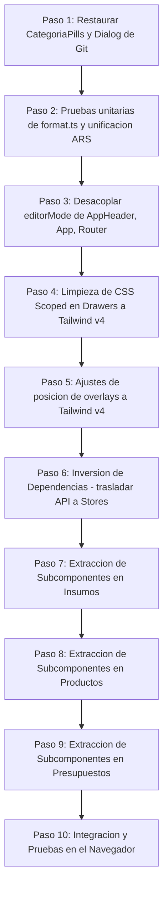

# Plan de Refactorización, Limpieza de Vistas y Resolución de Contradicciones (V2)

Este plan tiene como objetivo resolver los problemas de visualización en los formularios de creación/edición, recuperar el CRUD de categorías (solucionando la regresión funcional), unificar la moneda a ARS / es-AR, y avanzar hacia la meta de **Tailwind v4 puro** eliminando estilos scoped y reduciendo la dependencia del CSS legacy. 

Asimismo, se aborda la deuda arquitectónica de inversión de dependencias (DIP) y la preservación/expansión de tests automáticos.

---

## 1. Preservación y Expansión de Tests Automáticos

Contrario a la idea de eliminar Vitest o vaciar la suite de pruebas, mantendremos los tests de integración existentes en el backend y añadiremos pruebas para verificar los cambios en el formateador del frontend.

### Acciones
* **Preservar los 5 tests de integración del backend** en [api/src/test/](file:///d:/Desarrollando/presumemy/api/src/test/) (`ajustes.test.ts`, `auth.test.ts`, etc.) y corregirlos si es necesario tras el refactor.
* **`[NEW]` [format.test.ts](file:///d:/Desarrollando/presumemy/web/src/shared/lib/__tests__/format.test.ts)**:
  * Crear un archivo de pruebas unitarias para validar que `formatMoney` y otros formateadores en [format.ts](file:///d:/Desarrollando/presumemy/web/src/shared/lib/format.ts) procesen correctamente los montos bajo el locale de Argentina (`es-AR`) y con el sufijo de pesos argentinos (`ARS`).

---

## 2. Inversión de Dependencias (DIP) en los Componentes

Para evitar que la descomposición multiplique la violación de dependencias (DIP), la lógica de acceso a datos directa (`shared/api/client` -> `get`/`post`/`put`/`del`) será retirada de la capa de presentación (UI) y trasladada a los stores de Pinia de cada módulo.

### Modificación del Flujo de Datos
* **Insumos**: `InsumoDetalle` y sus nuevos hijos delegarán las llamadas a la API a las acciones `store.createInsumo()`, `store.updateInsumo()` y `store.deleteInsumo()`.
* **Productos**: `ProductoDetalle` delegará las llamadas a `store.createProducto()`, `store.updateProducto()`, etc.
* **Presupuestos**: `PresupuestoEditor` usará las acciones correspondientes en `presupuestosStore`.

La UI solo conocerá la interfaz expuesta por sus respectivos stores.

---

## 3. Recuperación del CRUD de Categorías (Regresión Funcional)

Recuperaremos la funcionalidad perdida para administrar categorías inline de insumos y productos.

### Acciones
1. **Restaurar componentes desde Git**: Localizar y recuperar del historial los archivos eliminados `CategoriaPills.vue` y `CategoriaDeleteDialog.vue` y moverlos a:
   * `[NEW]` [CategoriaPills.vue](file:///d:/Desarrollando/presumemy/web/src/shared/ui/CategoriaPills.vue)
   * `[NEW]` [CategoriaDeleteDialog.vue](file:///d:/Desarrollando/presumemy/web/src/shared/ui/CategoriaDeleteDialog.vue)
2. **Generalización (C17/DRY)**:
   * Modificar `CategoriaPills` para reemplazar el prop acoplado `variant: 'insumos' | 'productos'` por `allLabel: string` (ej. `"Todas"` o `"Todos"`).
   * Asegurar que el tipado de `Categoria` acepte un campo `count?: number` de forma directa para evitar dependencias cruzadas en `_count`.
3. **Cableado**: Conectar ambos componentes en [InsumosPage.vue](file:///d:/Desarrollando/presumemy/web/src/modules/insumos/InsumosPage.vue) y [ProductosPage.vue](file:///d:/Desarrollando/presumemy/web/src/modules/productos/ProductosPage.vue).

---

## 4. Unificación de Moneda y Locale (ARS vs MXN)

* **`[MODIFY]` [format.ts](file:///d:/Desarrollando/presumemy/web/src/shared/lib/format.ts)**:
  * Ajustar locale a `es-AR` (formato con miles en `.` y decimales en `,`).
  * Definir que el formateador financiero use el sufijo `ARS` (ej: `$ 1.250,00 ARS`).
  * Remover cualquier referencia a `es-MX` o `MXN` del formateador global.
* **Propagación**: Inspeccionar y corregir las cadenas de formato de moneda hardcodeadas localmente en las vistas.

---

## 5. Corrección de Errores de Visualización en Edición/Creación

### A. Posicionamiento en Pantalla Completa y Tailwind Puro (Adiós a components.css)
* **PresupuestoEditor.vue**: Eliminar la redefinición local `.editor-overlay` con `position: absolute` y los estilos scoped. En su lugar, aplicar clases Tailwind puro en la envoltura principal: `fixed top-0 right-0 bottom-0 left-[240px] z-30 bg-page-bg display-grid grid-rows-[auto_1fr_auto] overflow-hidden`.
* **InsumoDetalle.vue & ProductoDetalle.vue**: Eliminar los estilos scoped locales (`.id-overlay` y `.pd-overlay`) y sus múltiples estilos inline de posicionamiento. Migrarlos a la misma estructura Tailwind v4 pura de overlay autocontenido a pantalla completa.

### B. Desacoplamiento de `editorMode` y Resolución de Botones Duplicados
Se eliminará el `editorMode` global del navbar para que el overlay de edición sea autocontenido con su propio header (tal como en el diseño de React).
Esto impacta y requiere modificaciones en 6 archivos:
1. [AppHeader.vue](file:///d:/Desarrollando/presumemy/web/src/app/shell/AppHeader.vue): Remover lógica y controles visuales del `editorMode` (botones de disquete y cruz en la cabecera general).
2. [App.vue](file:///d:/Desarrollando/presumemy/web/src/app/App.vue): Quitar los listeners de eventos `@set-editor-mode` y la propagación de props del editor al header.
3. [router.ts](file:///d:/Desarrollando/presumemy/web/src/app/router.ts): Limpiar referencias si es necesario en las transiciones de estado de edición.
4. [InsumoDetalle.vue](file:///d:/Desarrollando/presumemy/web/src/modules/insumos/components/InsumoDetalle.vue): Agregar su encabezado de editor autocontenido (con flecha para volver y título) y remover emits `@update:header`.
5. [ProductoDetalle.vue](file:///d:/Desarrollando/presumemy/web/src/modules/productos/components/ProductoDetalle.vue): Igual que insumos.
6. [PresupuestoEditor.vue](file:///d:/Desarrollando/presumemy/web/src/modules/presupuestos/components/PresupuestoEditor.vue): Mover la barra de estado y los controles para que se rendericen dentro de su propio encabezado local en vez de usar un Teleport a la cabecera global.

### C. Estilos de Drawers
* Remover bloques `<style scoped>` y estilos inline de [ClienteDrawer.vue](file:///d:/Desarrollando/presumemy/web/src/modules/clientes/components/ClienteDrawer.vue), [MovimientoDrawer.vue](file:///d:/Desarrollando/presumemy/web/src/modules/finanzas/components/MovimientoDrawer.vue) y [ImprentaDrawer.vue](file:///d:/Desarrollando/presumemy/web/src/modules/finanzas/components/ImprentaDrawer.vue).
* Reemplazar las clases duplicadas por la estructura nativa de Tailwind v4 que emule el comportamiento del drawer del design system, o utilizar las variables CSS globales para lograr Tailwind puro sin depender del components.css legacy.

---

## 6. Optimización de la Componentización (Nombres Canónicos)

Para descomponer los componentes sobredimensionados (~1500 líneas), separaremos las secciones complejas de los formularios en subcomponentes atómicos utilizando la nomenclatura canónica definida en la arquitectura del proyecto (`00_Arquitectura_Modular.md`).

La reducción de líneas se logrará mediante la eliminación de los estilos scoped y la migración de estilos inline a utilidades de Tailwind v4.

### Subcomponentes a Crear

#### Módulo Insumos
1. **`[NEW]` [ProveedoresEditor.vue](file:///d:/Desarrollando/presumemy/web/src/modules/insumos/components/ProveedoresEditor.vue)** (Canónico):
   * Tabla dinámica de proveedores y lógica de precio principal.
2. **`[NEW]` [InsumoStockForm.vue](file:///d:/Desarrollando/presumemy/web/src/modules/insumos/components/InsumoStockForm.vue)**:
   * Barra de stock, inputs de stock actual, mínimo, y badges de nivel.

#### Módulo Productos
1. **`[NEW]` [BomEditor.vue](file:///d:/Desarrollando/presumemy/web/src/modules/productos/components/BomEditor.vue)** (Canónico):
   * Lista de materiales (receta BOM), autocompletado de insumos y cómputo de costos.
2. **`[NEW]` [ProductoMedidasForm.vue](file:///d:/Desarrollando/presumemy/web/src/modules/productos/components/ProductoMedidasForm.vue)**:
   * Inputs de dimensiones (base, altura, profundidad) y tipo (plano o cuerpo).

#### Módulo Presupuestos
1. **`[NEW]` [LinesSpreadsheet.vue](file:///d:/Desarrollando/presumemy/web/src/modules/presupuestos/components/LinesSpreadsheet.vue)** (Canónico):
   * Grilla interactiva de selección de productos, cantidades y cálculo de importes.
2. **`[NEW]` [EditorTotals.vue](file:///d:/Desarrollando/presumemy/web/src/modules/presupuestos/components/EditorTotals.vue)** (Canónico):
   * Resumen y cálculo de sumatorias (subtotal, envío, recargos y total final).

---

## Plan de Trabajo por Pasos

---

## 7. Alcance y Exclusiones (Stage 3)

Quedan fuera del alcance del presente plan (`Stage 2`) y se posponen para la fase de consolidación arquitectónica final (`Stage 3`):
* El saneamiento completo y estandarización de barrels `index.ts` por módulo.
* La separación completa de `api.ts` y del cliente HTTP en módulos no impactados por esta refactorización.
* La migración de esquemas de validación Zod y tipos compartidos a sus módulos correspondientes.
* La actualización integral del archivo `AGENTS.md` (debido a la regla de preservación de archivos ajenos).
* La eliminación final del archivo temporal `components.css`.
