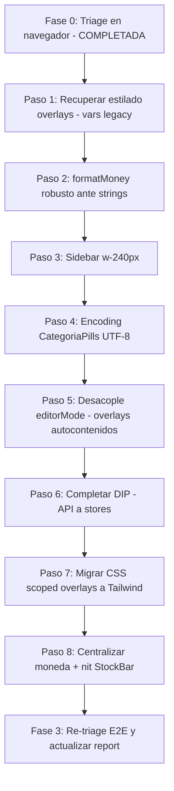

# Plan de Fix — First Review Post Stage 2

Este plan corrige los hallazgos del review [`first_review/00_first_review_report.md`](file:///d:/Desarrollando/presumemy/docs/MVP/mvp%20correcciones/refactor_plan/Stage_2/first_review/00_first_review_report.md) y cierra la deuda técnica pendiente del plan Stage 2 (DIP, `editorMode`, migración CSS, moneda). Alcance acordado: **bugs + deuda técnica**.

---

## Contexto y resultado de la verificación

Se verificó el report contra el código commiteado. El resultado es **mixto**: hay bugs reales presentes en el código, pero varios hallazgos "críticos/altos/medios" **no son reproducibles en el código actual** y provienen de la corrida E2E automatizada (que editó `InsumoDetalle.vue` en vivo para agregar `Trash2`, corrompiendo el estado HMR). El usuario confirmó que el síntoma vino solo del E2E, no de una sesión limpia.

**Eje del plan:** el desacople de `editorMode` (deuda §4B) hace los overlays autocontenidos, lo que a la vez (a) elimina el round-trip entre componentes —la causa runtime más plausible de la fragilidad de overlays vista en E2E—, (b) completa la deuda del plan, y (c) resuelve correctamente la doble-botonera (Stage 2 la había resuelto al revés).

### Clasificación de hallazgos (actualizada tras triage en navegador — 2026-07-20)

| Hallazgo | Estado tras verificación | Evidencia |
|---|---|---|
| **C-1/C-2** overlays "no abren" | 🔴 **Real — pero es un bug de CSS, no de apertura** | Los overlays **sí montan** (el `v-if` renderiza, los campos existen), pero se ven **rotos/transparentes** (se ve el fondo). Causa raíz: ver **§ Causa raíz del breakage visual** abajo. |
| **H-1** sidebar 210px | 🔴 **Real (confirmado en navegador)** | `getComputedStyle(aside).width` = **210px**, root = **14px**. `AppSidebar.vue:53` usa `w-60` (15rem). Overlays usan `left-[240px]` → gap visible de 30px. El header `h-16`=56px sí coincide con `top-[56px]`. |
| **M-1** encoding CategoriaPills | 🔴 **Real (confirmado en navegador)** | Los pills renderizan `Cortes ┬À 3`, `Embalaje ┬À 2`, etc. Mojibake UTF-8 (10 ocurrencias) en `shared/ui/CategoriaPills.vue`. Aislado a este archivo. Secuela del restore-desde-git. |
| **M-2** tabla "$ 8.8" | 🔴 **Real, pero mal diagnosticado** | La tabla **sí** llama `formatMoney()` (`InsumosPage.vue:235`). El bug es que `costoUnitario` llega como **string** (Decimal serializado) y `formatMoney` hace `value.toLocaleString()`; `String.prototype.toLocaleString` **ignora** las opciones de formato → devuelve `"8.8"`. Fix: `Number(value)` dentro de `formatMoney`. |
| DIP incompleto | 🔴 **Real** | 11 archivos importan `shared/api/client`. |
| `editorMode` no desacoplado | 🔴 **Real** | Sigue en `App.vue`, `router.ts`, `AppHeader.vue`, 3 overlays + `Teleport #editor-header-status`. |
| Moneda no centralizada | 🔴 **Real** | `money()` locales en `ProductoDetalle`/`MovimientoDrawer`/`ImprentaDrawer`; fallback `'MXN'` en `PresupuestoDoc.vue:154`. |
| **H-2** deep-links dashboard | 🟡 **Navegación OK; destino roto** | `DashboardPage` tiene `@click="router.push(...)"` con rutas válidas. La navegación funciona; los deep-links de insumos/productos caen en el overlay roto (= C-1/C-2). Falta re-test formal del click. |
| **M-3** StockBar "vacío" | 🟢 **No es bug** | `StockBar` **sí** renderiza barras coloreadas por nivel (verde/amarillo/coral) con ancho según ratio. Único detalle: usa el token `bg-canal-whatsapp` para el nivel OK (mal semántico; debería ser un color de stock). No está vacío. |
| **createTrigger** "Crear nuevo" | 🟡 **Inconsistencia observada** | El botón global "Crear nuevo" abrió el overlay la 1ª vez pero no en intentos posteriores tras cerrar por el header; el path de edición (botón Editar / doble-click) abre confiable. Probable estado pegado de `editorMode`/`createTrigger`. Se resuelve al desacoplar `editorMode` (Paso 3). |

### Causa raíz del breakage visual de los overlays (C-1/C-2)

La migración de tokens a `@theme` (Tailwind v4) **renombró** las variables CSS: `--surface → --color-surface`, `--border → --color-border`, `--r-lg → --radius-lg`, `--ink → --color-ink`, etc. Pero la CSS scoped + los estilos inline que **quedaron sin migrar** en los overlays siguen usando los **nombres viejos** (`var(--surface)`, `var(--border)`, `var(--r-lg)`, `var(--ink)`…), que hoy resuelven a **vacío**. Verificado en navegador: `--surface`, `--border`, `--r-lg`, `--ink` = `(vacío)`; sus equivalentes `--color-*`/`--radius-*` sí existen. Efecto: las `.id-card`/`.pd-card`/`.editor-*` renderizan **transparentes, sin borde ni radio** → se ve el fondo y el layout parece roto.

**Alcance (≈108 referencias muertas en 6 archivos):** `ProductoDetalle.vue` (47), `InsumoDetalle.vue` (32), `PresupuestoEditor.vue` (22), `BomEditor.vue` (4), `InsumoStockForm.vue` (2), `ProveedoresEditor.vue` (1). Son exactamente los componentes que Stage 2 dejó a medio migrar. Los drawers (que sí se migraron a Tailwind puro) **no** tienen este problema.

Esto **eleva la migración CSS de los overlays (antes "deuda §4A") a fix de bug visual crítico**, y adelanta su prioridad. El fix natural es completar la migración a Tailwind/tokens `@theme` de esos 6 archivos (o, como mínimo puente, reemplazar cada `var(--viejo)` por su `var(--color-*/--radius-*)` correcto).

---

## Fase 0 — Reproducción limpia y triage ✅ COMPLETADA (2026-07-20)

Ejecutada en navegador contra dev server limpio (backend :3000 + frontend :5173, sesión autenticada). Resultado: tabla de clasificación de arriba. Conclusión clave: los "críticos de apertura" C-1/C-2 son en realidad **un bug de CSS** (variables legacy muertas), M-2 es real con otra causa, M-3 no es bug, H-2 es navegación-OK-destino-roto.

---

## Fase 1 — Bugs confirmados de alto impacto (rápidos)

> **✅ Progreso (2026-07-20) — overlays restaurados y verificados con Playwright:**
> - Causa raíz real: los tokens `@theme` fueron renombrados pero `components.css` (130 refs, aún importado) y el scoped de los overlays quedaron con nombres viejos, y `tokens.css` no se importa → tokens indefinidos → estilado transparente/roto.
> - **Fix aplicado:** rename mecánico `var(--viejo)` → `var(--color-*/--radius-*/--text-*/--shadow-*)` en los 6 archivos de overlays/subcomponentes **y en `components.css`** (mantiene `@theme` como fuente única).
> - **Migrados a Tailwind (layout interno):** `InsumoStockForm` (grids costo/stock + barra nivel) y `ProductoMedidasForm` (fila base/altura).
> - **Bug extra corregido:** labels de `FloatingField` colapsaban espacios ("Costopack") → `white-space: pre` en `.ff-char` (aplica a toda la app).
> - **Verificado:** los 3 overlays (Insumo/Producto/Presupuesto) renderizan igual que la referencia; `vue-tsc -b` y `npm run build` OK.
>
> **✅ Completado además (2026-07-20), verificado con Playwright + typecheck + build:**
> - **M-1** encoding CategoriaPills — 14 secuencias mojibake corregidas a nivel de bytes (pills muestran "Cortes · 3").
> - **H-1** sidebar — `w-60` → `w-[240px]` (medido 240px, sin gap).
> - **M-2** — `formatMoney` ahora hace `Number(value)` (Decimal string) → tabla muestra "$ 8,80".
> - **Paso 8** moneda — `money()`/`moneyAbs` locales de `ProductoDetalle`/`MovimientoDrawer`/`ImprentaDrawer` centralizados en `formatMoney`; fallback `'MXN'` → `'ARS'` en `PresupuestoDoc`.
>
> **⏸️ Pendiente al cierre de esta ronda** — continúa en [`02_Plan_Fix_Refactor.md`](02_Plan_Fix_Refactor.md), donde el **Paso 6 (DIP) ya quedó ejecutado** y los Pasos 5 y 7 siguen abiertos. Nota de encuadre: las menciones a "Stage 3" de abajo son históricas — el 2026-07-25 se decidió que el refactor termina en Stage 2 y ese alcance se absorbió en la ronda `02`.
>
> *(refactors arquitectónicos, sin impacto visual — NO ejecutados en esta ronda para no arriesgar el flujo CRUD/guardado ya verificado):*
> - **Paso 5** desacople de `editorMode` (6 archivos, toca el flujo de guardado).
> - **Paso 6** DIP — sacar `shared/api` de la UI a stores (11 archivos + acciones de store; `ProveedoresEditor` está entrelazado con un `defineModel` del padre).
> - **Paso 7** migración CSS completa / borrar `components.css` — ya marcado como **Stage 3** en §6.
> Recomendación: ejecutar Paso 5 y 6 **módulo por módulo con verificación** (no en batch), en una sesión dedicada.

> **Decisión de ejecución (2026-07-20):** durante el fix se descubrió una **segunda capa** de causa: los 6 subcomponentes que Stage 2 extrajo (`ProveedoresEditor`, `InsumoStockForm`, `BomEditor`, `ProductoMedidasForm`, `LinesSpreadsheet`, `EditorTotals`) **no tienen `<style>` propio**; su CSS quedó en el `<style scoped>` del overlay padre y los estilos scoped **no llegan a los hijos** → renderizan sin estilo. El rename de vars (Paso 1) se aplicó como interino, pero el fix definitivo elegido es **adelantar el Paso 7: migrar los 3 overlays + 6 subcomponentes a Tailwind v4 puro** (sin `<style scoped>`). Se ejecuta por slices verticales (InsumoDetalle → ProductoDetalle → PresupuestoEditor), verificando contra la captura de referencia.

### Paso 1 (aplicado — interino) — C-1/C-2: recuperar el estilado de los overlays
Las cards/secciones de los 3 overlays + 3 subcomponentes se ven transparentes porque su CSS scoped/inline usa variables legacy muertas (ver § Causa raíz). Dos opciones:
- **Puente rápido (recomendado para desbloquear ya):** en los 6 archivos (`ProductoDetalle`, `InsumoDetalle`, `PresupuestoEditor`, `BomEditor`, `InsumoStockForm`, `ProveedoresEditor`) reemplazar cada `var(--viejo)` por su equivalente `@theme`: `--surface→--color-surface`, `--border→--color-border`, `--border-strong→--color-border-strong`, `--ink→--color-ink`, `--ink-muted→--color-ink-muted`, `--r-*→--radius-*`, `--violet-700→--color-violet-700`, `--teal-*/--coral-*→--color-*`, etc. (`--shadow-*` siguen válidas). Verificar: `grep -rE "var\(--(surface|border|ink|r-[a-z]|s-[0-9])\)" web/src/modules` → vacío.
- **Definitivo:** hacerlo dentro de la migración a Tailwind del Paso 5 (Fase 2). El puente y el Paso 5 no se pisan: el puente deja los overlays usables mientras se migran a fondo.

### Paso 2 — M-2: `formatMoney` robusto ante strings
- `[MODIFY]` [format.ts](file:///d:/Desarrollando/presumemy/web/src/shared/lib/format.ts): en `formatMoney`, coercionar `const n = Number(value)` antes de `toLocaleString` (los Decimal llegan como string y `String.prototype.toLocaleString` ignora las opciones → `"$ 8.8"`). Con esto la tabla y todos los consumidores muestran `$ 8,80`.

### Paso 3 — H-1: ancho del sidebar
- `[MODIFY]` [AppSidebar.vue](file:///d:/Desarrollando/presumemy/web/src/app/shell/AppSidebar.vue): línea 53, `class="w-60"` → `class="w-[240px]"` (alinear con `left-[240px]` de los overlays y el design system = 240px).
- Auditar el shell por otras dimensiones fijas basadas en `rem` afectadas por el root de 14px. (El header `h-16`=56px ya es correcto.)

### Paso 4 — M-1: encoding de CategoriaPills
- `[MODIFY]` [CategoriaPills.vue](file:///d:/Desarrollando/presumemy/web/src/shared/ui/CategoriaPills.vue): reescribir las 10 secuencias corruptas (separador `·` entre nombre y `count`, "Categorías", etc.) y guardar el archivo como **UTF-8 sin BOM**.
- Verificación: `grep -cP "\xe2\x94\x9c|\xc2\xa1" web/src/shared/ui/CategoriaPills.vue` debe dar `0`.

---

## Fase 2 — Deuda técnica

### Paso 5 — Desacople de `editorMode` (eje, §4B)
Hacer cada overlay **autocontenido** con su propio header (flecha volver + título + Guardar/Cerrar), eliminando el mecanismo global:
- `[MODIFY]` [AppHeader.vue](file:///d:/Desarrollando/presumemy/web/src/app/shell/AppHeader.vue): quitar el bloque `<template v-if="editorMode">` (botones Save/X, ~92-111) y el target Teleport `#editor-header-status` (114).
- `[MODIFY]` [App.vue](file:///d:/Desarrollando/presumemy/web/src/app/App.vue): quitar `handleSetEditorMode`, el uso de `editorMode`/`setEditorMode`/`editorDirty` y las props de editor pasadas a `AppHeader`.
- `[MODIFY]` [router.ts](file:///d:/Desarrollando/presumemy/web/src/app/router.ts): quitar `resetEditorMode()` del `beforeEach` (verificado: reset defensivo, seguro de remover).
- `[MODIFY]` [editorMode.ts](file:///d:/Desarrollando/presumemy/web/src/shared/lib/editorMode.ts): retirar el singleton global; si se conserva `editorDirty`, que sea estado local del overlay (para el confirm de salida).
- `[MODIFY]` [InsumoDetalle.vue](file:///d:/Desarrollando/presumemy/web/src/modules/insumos/components/InsumoDetalle.vue), [ProductoDetalle.vue](file:///d:/Desarrollando/presumemy/web/src/modules/productos/components/ProductoDetalle.vue), [PresupuestoEditor.vue](file:///d:/Desarrollando/presumemy/web/src/modules/presupuestos/components/PresupuestoEditor.vue): agregar header local (volver + título + Guardar/Cancelar); eliminar `emit('update:header')` y `openOverlay/closeOverlay` hacia el header global. En `PresupuestoEditor` mover el badge de estado desde `<Teleport to="#editor-header-status">` (~542) a su header local.
- `[MODIFY]` `InsumosPage.vue`, `ProductosPage.vue`, `PresupuestosPage.vue`: quitar `handleHeaderUpdate` / relay `emit('set-editor-mode', ...)`.

### Paso 6 — Completar DIP (§1): sacar `shared/api/client` de la UI (11 archivos)
Patrón único: mover cada `get/post/put/del/patch` a una acción del `store.ts` del módulo (reutilizando el patrón `create`/`update`/`remove` ya agregado en Stage 2); la UI llama solo al store.
- Cargas de catálogo (`get`) en `InsumoDetalle`/`ProductoDetalle`/`PresupuestoEditor` → acción `loadCatalogos()` en su store.
- `[MODIFY]` [ProveedoresEditor.vue](file:///d:/Desarrollando/presumemy/web/src/modules/insumos/components/ProveedoresEditor.vue) (`post, del`) → acciones `createProveedor`/`removeProveedor` en `modules/insumos/store.ts`.
- `patch` en `ProductosPage` (favorito) y `PresupuestosPage` (estado) → acción de store (`updateStatus` ya existe en presupuestos).
- Drawers `ClienteDrawer`, `MovimientoDrawer`, `ImprentaDrawer` → acciones en `modules/clientes/store.ts` y `modules/finanzas/store.ts`.
- `AjustesPage.vue` (`get, put`) y `DashboardPage.vue` (`get`) → store / stats-api del módulo.
- Cierre: `grep -rl "shared/api/client" web/src/modules` debe quedar **vacío** (solo `shared/api/client.ts` conoce `ofetch`).

### Paso 7 — Migrar CSS scoped de overlays a Tailwind (§4A) — cierre definitivo del Paso 1
En `InsumoDetalle.vue` (~532-952), `ProductoDetalle.vue` (~680-1184) y `PresupuestoEditor.vue` (~801-1139) + los 3 subcomponentes: trasladar clases `.id-*`/`.pd-*`/`.editor-*` y estilos inline a utilidades Tailwind v4 (esto elimina de raíz las `var()` legacy que el Paso 1 parchea). **Conservar** solo las transiciones justificadas (`overlay`, `drawer`) como `<style scoped>` mínimo (excepción explícita del plan Stage 1). Efecto secundario: reducir LOC de los archivos.

### Paso 8 — Centralizar moneda
Reemplazar formateadores locales por `formatMoney` de [format.ts](file:///d:/Desarrollando/presumemy/web/src/shared/lib/format.ts):
- `[MODIFY]` `ProductoDetalle.vue:126-128` (`money()`), `MovimientoDrawer.vue:72` (`moneyAbs`), `ImprentaDrawer.vue:48-50` (`money()`).
- `[MODIFY]` [PresupuestoDoc.vue](file:///d:/Desarrollando/presumemy/web/src/modules/presupuestos/components/PresupuestoDoc.vue): línea 154, fallback `config?.moneda || 'MXN'` → `|| 'ARS'`.
- **Nit M-3 (opcional):** en `StockBar.vue`, reemplazar el token `bg-canal-whatsapp` del nivel OK por un color de stock semántico (`--color-mint`/verde de stock).

---

## Fase 3 — Re-triage E2E
Volver a correr la validación de Fase 0 tras la Fase 2 y confirmar que C-1/C-2/H-2 quedan operativos (overlays ahora autocontenidos) y que M-2/M-3 se ven correctos. Actualizar `00_first_review_report.md` marcando qué era bug real vs artefacto stale.

---

## Plan de trabajo por pasos

---

## Plan de verificación
- `cd web && npx vue-tsc -b` → exit 0.
- `cd web && npm run build` → OK.
- Dev server limpio + backend; recorrer a mano:
  - Crear/editar insumo y producto: overlay abre, header local con Guardar funciona, guardado persiste.
  - Deep-links del dashboard navegan y abren su destino.
  - CRUD inline de categorías: pills muestran `·` correctamente.
  - Sidebar 240px sin gap contra los overlays.
  - Moneda `$ 1.250,00 ARS` uniforme en tablas, overlays y documento.
- `grep -rl "shared/api/client" web/src/modules` → sin resultados (DIP cerrado).
- `grep -rn "editorMode\|#editor-header-status\|update:header" web/src` → sin resultados (editorMode desacoplado).
- Re-correr el E2E de Playwright del review para confirmar C-1/C-2/H-2.
