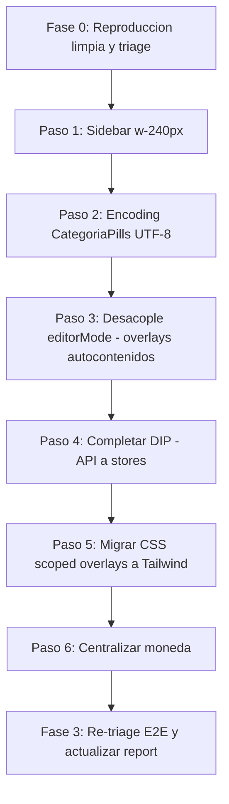

# Plan de Fix — First Review Post Stage 2

Este plan corrige los hallazgos del review [`first_review/00_first_review_report.md`](file:///d:/Desarrollando/presumemy/docs/MVP/mvp%20correcciones/refactor_plan/Stage_2/first_review/00_first_review_report.md) y cierra la deuda técnica pendiente del plan Stage 2 (DIP, `editorMode`, migración CSS, moneda). Alcance acordado: **bugs + deuda técnica**.

---

## Contexto y resultado de la verificación

Se verificó el report contra el código commiteado. El resultado es **mixto**: hay bugs reales presentes en el código, pero varios hallazgos "críticos/altos/medios" **no son reproducibles en el código actual** y provienen de la corrida E2E automatizada (que editó `InsumoDetalle.vue` en vivo para agregar `Trash2`, corrompiendo el estado HMR). El usuario confirmó que el síntoma vino solo del E2E, no de una sesión limpia.

**Eje del plan:** el desacople de `editorMode` (deuda §4B) hace los overlays autocontenidos, lo que a la vez (a) elimina el round-trip entre componentes —la causa runtime más plausible de la fragilidad de overlays vista en E2E—, (b) completa la deuda del plan, y (c) resuelve correctamente la doble-botonera (Stage 2 la había resuelto al revés).

### Clasificación de hallazgos

| Hallazgo | Estado tras verificación | Evidencia |
|---|---|---|
| **H-1** sidebar 210px | 🔴 **Real** | `AppSidebar.vue:53` usa `w-60` = 15rem × root 14px = 210px; overlays usan `left-[240px]` → gap 30px. El header `h-16`=56px sí coincide con `top-[56px]`. |
| **M-1** encoding CategoriaPills | 🔴 **Real** | Mojibake UTF-8 (10 ocurrencias) en `shared/ui/CategoriaPills.vue`. Aislado a este archivo. Secuela del restore-desde-git. |
| DIP incompleto | 🔴 **Real** | 11 archivos importan `shared/api/client`. |
| `editorMode` no desacoplado | 🔴 **Real** | Sigue en `App.vue`, `router.ts`, `AppHeader.vue`, 3 overlays + `Teleport #editor-header-status`. |
| CSS scoped sin migrar | 🔴 **Real** | ~420/500/340 líneas scoped en los 3 overlays. |
| Moneda no centralizada | 🔴 **Real** | `money()` locales en `ProductoDetalle`/`MovimientoDrawer`/`ImprentaDrawer`; fallback `'MXN'` en `PresupuestoDoc.vue:154`. |
| **C-1/C-2** overlays no abren | 🟡 **No reproducible (probable stale)** | Path `handleCreate/Edit → showOverlay → :open → v-if → transición (termina visible)` correctamente cableado; el round-trip de `editorMode` no desmonta nada. |
| **H-2** deep-links dashboard | 🟡 **No reproducible (probable stale)** | `DashboardPage` sí tiene `@click="router.push(...)"` con rutas válidas; insumos/productos dependen de que abra el overlay. |
| **M-2** tabla "$ 8.8" | 🟡 **Mal diagnosticado** | `InsumosPage.vue:235` **sí** usa `formatMoney()`, correcto para ARS (`$ 8,80`). |
| **M-3** StockBar vacío | 🟡 **Mal diagnosticado** | `InsumosPage.vue:238` **sí** renderiza `<StockBar>`. |

---

## Fase 0 — Reproducción limpia y triage (obligatoria, primero)

Objetivo: separar bugs reales de artefactos stale antes de tocar C-1/C-2/H-2/M-2/M-3. **No escribir fixes especulativos sobre bugs que no reproduzcan en limpio.**

1. Detener dev servers previos. Ejecutar `cd web && npm run build` limpio.
2. Levantar backend (`cd api && npx tsx src/index.ts`) y frontend (`cd web && npm run dev`) frescos; hacer hard reload (Ctrl+Shift+R).
3. Verificar (Playwright o manual) en estado limpio: abrir overlay de insumo (crear / editar / doble-click en fila), ídem producto, deep-links del dashboard, formato de moneda en tabla, badge de `StockBar`.
4. Marcar cada hallazgo 🟡 como **real** o **stale**. Solo se arreglan los que sigan fallando.

---

## Fase 1 — Bugs confirmados en código

### Paso 1 — H-1: ancho del sidebar
- `[MODIFY]` [AppSidebar.vue](file:///d:/Desarrollando/presumemy/web/src/app/shell/AppSidebar.vue): línea 53, `class="w-60"` → `class="w-[240px]"` (alinear con `left-[240px]` de los overlays y el design system = 240px).
- Auditar el shell por otras dimensiones fijas basadas en `rem` afectadas por el root de 14px. (El header `h-16`=56px ya es correcto.)

### Paso 2 — M-1: encoding de CategoriaPills
- `[MODIFY]` [CategoriaPills.vue](file:///d:/Desarrollando/presumemy/web/src/shared/ui/CategoriaPills.vue): reescribir las 10 secuencias corruptas (separador `·` entre nombre y `count`, "Categorías", etc.) y guardar el archivo como **UTF-8 sin BOM**.
- Verificación: `grep -cP "\xe2\x94\x9c|\xc2\xa1" web/src/shared/ui/CategoriaPills.vue` debe dar `0`.

---

## Fase 2 — Deuda técnica

### Paso 3 — Desacople de `editorMode` (eje, §4B)
Hacer cada overlay **autocontenido** con su propio header (flecha volver + título + Guardar/Cerrar), eliminando el mecanismo global:
- `[MODIFY]` [AppHeader.vue](file:///d:/Desarrollando/presumemy/web/src/app/shell/AppHeader.vue): quitar el bloque `<template v-if="editorMode">` (botones Save/X, ~92-111) y el target Teleport `#editor-header-status` (114).
- `[MODIFY]` [App.vue](file:///d:/Desarrollando/presumemy/web/src/app/App.vue): quitar `handleSetEditorMode`, el uso de `editorMode`/`setEditorMode`/`editorDirty` y las props de editor pasadas a `AppHeader`.
- `[MODIFY]` [router.ts](file:///d:/Desarrollando/presumemy/web/src/app/router.ts): quitar `resetEditorMode()` del `beforeEach` (verificado: reset defensivo, seguro de remover).
- `[MODIFY]` [editorMode.ts](file:///d:/Desarrollando/presumemy/web/src/shared/lib/editorMode.ts): retirar el singleton global; si se conserva `editorDirty`, que sea estado local del overlay (para el confirm de salida).
- `[MODIFY]` [InsumoDetalle.vue](file:///d:/Desarrollando/presumemy/web/src/modules/insumos/components/InsumoDetalle.vue), [ProductoDetalle.vue](file:///d:/Desarrollando/presumemy/web/src/modules/productos/components/ProductoDetalle.vue), [PresupuestoEditor.vue](file:///d:/Desarrollando/presumemy/web/src/modules/presupuestos/components/PresupuestoEditor.vue): agregar header local (volver + título + Guardar/Cancelar); eliminar `emit('update:header')` y `openOverlay/closeOverlay` hacia el header global. En `PresupuestoEditor` mover el badge de estado desde `<Teleport to="#editor-header-status">` (~542) a su header local.
- `[MODIFY]` `InsumosPage.vue`, `ProductosPage.vue`, `PresupuestosPage.vue`: quitar `handleHeaderUpdate` / relay `emit('set-editor-mode', ...)`.

### Paso 4 — Completar DIP (§1): sacar `shared/api/client` de la UI (11 archivos)
Patrón único: mover cada `get/post/put/del/patch` a una acción del `store.ts` del módulo (reutilizando el patrón `create`/`update`/`remove` ya agregado en Stage 2); la UI llama solo al store.
- Cargas de catálogo (`get`) en `InsumoDetalle`/`ProductoDetalle`/`PresupuestoEditor` → acción `loadCatalogos()` en su store.
- `[MODIFY]` [ProveedoresEditor.vue](file:///d:/Desarrollando/presumemy/web/src/modules/insumos/components/ProveedoresEditor.vue) (`post, del`) → acciones `createProveedor`/`removeProveedor` en `modules/insumos/store.ts`.
- `patch` en `ProductosPage` (favorito) y `PresupuestosPage` (estado) → acción de store (`updateStatus` ya existe en presupuestos).
- Drawers `ClienteDrawer`, `MovimientoDrawer`, `ImprentaDrawer` → acciones en `modules/clientes/store.ts` y `modules/finanzas/store.ts`.
- `AjustesPage.vue` (`get, put`) y `DashboardPage.vue` (`get`) → store / stats-api del módulo.
- Cierre: `grep -rl "shared/api/client" web/src/modules` debe quedar **vacío** (solo `shared/api/client.ts` conoce `ofetch`).

### Paso 5 — Migrar CSS scoped de overlays a Tailwind (§4A)
En `InsumoDetalle.vue` (~532-952), `ProductoDetalle.vue` (~680-1184) y `PresupuestoEditor.vue` (~801-1139): trasladar clases `.id-*`/`.pd-*`/`.editor-*` y estilos inline a utilidades Tailwind v4. **Conservar** solo las transiciones justificadas (`overlay`, `drawer`) como `<style scoped>` mínimo (excepción explícita del plan Stage 1). Efecto secundario: reducir LOC de los 3 archivos.

### Paso 6 — Centralizar moneda
Reemplazar formateadores locales por `formatMoney` de [format.ts](file:///d:/Desarrollando/presumemy/web/src/shared/lib/format.ts):
- `[MODIFY]` `ProductoDetalle.vue:126-128` (`money()`), `MovimientoDrawer.vue:72` (`moneyAbs`), `ImprentaDrawer.vue:48-50` (`money()`).
- `[MODIFY]` [PresupuestoDoc.vue](file:///d:/Desarrollando/presumemy/web/src/modules/presupuestos/components/PresupuestoDoc.vue): línea 154, fallback `config?.moneda || 'MXN'` → `|| 'ARS'`.

---

## Fase 3 — Re-triage E2E
Volver a correr la validación de Fase 0 tras la Fase 2 y confirmar que C-1/C-2/H-2 quedan operativos (overlays ahora autocontenidos) y que M-2/M-3 se ven correctos. Actualizar `00_first_review_report.md` marcando qué era bug real vs artefacto stale.

---

## Plan de trabajo por pasos

---

## Plan de verificación
- `cd web && npx vue-tsc -b` → exit 0.
- `cd web && npm run build` → OK.
- Dev server limpio + backend; recorrer a mano:
  - Crear/editar insumo y producto: overlay abre, header local con Guardar funciona, guardado persiste.
  - Deep-links del dashboard navegan y abren su destino.
  - CRUD inline de categorías: pills muestran `·` correctamente.
  - Sidebar 240px sin gap contra los overlays.
  - Moneda `$ 1.250,00 ARS` uniforme en tablas, overlays y documento.
- `grep -rl "shared/api/client" web/src/modules` → sin resultados (DIP cerrado).
- `grep -rn "editorMode\|#editor-header-status\|update:header" web/src` → sin resultados (editorMode desacoplado).
- Re-correr el E2E de Playwright del review para confirmar C-1/C-2/H-2.
