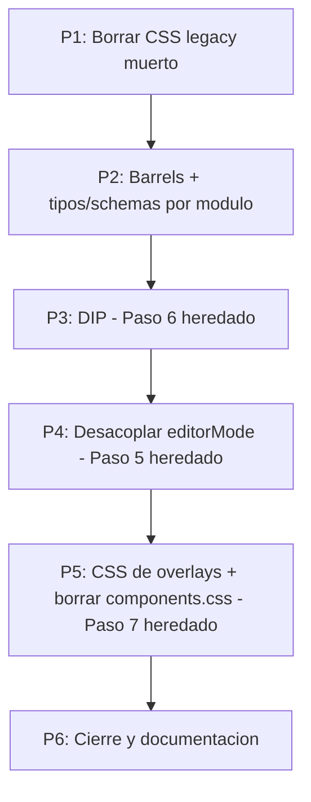

# Plan de Fix 02 — Cierre de deuda arquitectónica (Stage 2, tercera ronda)

**Fecha:** 2026-07-25
**Rama:** `feature/refactor-frontend-modular`
**Origen:** la sección §6 de [`01_Walkthrough_Refactorización_Stage_2.md`](01_Walkthrough_Refactorización_Stage_2.md) ("Decisiones sobre alcance: qué NO se ejecutó y por qué") y la deuda listada en [`second_review/00_second_review_report.md`](second_review/00_second_review_report.md).

---

## 0. Encuadre: no hay Stage 3

**Decisión del usuario (2026-07-25): el refactor termina en Stage 2.** Lo que quedó pendiente tras la ronda `01` —y que en su momento se rotuló "Stage 3"— se absorbe en esta tercera ronda de fix. No se abre una fase nueva: se cierran los Pasos 5, 6 y 7 que el plan `00` había diferido.

En consecuencia:
- La carpeta `Stage_3/` y su plan quedan **eliminados**. No hay trabajo planificado fuera de Stage 2.
- Las menciones a "Stage 3" en los documentos `00_*`, `01_*` y en los reviews se conservan **como registro histórico** de la decisión que se tomó entonces; no describen trabajo futuro.

**Testing E2E: congelado.** El material de `docs/MVP/testing/` no se profundiza hasta nuevo aviso. La verificación de esta ronda es typecheck + build + unit tests + revisión manual en navegador.

---

## 1. Alcance heredado

Los tres pasos que `01` dejó explícitamente sin ejecutar:

| Paso del plan `00`/`01` | Motivo del diferimiento | Estado en esta ronda |
|---|---|---|
| **Paso 5** — desacople de `editorMode` | Toca el flujo de guardado del header; riesgo sobre CRUD ya verificado | **Pendiente** → P4 |
| **Paso 6** — DIP (sacar `shared/api` de la UI) | 11 archivos + acciones nuevas de store; `ProveedoresEditor` entrelazado con un `defineModel` del padre | **✅ Hecho** → P3 |
| **Paso 7** — borrar `components.css` | Marcado como fuera de alcance en `00` §6 | **Pendiente** → P5 |

A eso se sumaron dos trabajos de higiene que aparecieron al auditar el código (P1 y P2), ambos ya ejecutados.

---

## 2. Auditoría de estado (medida sobre el código, 2026-07-24)

| Ítem | Medición real | Delta contra lo que decía el report de la second review |
|---|---|---|
| `editorMode` global | **7** archivos: `shared/lib/editorMode.ts`, `app/App.vue`, `app/router.ts`, `app/shell/AppHeader.vue` y los 3 overlays | El report sumaba también las 3 páginas: **no es así**, las páginas solo usan `createTrigger`. Alcance menor al estimado |
| DIP incompleto | 11 archivos de UI + el composable `useGlobalSearch` importaban `shared/api/client` | Coincide |
| `components.css` | 3.536 líneas, 151 clases, **66 aún referenciadas** desde `.vue` | No se puede borrar de un tirón: hay que migrar antes a sus consumidores |
| CSS scoped en overlays | `ProductoDetalle` 1.185 líneas · `PresupuestoEditor` 1.141 · `InsumoDetalle` 937 | Coincide |
| **CSS legacy muerto (hallazgo nuevo)** | `src/style.css` (300 líneas), `src/assets/css/main.css`, `src/assets/css/tokens.css` (105) **sin importador**; único entrypoint real: `src/app/styles/main.css` | No estaba registrado |
| **Contratos globales (hallazgo nuevo)** | `src/types/index.ts` (249 líneas) y `src/schemas/*.ts` fuera de los módulos; **ningún** barrel `index.ts` | No estaba registrado |
| **Cobertura de tests (hallazgo nuevo)** | En `web/` hay **un solo** archivo de test versionado (`format.test.ts`) | El `Audit_Report` de Stage 1 declaraba 26 tests en 3 archivos; `stock.test.ts` y `ConfirmDialog.test.ts` **no están en el repo** |

---

## 3. Principios de ejecución

1. **Un paso a la vez, con validación del usuario entre pasos.** Los pasos que tocan guardado o estilos no se encadenan sin que el usuario pruebe en el navegador.
2. **Sin cambios de comportamiento.** Ningún paso puede alterar lo que el usuario ve ni el resultado de un guardado.
3. **Orden por riesgo creciente:** primero lo mecánico y reversible, al final lo visualmente riesgoso.
4. **Commit por paso**, previa validación del usuario (regla de `CLAUDE.md`).

---

## 4. Pasos

### ✅ P1 — Higiene de CSS legacy muerto

Eliminar los archivos que ningún entrypoint importa (`src/style.css`, `src/assets/css/main.css`, `src/assets/css/tokens.css`) y dejar `src/app/styles/main.css` como único origen de estilos.

**Verificación:** ninguna referencia por `grep`, tokens `@theme` vivos en navegador, build OK.

### ✅ P2 — Barrels y colocación de contratos

Repartir `src/types/index.ts` y `src/schemas/*.ts` dentro de cada módulo; `PaginationResult` a `shared/types.ts`; un `index.ts` por módulo.

**Verificación:** `vue-tsc -b` (el compilador es el test de este paso) + unit tests.

### ✅ P3 — DIP completo *(Paso 6 heredado)*

Un `api.ts` por módulo con las llamadas HTTP; solo el store lo consume; los componentes usan acciones del store.

**Verificación:** `grep "shared/api/client" --include=*.vue` vacío + CRUD real en navegador.

### ⏳ P4 — Desacople de `editorMode` *(Paso 5 heredado)*

**Estado actual del flujo:** overlay → `editorDirty` global → página → `emit('set-editor-mode')` → `App.vue` → `AppHeader` → callbacks `onSave`/`onClose` guardados en refs globales. `PresupuestoEditor` además teletransporta su badge de estado a `#editor-header-status`.

**Objetivo:** overlays autocontenidos. Cada overlay dibuja su propia barra de acciones (Guardar / Cerrar / estado) y desaparecen `shared/lib/editorMode.ts`, las props `editorMode`/`editorTitle`/`editorDirty` de `AppHeader`, el `Teleport #editor-header-status`, el `emit('set-editor-mode')` de las 3 páginas y el `resetEditorMode()` de `router.ts` y `App.vue`.

**Archivos (7):** `shared/lib/editorMode.ts`, `app/App.vue`, `app/router.ts`, `app/shell/AppHeader.vue`, `InsumoDetalle.vue`, `ProductoDetalle.vue`, `PresupuestoEditor.vue`.

**Ejecución:** un overlay por vez, con validación en navegador entre cada uno — es la recomendación que quedó registrada en `01` §6 y se mantiene.

**Verificación por overlay:** abrir en crear y en editar · ensuciar el formulario (Guardar se habilita) · guardar · cerrar con cambios (pide confirmación) · `Esc` · navegar de ruta con el overlay abierto.

### ⏳ P5 — CSS de overlays y borrado de `components.css` *(Paso 7 heredado)*

Migrar el `<style scoped>` de los 3 overlays a utilidades Tailwind con tokens `@theme`; después purgar las 85 clases muertas de `components.css`, migrar los consumidores restantes (`FloatingField`, `DrawerShell`, `LinesSpreadsheet`, `PresupuestoDoc`…) y borrar el archivo junto con su `@import`.

**Riesgo alto de regresión visual** — es exactamente el tipo de migración que en Stage 1 rompió el ancho del sidebar. Se hace un archivo por vez, comparando contra las capturas de [`second_review/`](second_review/) y el prototipo `docs/MVP/design-system/project/ui_kits/presumemi/index.html`.

**Invariantes a medir en navegador tras cada archivo:** sidebar 240px · header 56px · overlay anclado a `left: 240px` · radios · sombras · focus ring teal · hover de filas.

### ⏳ P6 — Cierre

1. Actualizar `AGENTS.md` con la arquitectura modular resultante (quedó fuera de alcance en `00` §6 por la regla de preservación de archivos ajenos).
2. Evaluar la recuperación de los tests perdidos (`stock.test.ts`, `ConfirmDialog.test.ts`) — decisión del usuario, no se asume.
3. `vue-tsc -b`, `npm run build`, `npm run test` en `web/` y `api/`.
4. Walkthrough final con evidencia.

---

## 5. Criterios de aceptación

- `grep -rn "@/shared/api/client" web/src --include=*.vue` → **vacío** ✅
- `web/src/types/` y `web/src/schemas/` → **no existen** ✅
- `web/src/shared/lib/editorMode.ts` → no existe ⏳
- `web/src/assets/css/` → no existe ⏳
- Ningún `.vue` de `modules/` con `<style scoped>` usando tokens legacy ⏳
- Cada módulo expone un `index.ts` ✅
- `vue-tsc -b` y `npm run build` sin errores; unit tests verdes ✅
- Sin cambios visuales respecto de las capturas de `second_review/` — **pendiente de validación del usuario**
