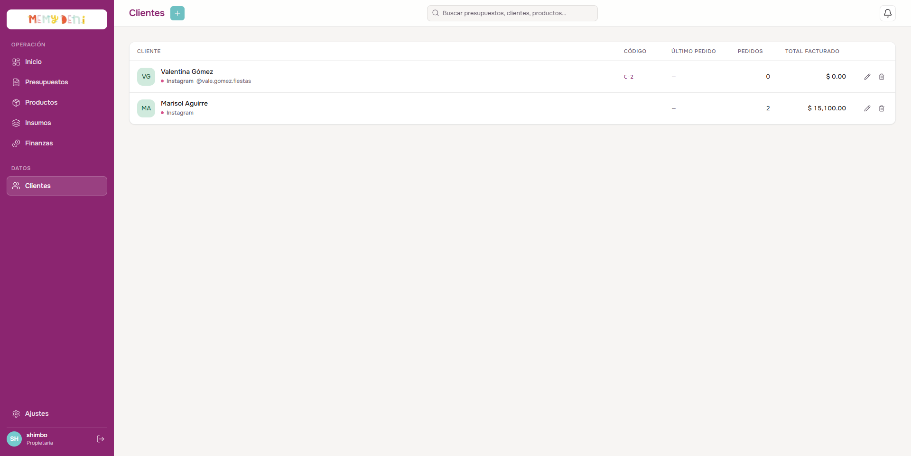
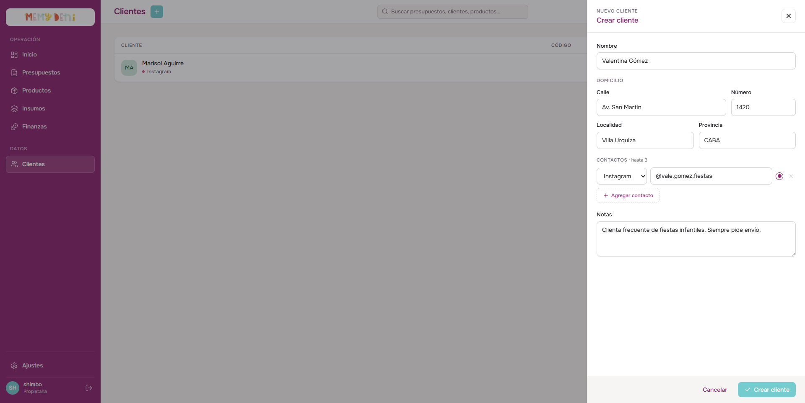

# Flujo de Creación de Cliente
Módulo Comercial · MemyDeni

## Contexto
Un cliente es cualquier persona o entidad que realiza un pedido o interactúa comercialmente con MemyDeni. Con el fin de mantener un microERP ágil y minimalista, el modelo de datos no contempla campos complejos de facturación B2B (como CUIT, razón social o condición tributaria).

Para lograr una estructura flexible y extensible, los medios de contacto viven en una tabla separada llamada `cliente_contactos` (relación $1:N$). Esto permite soportar múltiples canales de comunicación (redes sociales, mensajería, correo) sin alterar el esquema de la base de datos principal al añadir nuevos canales en el futuro.

---

## El Listado de Clientes
El listado de clientes centraliza la información general del contacto comercial, el canal principal de comunicación, la cantidad de pedidos realizados y el total histórico facturado.

### Accesos de Creación y Edición
* **Crear nuevo:** Ubicado en la esquina superior derecha del módulo. Al pulsarlo, se abre un panel lateral derecho vacío para ingresar los datos del nuevo cliente.
* **Editar:** Botón con icono de lápiz a la derecha de cada fila. Abre el panel lateral con los datos del cliente cargados.
* **Eliminar:** Botón con icono de basurero. Realiza una desactivación lógica en el sistema (`activo = false`) para conservar el historial de presupuestos emitidos.

---

## Formulario de Creación y Edición (Overlay)
Al iniciar la creación o edición, se despliega un panel lateral derecho que organiza secuencialmente el flujo del cliente.

### Paso 1 — Datos de Identidad
Esta sección captura los atributos de identidad y domicilio del cliente:

| Campo | Valor ejemplo | Notas |
|---|---|---|
| **Nombre** | Valentina Gómez | Campo obligatorio. Nombre real o apodo de uso operativo interno. |
| **Código** | `C-2` | Generado automáticamente con la nomenclatura `C-${id}`. |
| **Calle** | Av. San Martín | Nombre de la calle de residencia o entrega. |
| **Número** | 1420 | Altura del domicilio. |
| **Localidad** | Villa Urquiza | Municipio o localidad de residencia. |
| **Provincia** | CABA | Estado o provincia. |
| **Notas** | Clienta frecuente de fiestas infantiles. Siempre pide envío | Notas internas y observaciones del cliente legibles por el equipo. |
| **Cliente activo** | `true` (switch) | Activado por defecto. Al desactivarse, el cliente se oculta de los autocompletados sin eliminar sus presupuestos. |

---

### Paso 2 — Canales de Contacto
Los medios de contacto están vinculados en una relación relacional $1:N$ con la tabla `cliente_contactos`. No existe un límite estricto de canales por cliente.

| Tipo de Canal | Dirección / Valor | ¿Principal? |
|---|---|---|
| **Instagram** | `@vale.gomez.fiestas` | `true` (Marcado) |
| **WhatsApp** | `+54 9 11 5523 4481` | `false` |

#### Tipos de Canales Disponibles (ENUM):
El sistema soporta los siguientes canales por defecto:
* `instagram`
* `whatsapp`
* `mail`
* `otros`

#### Reglas de Operación de Contactos:
* **Canal Principal:** Solo puede haber un canal marcado como principal (`esPrincipal: true`) por cliente. Si el usuario marca otro contacto como principal, el contacto principal anterior cambia automáticamente a `false`.
* **Sugerencia en presupuestos:** Al crear un nuevo presupuesto para el cliente, el sistema lee automáticamente el contacto marcado como principal para sugerir el canal de comunicación y envío de cotizaciones.
* **Extensibilidad:** Agregar un tipo de canal nuevo al ENUM en la base de datos no requiere alterar la tabla principal de `clientes`.

---

## Resultado Final
Una vez que el cliente es creado correctamente, se le asigna su código secuencial (por ejemplo, `C-2`) y se asienta en la base de datos.

A partir de este momento, el cliente queda disponible en el catálogo de búsqueda de presupuestos. El usuario puede iniciar la creación de un nuevo presupuesto directamente seleccionando al cliente desde el autocompletado en el formulario comercial.

---

## Campos de Auditoría
* `createdAt` / `updatedAt`: Marcas de tiempo que registran de forma automática la fecha y hora de creación y última actualización del cliente en la base de datos.
* `activo`: Booleano de estado para borrado lógico.

> [!NOTE]
> La tabla `cliente_contactos` no cuenta con campos de auditoría independientes (como `createdAt` o `updatedAt`). Al tratarse de datos simples e instrumentales de contacto, su ciclo de vida y control de auditoría se gestiona a través del registro principal del cliente.

---

## Veto Aplicado
> [!IMPORTANT]
> **V12 — Sin columnas fijas de contacto en la tabla de clientes:**
> Los campos estáticos clásicos (`instagram`, `facebook`, `whatsapp`, `email`) fueron eliminados de la tabla de clientes y reemplazados por la estructura relacional de la tabla `cliente_contactos`. Esta decisión de arquitectura previene redundancias y evita tener que realizar migraciones o cambios estructurales en la tabla de clientes si en el futuro se incorpora un nuevo canal de comunicación.
