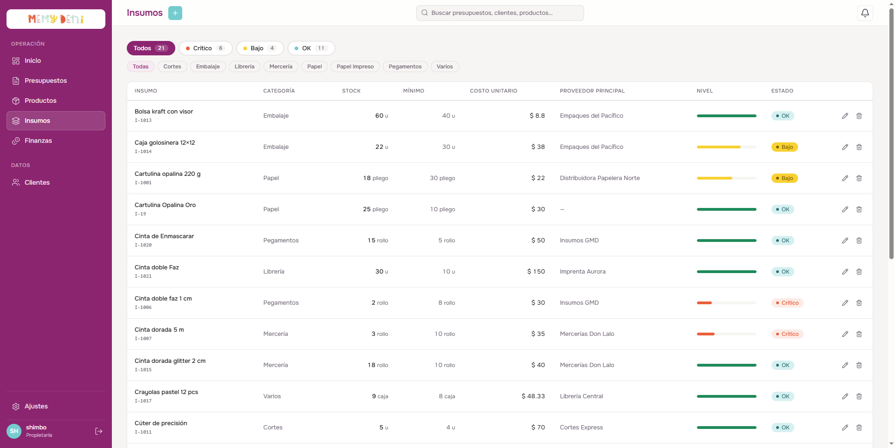
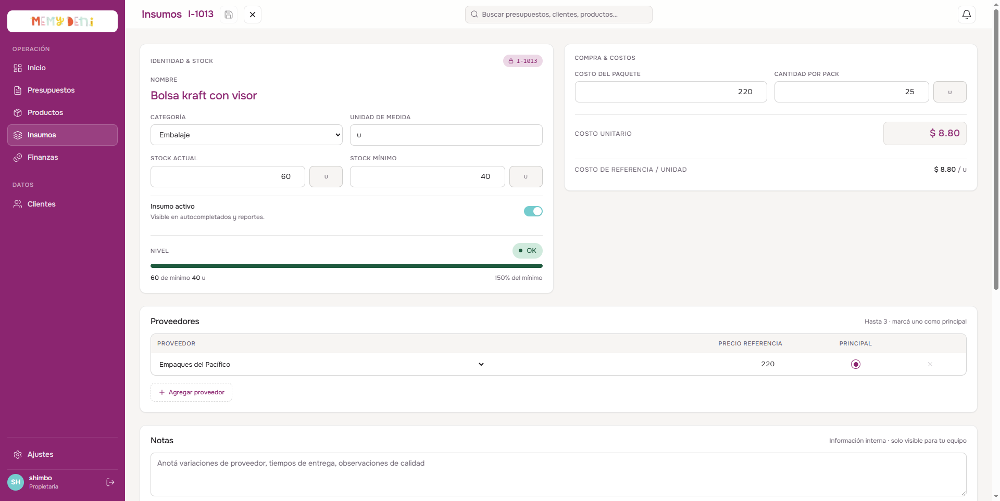

# Flujo de Creación y Edición de Insumo
Módulo Productos · MemyDeni

## Contexto
Un insumo es una materia prima que se compra en pack y se consume por unidad. El flujo de creación captura tanto los datos de identidad como la lógica de costeo que alimenta la BOM (receta) de los productos. Además, se permite tanto la creación directa desde el panel como la edición rápida mediante interacciones de doble clic o botones de acción en la tabla principal.

---

## El Listado de Insumos
El listado centraliza todos los insumos disponibles. Desde aquí se puede iniciar el flujo de creación o abrir el formulario de edición.

### Accesos de Edición
* **Doble clic en la fila:** Al hacer doble clic sobre cualquier fila en el cuerpo de la tabla se abrirá inmediatamente el overlay de edición. La fila cuenta con un cursor de tipo `pointer` y selección de texto deshabilitada (`user-select: none`) para asegurar una interacción limpia y fluida.
* **Botón Editar (Lápiz):** Ubicado en la columna de acciones rápidas al extremo derecho de cada fila. Abre el mismo panel de edición.

---

## Formulario de Creación y Edición (Overlay)
Al hacer clic en **"Crear nuevo"** o al interactuar con las opciones de edición en una fila, se desliza un panel de pantalla completa (overlay) que se organiza en secciones.

### Paso 1 — Datos de identidad
| Campo | Valor ejemplo | Notas |
|---|---|---|
| **Nombre** | Cartulina Opalina Oro | Nombre descriptivo completo — marca + medida + gramaje si aplica. |
| **Categoría** | Papel / Pegamentos / etc. | Relación (`FK`) con las categorías de insumo. Define el tipo de material. |
| **Unidad de medida** | pliego / rollo / u | Cómo se consume y fracciona (ej: pliego, m, rollo, u). |
| **Stock actual** | 25 | Cantidad física disponible en el taller. |
| **Stock mínimo** | 10 | Umbral de alerta para notificaciones de stock crítico o bajo. |
| **Insumo activo** | `true` (switch) | Borrado lógico — al desactivarse se oculta de autocompletados y reportes sin borrar el histórico. |

---

### Paso 2 — Datos de compra & Costeo
| Campo | Valor ejemplo | Notas |
|---|---|---|
| **Costo del paquete** | $ 150.00 MXN | Lo que se paga al proveedor por el pack completo. |
| **Cantidad por pack** | 5 | Cuántas unidades individuales contiene el paquete de compra. |
| **Costo unitario** | $ 30.00 MXN | Campo autocalculado: `costo_paquete / cantidad_pack`. |
| **Costo de referencia** | $ 30.00 / pliego | Visualización canónica del costo unitario fraccionado por su unidad de medida. |

> [!NOTE]
> **Cálculo automático del costo unitario:**
> $$\text{Costo unitario} = \frac{\text{Costo del paquete}}{\text{Cantidad por pack}}$$
> *Ejemplo:* $\$ 150.00 \div 5 \text{ unidades} = \$ 30.00 \text{ por unidad.}$
> El `costo_unitario` se computa y guarda automáticamente; el usuario no lo ingresa de forma manual.

---

### Paso 3 — Asignación de Proveedores
Se pueden vincular hasta 3 proveedores por cada insumo para registrar las diferencias de precios del mercado.

| Campo | Proveedor Principal | Proveedor Secundario |
|---|---|---|
| **Proveedor** | Insumos GMD | Mercerías Don Lalo |
| **Precio referencia** | $ 180.00 | $ 195.00 |
| **Principal** | `true` (seleccionado) | `false` |

> [!IMPORTANT]
> **Reglas de Gobernanza de Proveedores:**
> * Solo puede haber un proveedor marcado como **Principal** (`esPrincipal: true`) por insumo. Si se marca otro, el anterior se desmarca automáticamente.
> * El precio de referencia guardado por proveedor sirve como histórico, mientras que el campo **Costo del paquete** en la sección de compra actúa como el valor canónico para la BOM en ese momento.

---

### Paso 4 — Notas y Confirmación
* **Notas:** Campo de texto libre para anotaciones internas del equipo (variaciones de tiempos de entrega, observaciones de calidad del lote, etc.). No interfiere en cálculos ni reportes comerciales.
* **Acciones de pie:**
  * **Volver a insumos / Cerrar:** Si el formulario está modificado (estado `dirty`), solicitará confirmación para evitar la pérdida accidental de datos.
  * **Guardar cambios / Crear insumo:** Realiza las peticiones HTTP (`POST` o `PUT`) correspondientes y actualiza la tabla de forma reactiva.

---

## Resultado e Integración (BOM)
Una vez guardado el insumo, este se encuentra disponible en la base de datos con su identificador secuencial único (ej. `I-1020`). 

Cualquier producto que requiera este material en su receta (BOM) calculará su costo proporcional usando el `costo_unitario` generado del insumo:
$$\text{Subtotal de material} = \text{Cantidad consumida} \times \text{Costo unitario del insumo}$$

## Campos de Auditoría
* `fechaActualizacion`: Se registra automáticamente con la marca de tiempo de la última modificación para el seguimiento de la fluctuación de costos de materias primas.
* `codigo`: Generado secuencialmente en el formato `I-10XX` (ej: `I-1020`) a partir del consecutivo de ID del registro en base de datos.
