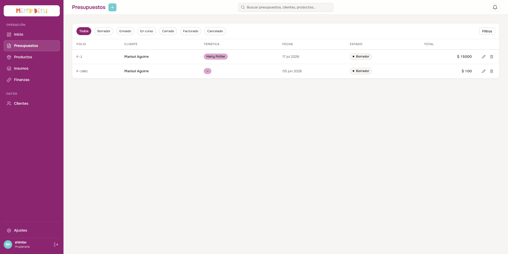
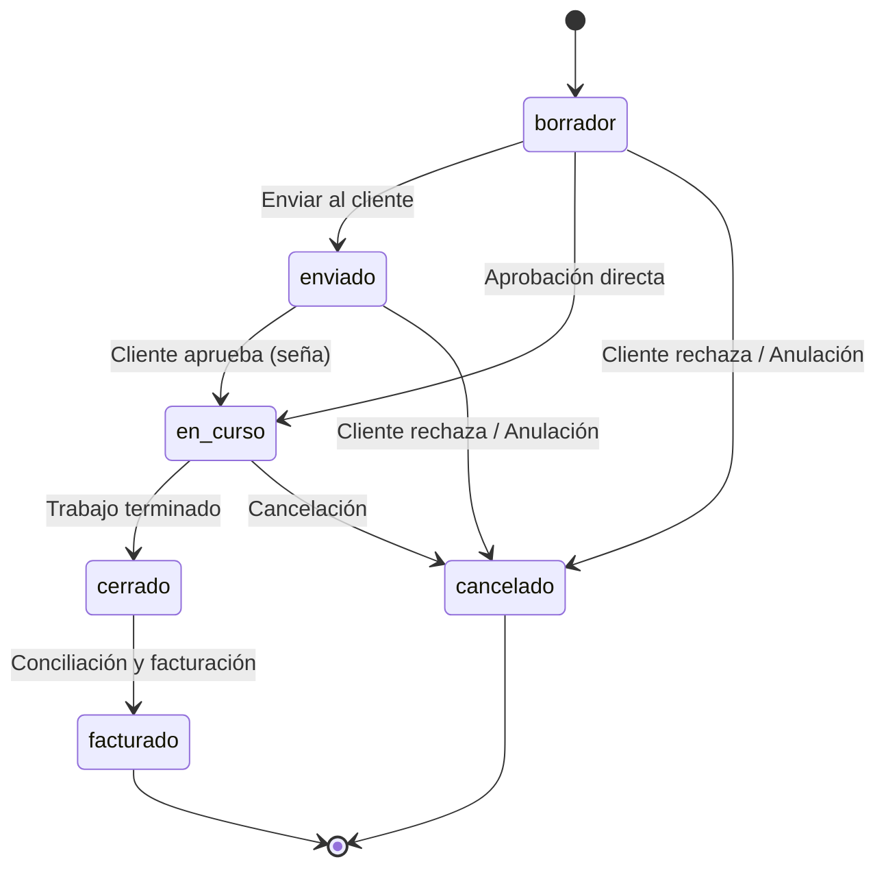
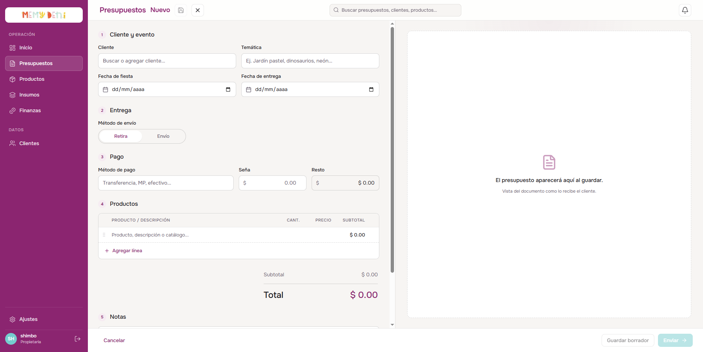

# Flujo de Creación y Estados de Presupuesto
Módulo Comercial · MemyDeni

## Contexto
El presupuesto es la entidad central de la operación comercial en Presumemi. Vincula a un cliente con un conjunto de productos del catálogo, define las fechas del evento y de entrega, establece las condiciones logísticas y de pago, y dispara la distribución contable automatizada al momento de facturar. Este flujo y sistema de estados digitalizados reemplaza la antigua gestión manual basada en carpetas compartidas de Google Drive.

---

## El Listado de Presupuestos
El panel comercial muestra el listado completo de los presupuestos emitidos. Permite buscar por cliente, temática o producto, y filtrar los registros según su estado de ciclo de vida.

### Accesos de Edición y Creación
* **Crear nuevo:** Al pulsar el botón **"Crear nuevo"** en la parte superior derecha de la vista, se desliza el panel lateral de pantalla completa con el formulario en blanco.
* **Editar:** Al hacer clic en el botón de lápiz o seleccionar la fila correspondiente, se abre el panel lateral con los datos cargados para su edición o actualización.
* **Filtros por estado:** Pestañas rápidas en el encabezado de la tabla para segmentar la lista por *Borrador*, *Enviado*, *En curso*, *Cerrado*, *Facturado* o *Cancelado*.

---

## Modelo de Estados (FSM)
El ciclo de vida de un presupuesto sigue una máquina de estados finitos (FSM) con transiciones reguladas para asegurar la coherencia comercial e histórica:

### Reglas de Transición
* **en_curso → cancelado:** El cliente rechaza la cotización o se cancela de forma automática tras expirar el periodo de espera (si está configurado).
* **en_curso → cerrado:** El cliente confirma el pedido, iniciándose el cierre operativo.
* **cerrado → facturado:** Conciliación contable formal del cobro total y emisión de la factura de venta.
* **Transiciones Prohibidas:**
  - `facturado` → ningún otro estado (el registro contable queda congelado).
  - `cancelado` → ningún otro estado.
  - `cerrado` → `cancelado` (no es posible anular un pedido ya cerrado y entregado sin devoluciones manuales).

---

## Formulario de Creación y Edición (Overlay)
El formulario de presupuestos se organiza en un panel estructurado en 5 pasos lógicos y una columna derecha de previsualización en vivo (Live Preview) que simula el documento final del cliente en tiempo real.

### Paso 1 — Identificación del Pedido
Define los datos descriptivos del pedido:

| Campo | Valor ejemplo | Notas |
|---|---|---|
| **Folio / Número** | `P-1001` | Generado automáticamente con la nomenclatura `P-${nextId}` correlativa. |
| **Cliente** | Valentina Gómez · `C-1041` | Relación (`FK`) con el catálogo de clientes registrado. |
| **Temática** | Harry Potter | Descriptor temático libre del evento. |
| **Estado** | `borrador` | Estado inicial asignado por defecto al crear el documento. |
| **Notas** | Confirmar diseño antes del 20 | Texto libre con observaciones y detalles internos del pedido. |

---

### Paso 2 — Fechas
El sistema realiza el seguimiento del cronograma a través de dos fechas críticas:

* **Fecha de fiesta:** Indica el día de la celebración del evento del cliente.
* **Fecha de entrega:** Día pactado para entregar los productos listos.
* **Fecha de finalización:** Se registra de forma automática en el sistema cuando el presupuesto pasa al estado `cerrado`.

> [!NOTE]
> **Margen de Trabajo y Puntualidad:**
> * La diferencia entre `fecha_entrega` y `fecha_fiesta` mide el margen de maniobra logística del taller.
> * La comparación entre `fecha_finalizacion` y `fecha_entrega` sirve para auditar internamente si el pedido fue terminado a tiempo o con demora.

---

### Paso 3 — Ítems (Detalle del Presupuesto)
La sección de artículos actúa como una hoja de cálculo densa dentro del formulario para cargar las cantidades y precios de venta.

| Producto / Descripción | Cantidad | Precio unitario | Subtotal |
|---|---|---|---|
| Aplique letra 14cm - HP | 12 | $\$ 1,200.00$ | $\$ 14,400.00$ |
| Tag personalizado - HP | 30 | $\$ 350.00$ | $\$ 10,500.00$ |
| Armado de mesa dulce | 1 | $\$ 8,000.00$ | $\$ 8,000.00$ |
| **Total General** | | | **$\$ 32,900.00$** |

$$\text{Subtotal de línea} = \text{Cantidad} \times \text{Precio unitario}$$
$$\text{Total Presupuesto} = \sum \text{Subtotal de línea}$$

> [!IMPORTANT]
> **Regla de Congelamiento de Precios e Ítems Libres:**
> * **Congelamiento de precio:** Cuando se asocia un producto al detalle del presupuesto, el `precioUnitario` se inicializa con el `precio_final` configurado en el catálogo en ese instante. Si en el futuro cambian los insumos y el precio del catálogo sube, el valor unitario en este presupuesto permanece intacto para respetar lo pactado.
> * **Ítems libres:** Permiten incluir servicios o adicionales libres escribiendo el texto descriptivo y asignando el precio manualmente (en el MVP actual se vincula a un registro del catálogo debido a restricciones de integridad de la base de datos).

---

### Paso 4 — Logística
Determina el método de entrega de los artículos:

* **Método de envío:** Selección binaria entre `Retira` (retiro por taller por parte del cliente) o `Envío` (despacho a domicilio).
* **Lugar de envío:** Dirección completa requerida únicamente si el método seleccionado es `Envío`. Al cerrar el presupuesto, la logística se actualiza y genera un registro de orden de despacho.

---

### Paso 5 — Condiciones de Pago
Registra el flujo de dinero acordado con el cliente:

* **Método de pago:** Campo de texto libre para detallar el medio utilizado (ej. Transferencia, Mercado Pago, Efectivo, o combinación de varios).
* **Monto de seña:** Pago adelantado registrado manualmente por el usuario.
* **Monto de resto:** El saldo pendiente de cobro.
* **Independencia de Pagos:**
  $$\text{Monto seña} + \text{Monto resto} \neq \text{necesariamente el Total del presupuesto}$$
  Esto permite al usuario aplicar descuentos discrecionales por pago en efectivo, redondeos manuales u otros acuerdos comerciales sin que la aplicación bloquee la transacción por discrepancias matemáticas con el total de los ítems.

---

### Paso 6 — Flags Operativos
Opciones booleanas para el control de insumos y recursos adicionales:
* **Comprar archivo:** Marcado si el cliente adquirió la propiedad digital de los diseños para uso propio.
* **Insumos especiales:** Indica si el diseño del pedido requiere la compra de materiales fuera de los estándares habituales de catálogo.

---

## Resultado — Distribución Contable Automatizada
Al cambiar el estado del presupuesto a `facturado`, el backend ejecuta un trigger contable que divide las ganancias de forma proporcional según las cuotas registradas en `distribucion_ganancias` (por defecto: Meme 40%, Pety 30%, Gastos 30%).

Para un presupuesto facturado de $\$ 32,900.00$ con un costo estimado de insumos y servicios de imprenta, el sistema desglosa y asienta automáticamente hasta 8 movimientos de transacciones financieras:
* **Ingreso:** $+\$ 17,900.00$ (saldo cobrado)
* **Egreso Insumos:** $-\$ 4,200.00$ (materiales del BOM)
* **Egreso Imprenta:** $-\$ 1,800.00$ (costos de cortes y plóter)
* **Retiro Meme (40%):** $-\$ 7,200.00$
* **Retiro Pety (30%):** $-\$ 5,400.00$
* **Retiro Gastos (30%):** $-\$ 5,400.00$

Este flujo automatizado elimina la necesidad de realizar los registros financieros de manera manual.

---

## Campos de Auditoría
* `folio`: Código incremental único de presupuesto (ej: `P-1001`).
* `createdAt` / `updatedAt`: Marcas de tiempo de creación y última actualización para el seguimiento del ciclo del presupuesto.
