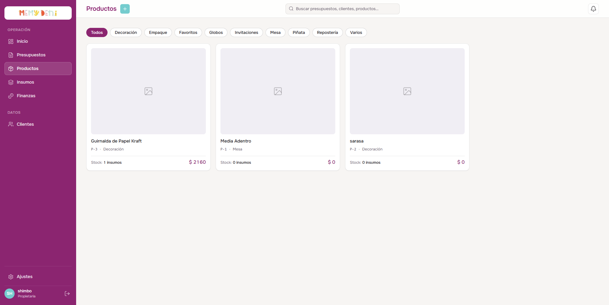
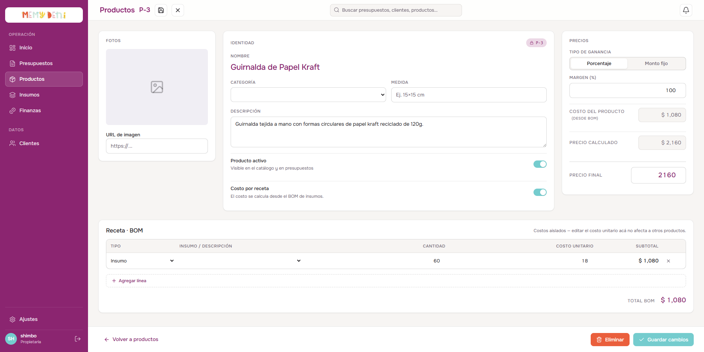

# Flujo de Creación y Receta de Producto
Módulo Productos · MemyDeni

## Contexto
Un producto representa la unidad final vendible dentro de nuestro catálogo. Su costo base puede ingresarse manualmente o calcularse dinámicamente mediante una receta (BOM - *Bill of Materials*). Su precio final se determina aplicando una ganancia configurable (por porcentaje o monto fijo) sobre el costo del producto, permitiendo ajustes y validaciones de margen en tiempo real.

---

## El Listado de Productos
El listado de productos se presenta en formato de cuadrícula (grid) de tarjetas de productos, permitiendo visualizar rápidamente sus fotos, códigos, categorías, número de insumos asociados y precio final de venta.

### Accesos de Edición y Creación
* **Clic en la tarjeta:** Al hacer clic sobre cualquier tarjeta de producto en el catálogo, se desliza el panel lateral derecho (overlay) para su edición.
* **Botones de Acción:** Al pasar el cursor sobre una tarjeta (hover), se revelan botones de acción rápida para **Editar** (icono de lápiz) y **Eliminar** (icono de basurero).
* **Crear Nuevo:** Desde el botón **"Crear nuevo"** (ubicado en el encabezado global al estar en la sección de Productos) se abre el panel lateral vacío para la creación de un nuevo producto.

---

## Formulario de Creación y Edición (Overlay)
Al iniciar la creación o edición, se despliega un panel lateral derecho que organiza secuencialmente el flujo del producto.

### Paso 1 — Datos básicos (Identidad)
Esta sección captura los atributos descriptivos del producto:

| Campo | Valor ejemplo | Notas |
|---|---|---|
| **Nombre** | Vaso polipapel personalizado | Nombre descriptivo completo. |
| **Categoría** | Varios | Relación (`FK`) con las categorías de producto. Determina el tipo de producto. |
| **Medida** | 250ml · 8cm alto | Dimensiones físicas o presentación del producto (se almacena en el campo de descripción/detalles). |
| **Descripción** | Vaso de polipapel con impresión full color en una cara | Texto libre detallado con características especiales de diseño o empaque. |
| **Producto activo** | `true` (switch) | Borrado lógico (`activo`). Si está inactivo, se oculta de los autocompletados en la creación de presupuestos. |

---

### Paso 2 — BOM (Lista de materiales)
El usuario puede decidir cómo se determina el costo del producto utilizando el control **"Costo por receta"** (`tieneBom`):

* **Costo manual (Switch desactivado):** El campo del costo del producto se desbloquea para ingresar un valor de forma directa.
* **Costo por receta (Switch activado):** El campo de costo queda en solo lectura y se autocalcula como la suma total de las líneas registradas en el BOM:
  $$\text{Costo del producto} = \sum \text{Subtotal de cada línea BOM}$$

#### Estructura de la Tabla BOM (Receta):
Al hacer clic en **"Agregar línea"** se inserta una fila en la receta con los siguientes campos editables:
1. **Tipo de línea:** Selector con las opciones `Insumo`, `Cameo`, `Embalaje` y `Extra`.
2. **Insumo / Descripción:** Selector con autocompletado si el tipo es `Insumo`, `Cameo` o `Embalaje` (obtenido del catálogo centralizado de insumos). En caso de ser `Extra`, se habilita como un campo de texto libre.
3. **Cantidad:** Selector numérico con control de incremento decimal de la cantidad utilizada en la receta.
4. **Costo unitario:** Costo del recurso por unidad de medida.
5. **Subtotal:** Calculado dinámicamente en la fila:
   $$\text{Subtotal} = \text{Cantidad} \times \text{Costo unitario}$$

> [!IMPORTANT]
> **Regla de Aislamiento de Costos (Aislamiento de la Receta):**
> Al agregar una línea de tipo insumo, el **Costo unitario** se inicializa copiando el costo unitario de referencia del insumo en ese instante (`insumos.costo_unitario`). Sin embargo, el usuario puede modificar libremente este costo unitario directamente en la tabla BOM.
> * **Esta edición afecta únicamente al producto actual.**
> * No se propaga de vuelta al catálogo general de insumos ni altera a otros productos que compartan dicho recurso.
> * Los cortes de plotter Cameo se seleccionan del catálogo como insumos normales de la categoría "Cortes", no de una tabla separada.

---

### Paso 3 — Ganancia
La ganancia admite dos modalidades de cálculo configurables mediante la opción **"Tipo de ganancia"**:

#### A. Porcentaje (%)
El precio calculado incrementa el costo base aplicando el porcentaje de margen definido:
$$\text{Precio calculado} = \text{Costo del producto} \times \left(1 + \frac{\text{Margen (\%)}}{100}\right)$$

*Ejemplo:* Para un costo de $\$ 593.00$ y un margen del $80\%$:
$$\text{Precio calculado} = \$ 593.00 \times \left(1 + \frac{80}{100}\right) = \$ 1,067.40$$

#### B. Monto fijo ($)
El precio calculado se compone sumando directamente la ganancia absoluta al costo:
$$\text{Precio calculado} = \text{Costo del producto} + \text{Ganancia fija}$$

*Ejemplo:* Para un costo de $\$ 593.00$ y una ganancia fija de $\$ 500.00$:
$$\text{Precio calculado} = \$ 593.00 + \$ 500.00 = \$ 1,093.00$$

---

### Paso 4 — Precio final
* **Precio calculado:** Campo numérico de solo lectura generado automáticamente según la fórmula del Paso 3.
* **Precio final:** El valor de venta oficial aprobado manualmente por el usuario. Al escribir en este campo, el sistema recalcula de forma inversa el margen/ganancia para mantener la coherencia.
* **Precio ambientadora:** Variante opcional para el canal de venta alternativo de ambientación (si aplica).
* **Estado de validación del precio final:**
  
  | Estado | Condición de Activación | Nivel visual | Comportamiento |
  |---|---|---|---|
  | **Sin Precio** (`sin_precio`) | El `precio_final` es nulo, vacío o igual a `0`. | `Advertencia` | El producto requiere un precio aprobado antes de venderse. |
  | **Bajo Margen** (`error`) | El `precio_final` es menor que el `precio_calculado`. | `Crítico` | Indica que el producto se está ofreciendo por debajo de la ganancia esperada. |
  | **Margen Ok** (`ok`) | El `precio_final` es mayor o igual al `precio_calculado`. | `Normal` | Margen de ganancia saludable y aprobado. |

---

## Integración con Presupuestos (Congelamiento de Precios)
Cuando un producto se añade a un presupuesto, el valor que se registra en `precioUnitario` del detalle es el `precio_final` configurado en ese instante.

> [!NOTE]
> **Inmutabilidad Histórica:**
> Si los costos de los insumos aumentan en el futuro y la receta del producto incrementa su costo calculado, **los presupuestos que ya fueron emitidos no se verán alterados ni recalculados**, garantizando la inmutabilidad de los precios congelados acordados con los clientes.

## Campos de Auditoría
* `codigo`: Código secuencial autogenerado con la nomenclatura `P-${id}` (ej: `P-3`).
* `activo`: Booleano para el borrado lógico en la base de datos (oculta el producto sin borrar el histórico).
* `createdAt` / `updatedAt`: Marcas de tiempo que registran la fecha de creación y última actualización del registro para auditoría de precios.
