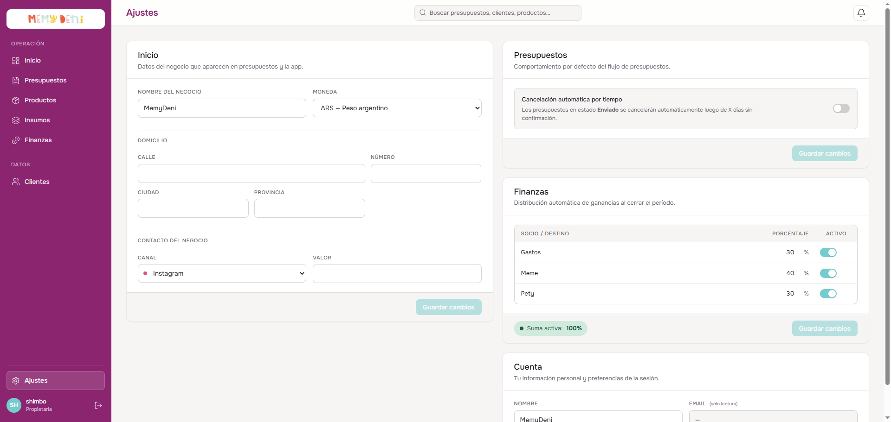
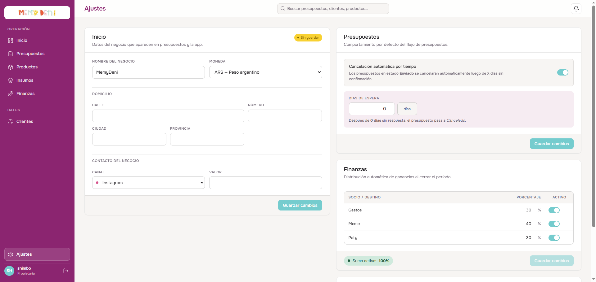

# Flujo del Módulo de Ajustes
Configuración General · MemyDeni

## Contexto
El módulo de Ajustes centraliza los parámetros operativos del negocio. A través de este módulo, las propietarias configuran las variables estáticas y las reglas de negocio automatizadas que alteran el comportamiento de la aplicación en el backend y los datos de contacto que se muestran en los documentos de presupuesto dirigidos a los clientes.

El diseño está optimizado en una estructura de dos columnas que divide las responsabilidades en bloques independientes para evitar la sobrecarga visual.

---

## Interfaz General de Ajustes
La pantalla se divide en cuatro bloques agrupados por áreas funcionales para asegurar simplicidad operativa.

---

## Bloque 1 — Inicio (Identidad y Contacto)
Contiene la información de identidad comercial básica de MemyDeni. Estos campos se inyectan dinámicamente en el encabezado y pie de página de los presupuestos PDF o de la vista web del cliente.

### Campos de Configuración:
* **Nombre del negocio:** Nombre operativo de la marca (ej. `MemyDeni`).
* **Moneda:** Moneda por defecto utilizada en la aplicación. Soporta `ARS`, `USD`, `EUR` u `Otra moneda…`.
* **Domicilio (Calle, Número, Ciudad, Provincia):** Domicilio físico de retiro o facturación del negocio.
* **Contacto del negocio (Canal y Valor):** Canal preferencial de comunicación pública. El selector de canal cambia de color según el tipo de canal (WhatsApp en verde, Instagram en rosa, Correo en verde azulado y Otros en gris) y se asocia con el valor público (ej. usuario de Instagram o número telefónico).

Al modificar cualquier campo de esta sección, se activa un indicador visual en el encabezado del bloque que dice **Sin guardar**, habilitando el botón **Guardar cambios** que ejecuta un `PUT` hacia `/api/ajustes/configuracion`.

---

## Bloque 2 — Presupuestos (Lógica Condicional)
Este bloque define la automatización de la validez y ciclo de vida de las cotizaciones emitidas a los clientes.

### Cancelación Automática por Tiempo
El sistema cuenta con un switch que activa o desactiva la caducidad lógica de presupuestos en estado **Enviado**.

* **Estado desactivado:** Los presupuestos enviados no tienen fecha de vencimiento lógica y permanecen abiertos indefinidamente.
* **Estado activo (condicional):** Al activar el switch, se despliega dinámicamente un campo para ingresar los **Días de espera** válidos.

#### Lógica de Vencimiento:
Una vez transcurridos los días de espera ingresados sin que el cliente confirme el presupuesto, el backend cambia de forma automática el estado de la cotización a **Cancelado** (mediante la lógica de la máquina de estados FSM).

---

## Bloque 3 — Finanzas (Distribución de Socios)
Este bloque gestiona los destinos de la utilidad del negocio al cierre de cada ciclo financiero mensual. Permite dividir las ganancias entre socias y fondos de reinversión.

### Reglas de Operación y Validación:
1. **Asignación de porcentajes:** Cada fila representa una socia o fondo (ej. *Meme*, *Pety*, *Gastos*). El porcentaje de reparto se ingresa libremente.
2. **Suma de control (Suma activa):** El sistema calcula en tiempo real la suma total de los porcentajes asignados a los destinos marcados como **Activo**.
3. **Validación obligatoria de 100%:** 
   * Si la suma activa es exactamente **100%**, el indicador de suma se muestra en color verde (OK) y permite guardar la configuración.
   * Si la suma es menor o mayor a 100%, el indicador se torna rojo mostrando la advertencia de error y el botón **Guardar cambios** se bloquea automáticamente para evitar estados financieros inconsistentes.

La acción de guardar ejecuta una actualización en lote mediante `PUT` hacia `/api/ajustes/distribucion`.

---

## Bloque 4 — Cuenta (Sesión de Usuario)
Muestra la información de la cuenta activa que ha iniciado sesión en el ERP.

* **Nombre de usuario:** Nombre de la propietaria o administrador en sesión.
* **Email:** Dirección de correo de acceso.
* **Estado:** Es de solo lectura para evitar modificaciones accidentales en el perfil del usuario activo.

---

## Estructura de Datos y API
El módulo interactúa con dos tablas principales del modelo relacional en PostgreSQL:
1. `config` (**ConfiguracionNegocio**): Almacena las variables del negocio e inicio de sesión.
2. `distribucion_ganancia` (**DistribucionGanancia**): Almacena las filas de distribución de las ganancias.

### Rutas API Utilizadas:
* `GET /api/ajustes/configuracion` — Obtiene los parámetros del negocio.
* `PUT /api/ajustes/configuracion` — Guarda los cambios de identidad y ruteo de presupuestos.
* `GET /api/ajustes/distribucion` — Obtiene la lista de destinos de distribución de utilidades.
* `PUT /api/ajustes/distribucion` — Guarda los porcentajes actualizados de los socios en lote.
