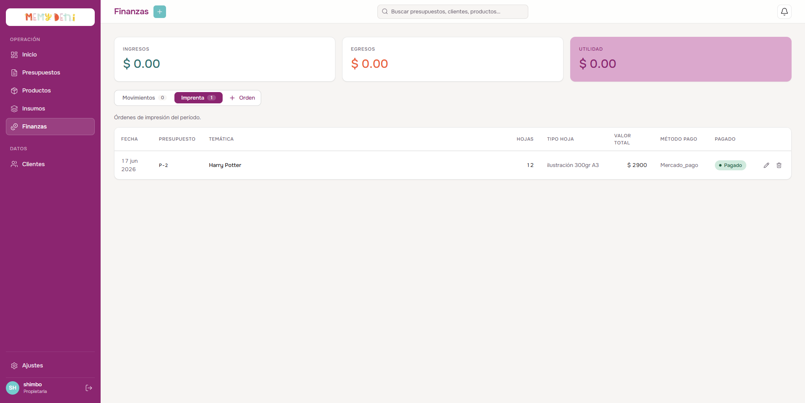
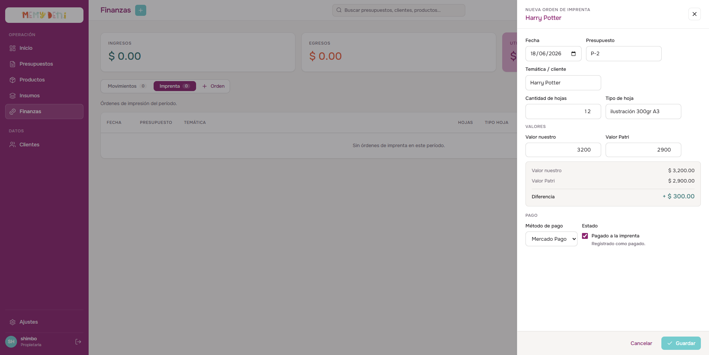
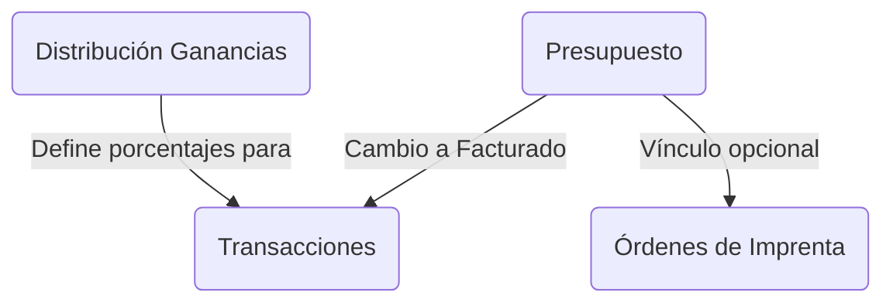

# Flujo del Módulo Finanzas
Módulo Finanzas · MemyDeni

## Contexto
El módulo Finanzas registra todos los movimientos de dinero del negocio, parametriza cómo se distribuyen las ganancias entre las socias y gestiona los pedidos a la imprenta tercerizada (Patri). Este módulo reemplaza por completo las antiguas planillas de Excel "Cuentas 2022/2023/2024/2025" y el cuaderno manual de control de imprenta.

---

## Estructura de Vistas de Finanzas
El módulo se divide en dos secciones principales mediante pestañas en la cabecera:
1. **Movimientos:** Registro central de transacciones financieras (libro diario).
2. **Imprenta:** Registro y control de las órdenes de impresión enviadas a la imprenta tercerizada.

---

## Tabla 1 — Distribución de Ganancias (`distribucion_ganancias`)
Parametriza el porcentaje en que se reparten los ingresos netos entre las socias y los gastos del taller. Solo contiene 3 filas activas (una por concepto):

| ID | Concepto | Porcentaje | Activo | Archivado |
|---|---|---|---|---|
| **1** | Meme | $40.00\%$ | `true` | `false` |
| **2** | Pety | $30.00\%$ | `true` | `false` |
| **3** | Gastos | $30.00\%$ | `true` | `false` |

### Reglas de Operación:
1. **Archivado permanente:** Si una fila se marca como archivada (`archivado = true`), se fuerza su desactivación (`activo = false`) de forma inmutable. Una fila archivada nunca puede reactivarse.
2. **Límite de porcentajes:** La suma de porcentajes de las filas activas no puede superar el $100.00\%$:
   $$\sum \text{Porcentaje (donde activo = true)} \le 1.0000$$
   Si al registrar o modificar una distribución la suma supera el $100.00\%$, la aplicación rechaza la operación informando al usuario (validado en la capa de negocio sin triggers complejos en la base de datos).
3. **Reactivación:** Una fila con `activo = false` y `archivado = false` puede volver a activarse si cambian las condiciones comerciales del taller.
4. **Uso en el sistema:** Se consulta de forma automática únicamente cuando un presupuesto cambia a estado `facturado` para asentar la partición de dinero correspondiente.

---

## Tabla 2 — Transacciones (`transacciones`)
El libro diario del negocio. Cada fila representa un movimiento individual de entrada o salida de dinero:

| Campo | Tipo | Descripción |
|---|---|---|
| **id** | `Int` | Identificador único incremental (`PK`). |
| **fecha** | `DateTime` | Fecha del movimiento financiero. |
| **presupuestoId** | `Int?` | Vínculo opcional (`FK`) con un presupuesto si el movimiento se deriva de un pedido. |
| **cuenta** | `Enum` | Cuenta afectada: `banco` \| `mercado_pago` \| `efectivo` \| `tarjeta` \| `billetera`. |
| **tipo** | `Enum` | Tipo de movimiento comercial (ver categorías abajo). |
| **monto** | `Decimal` | Valor de la transacción (positivo = ingreso, negativo = egreso). |
| **detalle** | `String` | Concepto o nota descriptiva libre. |
| **nroFactura** | `String?` | Número de comprobante fiscal cuando aplique. |

### Tipos de Movimientos Disponibles (`TipoTransaccion`):
Mapea exactamente las columnas de control de las planillas históricas del taller:
* `ingresos` (venta de presupuestos, cobro a clientes)
* `insumos` (compra de materias primas)
* `cameo` (gastos de imprenta / corte)
* `embalaje` (cajas, bolsas de envío)
* `meme` / `pety` (retiros individuales de socias)
* `gastos` (servicios, mantenimiento)
* `iva` / `monotributo` / `contadora`
* `comisiones` / `intereses`

---

## Distribución Automática al Facturar
Al cambiar el estado de un presupuesto a `facturado`, el backend consulta los porcentajes de la tabla `distribucion_ganancias` y genera de forma automática hasta 8 registros en la tabla de transacciones de forma atómica:

*Ejemplo:* Presupuesto folio `P-1119` con un total de $\$ 32,900.00$:
* **Ingreso:** $+\$ 17,900.00$ (en la cuenta seleccionada por cobro de saldo del presupuesto `P-1119`).
* **Egreso Insumos:** $-\$ 4,200.00$ (costo calculado de materiales).
* **Egreso Cameo (Cortes):** $-\$ 1,800.00$ (costos de imprenta Patri).
* **Retiro Meme (40%):** $-\$ 7,200.00$ (asentado en cuenta banco).
* **Retiro Pety (30%):** $-\$ 5,400.00$ (asentado en cuenta banco).
* **Retiro Gastos (30%):** $-\$ 5,400.00$ (retenido para fondo de gastos).

> [!NOTE]
> Todos los movimientos resultantes quedan vinculados con el `presupuestoId = 1119`, lo que permite rastrear y auditar de forma granular la trazabilidad financiera del pedido en cualquier reporte.

---

## Tabla 3 — Órdenes de Imprenta (`ordenes_imprenta`)
Esta tabla gestiona las piezas enviadas a imprimir con Patri (imprenta tercerizada).

| Campo | Valor ejemplo | Notas |
|---|---|---|
| **Fecha** | `2026-06-18` | Fecha en que se solicita el trabajo. |
| **Presupuesto** | `P-2` | Vínculo opcional (`FK` a `Presupuesto.id`) para trazar costos de imprenta por pedido. |
| **Temática / Cliente** | Harry Potter | Nombre del pedido o temática para control visual. |
| **Hojas** | 12 | Cantidad de pliegos/hojas impresas. |
| **Tipo de hoja** | Ilustración 300gr A3 | Tipo de material de soporte utilizado. |
| **Valor nuestro** | $\$ 3,200.00$ | Estimación o costo de referencia cobrado al cliente. |
| **Valor Patri** | $\$ 2,900.00$ | Importe real facturado por la imprenta. |
| **Método pago** | Mercado Pago | Cuenta o billetera desde la que se abona. |
| **Pagado** | `true` (checkbox) | Estado de pago de la orden a la imprenta. |

### Auditoría de Rendimiento de Imprenta:
La comparación directa entre la estimación y el precio cobrado por la imprenta genera una métrica de precisión:
$$\text{Diferencia} = \text{Valor nuestro} - \text{Valor Patri}$$
$$\text{Diferencia} = \$ 3,200.00 - \$ 2,900.00 = \$ 300.00 \text{ a favor del negocio}$$
Esto permite auditar si el taller está cotizando los pliegos por encima o por debajo del costo real del proveedor.

---

## Tabla 4 — Envíos (Postergada)
* **Estado actual:** Postergada para una etapa posterior de desarrollo.
* **Funcionalidad futura:** Almacenará la información de envío (destinatarios, transportista, códigos de seguimiento y etiquetas) para los presupuestos con `metodo_envio = 'envio'` evitando la doble carga de datos.
* **Gobernanza:** Registros contables de tipo histórico e inmutables.

---

## Relaciones del Módulo

---

## Campos de Auditoría
* **Transacciones:** Cuenta únicamente con `createdAt` para registrar el momento exacto del movimiento. Al ser un libro contable inmutable, no dispone de campo `updatedAt`.
* **Órdenes de Imprenta:** Cuenta con `createdAt` y `updatedAt` para auditar el ciclo de impresión y actualización de facturas de Patri.

---

## Vetos de Arquitectura Aplicados
* **V1 — Sin contabilidad de partida doble:** El sistema registra transacciones mediante un libro diario de partida simple categorizada. Esto reduce la complejidad de la lógica contable y facilita el mantenimiento por parte de las socias.
* **V8 — Sin triggers complejos en base de datos:** El backend de la aplicación Hono procesa e inserta los registros financieros en un solo bloque atómico de base de datos.
* **V13 — Sin validaciones de bases de datos para sumas de porcentajes:** Las restricciones matemáticas ($\le 100\%$) se controlan estrictamente en la capa de negocio de la aplicación antes de la persistencia de datos.
