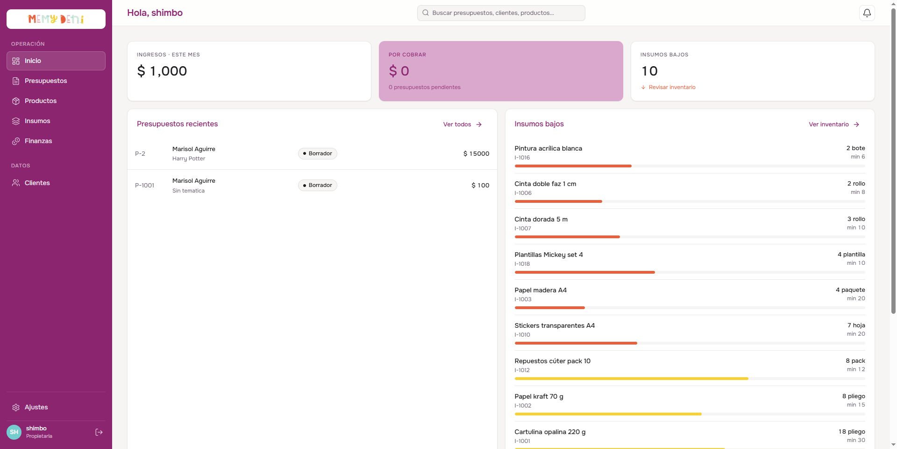
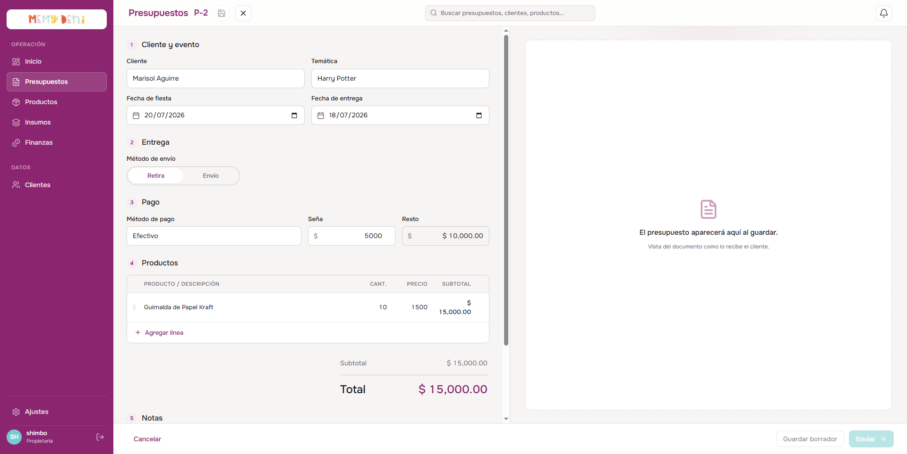
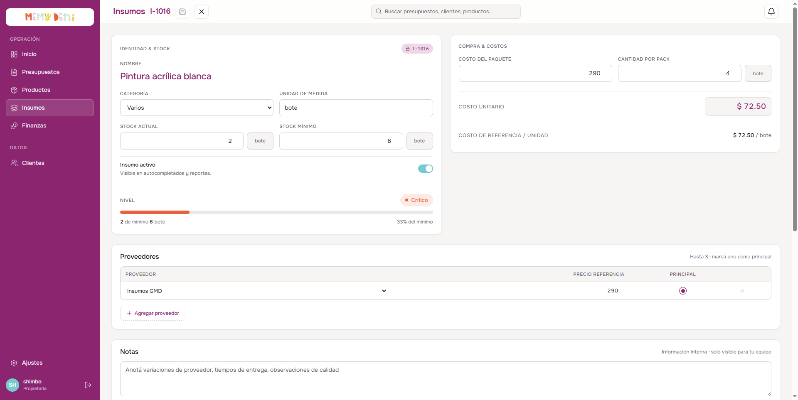

# Flujo de Navegación desde Inicio (Dashboard)
Panel de Inicio · MemyDeni

## Contexto
El panel de inicio (Dashboard) actúa como el centro de comandos de MemyDeni. Su objetivo principal es ofrecer a las propietarias una vista consolidada de la salud del negocio (ingresos, cuentas por cobrar, estado del stock de insumos y ventas recientes) sin sobrecargarlas de información.

Para maximizar la velocidad operativa y la comodidad del usuario (*Vibe*), las listas de "Presupuestos recientes" y de "Insumos bajos" son completamente interactivas. Al presionar sobre cualquier elemento de estas tablas, el sistema realiza una transición fluida al módulo correspondiente y abre automáticamente el panel lateral ("drawer") de edición del registro seleccionado, precargando toda su información desde el servidor.

---

## El Panel de Inicio (Dashboard)
La pantalla principal organiza de manera visual los principales indicadores clave de rendimiento (KPIs) e históricos de venta.



### Elementos Interactivos del Dashboard:
* **KPI Insumos bajos:** Muestra el contador de insumos críticos o con stock por debajo del mínimo recomendado.
* **Presupuestos recientes:** Tabla que lista las últimas 5 cotizaciones creadas. Cada fila es interactiva y hace de puente directo hacia su edición.
* **Insumos bajos:** Lista de los insumos que requieren reposición urgente. Cada elemento abre de manera directa la ficha del material.
* **Botón "Ver todos" / "Ver inventario":** Enlaces rápidos para navegar a las vistas completas de cada módulo de forma plana.

---

## Flujo de Edición de Presupuesto desde el Dashboard

Al hacer clic en cualquier fila de la tabla **Presupuestos recientes**, el sistema ejecuta una navegación hacia el módulo comercial inyectando un parámetro de consulta (`query`) en la URL:

```typescript
// Al hacer clic en una fila del dashboard
router.push({ name: 'presupuestos', query: { edit: p.folio } })
```

Esto despliega la vista de presupuestos en la URL `/presupuestos?edit=P-XX`.



### Lógica de Carga y Renderizado:
1. **Detección de URL:** El componente `PresupuestosView.vue` vigila de manera reactiva el parámetro de edición y el estado del almacén de datos (Pinia store):
   ```typescript
   watch(
     [() => route.query.edit, () => store.hasFetched],
     ([editVal, hasFetched]) => {
       if (editVal && hasFetched) {
         const p = store.data.find(item => item.folio === editVal || String(item.id) === editVal)
         if (p) handleEdit(p)
       }
     },
     { immediate: true }
   )
   ```
2. **Ciclo de Vida en Montaje (onMounted):** Si el componente se monta por primera vez con el cajón abierto (por ejemplo, al recargar la página directamente con la URL query), la lógica en `onMounted` de `PresupuestoEditor.vue` asegura que los datos se lean una vez completadas las dependencias del catálogo:
   ```typescript
   if (props.open) {
     await loadPresupuesto()
     openEditor()
   }
   ```
3. **Carga Robusta de Detalles (API):** Dado que el listado general del ERP no carga la lista completa de artículos para optimizar ancho de banda, la función `loadPresupuesto()` realiza una petición bajo demanda al backend si el objeto inicial no cuenta con el arreglo de líneas:
   ```typescript
   if (!p.detalles) {
     const res = await get<{ data: Presupuesto }>(`/presupuestos/${p.id}`)
     p = res.data
   }
   ```
   *Nota: También configuramos el listado del backend (`GET /api/presupuestos`) para incluir los detalles por defecto, asegurando doble consistencia.*

---

## Flujo de Edición de Insumo desde el Dashboard

Al presionar sobre un insumo en la lista de **Insumos bajos** del panel de inicio, se navega hacia el módulo de almacén pasándole el código único en el query:

```typescript
// Al hacer clic en un insumo del dashboard
router.push({ name: 'insumos', query: { edit: i.codigo } })
```

Esto transiciona al usuario a `/insumos?edit=I-XXXX`.



### Lógica de Carga y Reactividad:
1. **Vigilancia reactiva:** `InsumosView.vue` observa el código en la URL y activa el overlay del insumo pasándole el objeto correspondiente del store de Pinia.
2. **Precarga en onMounted:** `InsumoDetalle.vue` intercepta la carga inicial en su ciclo `onMounted`. Si la ficha se abre de manera directa, descarga de manera asíncrona los catálogos y proveedores necesarios antes de poblar el formulario:
   ```typescript
   onMounted(async () => {
     if (props.open) {
       // Carga catálogos de categorías y proveedores
       await loadCatalogs()
       loadInsumo()
       openOverlay()
     }
   })
   ```
3. **Observador Multivariable:** Vigila de manera simultánea el estado de visibilidad (`open`) y el objeto seleccionado (`insumo`). Esto permite al usuario cambiar el insumo en edición de forma consecutiva sin necesidad de cerrar y volver a abrir el panel.

---

## Campos de Auditoría y Control de Cambios
Al realizar modificaciones en los registros a través de los paneles abiertos desde el dashboard, el sistema mantiene la consistencia relacional y auditoría:
* `updatedAt` se actualiza automáticamente en la base de datos de Supabase PostgreSQL mediante Prisma.
* Se recalcula el stock y los niveles de alerta en tiempo real en el Dashboard al confirmarse cualquier cambio.
