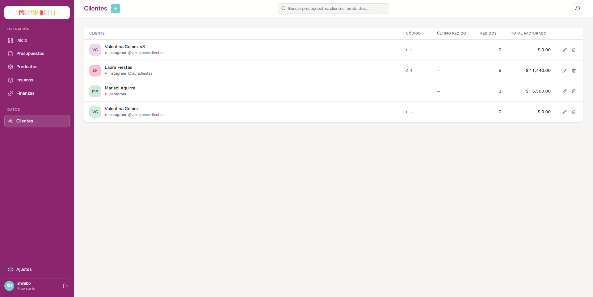
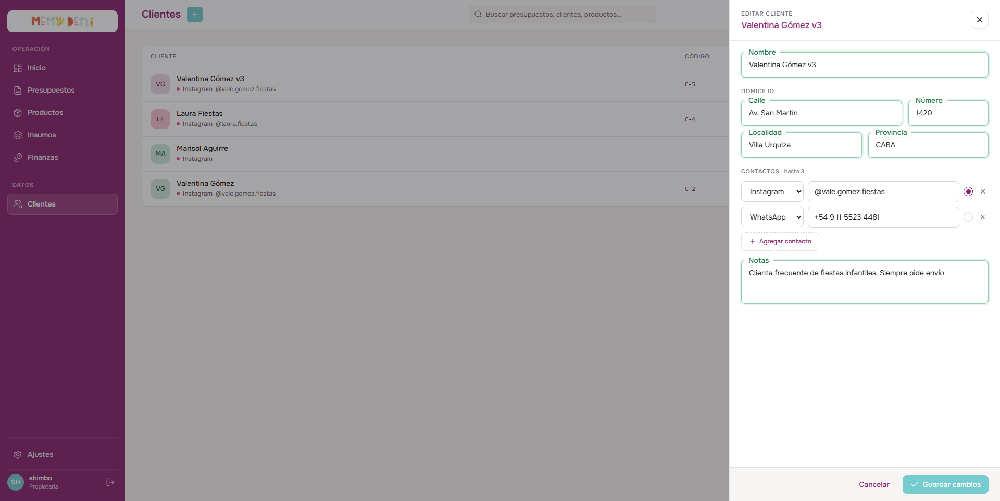

# Flujo de Creación de Cliente
Módulo Comercial · MemyDeni

## Contexto general
El flujo de creación y edición de clientes permite registrar y actualizar a las personas o entidades que interactúan comercialmente con MemyDeni. El microERP mantiene un diseño minimalista enfocado en la agilidad de carga, por lo que no contempla campos de facturación compleja (como identificaciones tributarias o razones sociales). 

Para lograr una arquitectura flexible y extensible, los datos de contacto viven en una tabla relacional independiente (`cliente_contactos` con relación $1:N$), lo que permite que un cliente tenga múltiples canales de comunicación sin redundancias ni modificaciones en la estructura de la base de datos principal.

---

## Accesos y navegación
El usuario puede interactuar con el flujo de clientes a través de los siguientes accesos en la vista `/clientes`:

1. **Crear cliente:** Botón "Nuevo cliente" ubicado en la cabecera superior derecha de la sección. Al pulsarlo, se despliega el panel lateral derecho (`ClienteDrawer.vue`) en su estado vacío para iniciar la carga.
2. **Editar cliente:** Botón con el ícono de lápiz en la columna de acciones a la derecha de la fila correspondiente en la tabla. Al pulsarlo, se despliega el panel lateral con los datos del cliente cargados en los campos de edición.
3. **Eliminar cliente:** Botón con el ícono de basurero en la columna de acciones. Solicita confirmación en pantalla y, al aceptar, realiza una desactivación lógica en el sistema (`activo = false`). Esto oculta al cliente de futuras búsquedas o autocompletados pero conserva todo su historial comercial intacto (presupuestos previos y facturación).

---

## El Listado de Clientes
La vista principal del módulo comercial presenta una tabla estructurada de forma densa y limpia, optimizada para la lectura rápida.

### Estructura de la Tabla de Datos

| Columna | Alineación | Formato / Valor de Ejemplo | Descripción y Reglas Visuales |
| :--- | :--- | :--- | :--- |
| **CLIENTE** | Izquierda | Valentina Gómez   `• WhatsApp: +54 9 11 5523 4481` | Muestra un avatar circular con las iniciales del nombre (color asignado dinámicamente de una paleta mediante hash del nombre), el nombre principal y, debajo en menor tamaño (`--ink-muted`), el canal de contacto principal (dot de color del canal, etiqueta y valor). |
| **CÓDIGO** | Izquierda | `C-2` | Código identificador secuencial con la nomenclatura `C-${id}` generado automáticamente por la base de datos. |
| **ÚLTIMO PEDIDO** | Izquierda | `08/06/2026` / `—` | Fecha en formato local de la última cotización confirmada o `—` si no registra pedidos. |
| **PEDIDOS** | Derecha (num) | `12` | Cantidad total de presupuestos confirmados en estado `en_curso`, `cerrado` o `facturado`. Usa fuente tabular (`font-variant-numeric: tabular-nums`). |
| **TOTAL FACTURADO**| Derecha (num) | `$ 1,250.00` | Suma histórica acumulada de presupuestos facturados o en curso. Formato de moneda localizado sin el sufijo de país en tablas densas. |

---

## Formulario de Creación y Edición (ClienteDrawer)
El panel lateral derecho se abre con una transición suave de 220ms y un ancho fijo de `520px`. Utiliza una capa de fondo traslúcida (scrim) con `z-index: 80` y el panel tiene `z-index: 81` para evitar bloqueos de foco y apilamiento.

<!-- slide -->
> [!NOTE]
> **Marcador de Posición para Captura:**
> 
> *(Captura de pantalla referencial que muestra el drawer de creación/edición con campos vacíos e inputs floating-label)*

### Paso 1 — Identidad y Domicilio
Se compone de campos basados en el componente reutilizable `FloatingField` (estética unificada de label flotante animada tipo "wave", foco violeta, bordes coloreados por estado y label tipo píldora).

| Campo | Componente / Tipo | Requerido | Valor Ejemplo | Notas / Reglas de Validación |
| :--- | :--- | :--- | :--- | :--- |
| **Nombre** | `FloatingField` (Texto) | **Sí** | Valentina Gómez | Validado por Zod (`min(1)`). Si se pierde el foco y está vacío, el borde se tiñe de rojo (`--coral-500`) y muestra un mensaje inline de alerta `role="alert"`. |
| **Calle** | `FloatingField` (Texto) | No | Av. San Martín | Nombre de la calle para entregas. Opcional. |
| **Número** | `FloatingField` (Texto) | No | 1420 | Altura física de la dirección. Opcional. |
| **Localidad** | `FloatingField` (Texto) | No | Villa Urquiza | Localidad, municipio o alcaldía. Opcional. |
| **Provincia** | `FloatingField` (Texto) | No | CABA | Estado o provincia. Opcional. |

---

### Paso 2 — Contactos Dinámicos
Los canales de contacto se gestionan de forma dinámica en una lista repetible directamente dentro del formulario. El sistema permite registrar **hasta 3 contactos** por cliente.

| Elemento | Control / Componente | Opciones / Formato | Reglas de Operación |
| :--- | :--- | :--- | :--- |
| **Tipo de Canal** | Select clásico | `Instagram` (default), `WhatsApp`, `Mail`, `Otros` | Selector directo mapeado al enumerado del backend. |
| **Valor de Contacto** | Input de texto clásico | `@vale.gomez.fiestas` | Dirección, teléfono o casilla. Si el contacto tiene texto pero no se cargó el valor, la validación de Zod arroja un error al guardar. |
| **Principal** | Botón de selección circular (Radio) | Activo / Inactivo | Solo puede haber un canal principal (`esPrincipal: true`) seleccionado. Si se marca otro, el anterior se desactiva de forma automática. |
| **Eliminar Contacto**| Botón con ícono `X` (Cruz) | Hover en tono coral | Borra la fila de contacto. Se deshabilita si queda solo un contacto para evitar dejar al cliente sin canales. Si se borra el contacto marcado como principal, el primer contacto restante asume la propiedad de principal automáticamente. |
| **Agregar Contacto** | Botón dashed con ícono `Plus` | "Agregar contacto" | Añade una nueva fila de contacto con tipo `instagram` y valor vacío. Se deshabilita al alcanzar el límite estricto de 3 contactos. |

---

### Paso 3 — Notas Internas
Un campo de notas de texto multilínea opcional para anotaciones y especificaciones operativas.

* **Notas:** Campo `FloatingField` multilínea (textarea). Muestra un placeholder de uso interno: *"Información interna · solo visible para tu equipo"*.

---

## Reglas de Validación y Gobernanza del Negocio

> [!IMPORTANT]
> **Validación en Tiempo Real y Accesibilidad:**
> Los campos clave como el **Nombre** están asociados a Zod schemas en el frontend (`web/src/schemas/clientes.ts`).
> Para garantizar la accesibilidad (WCAG 2.2):
> * Todos los inputs y selectores tienen IDs descriptivos únicos (`cl-nombre`, `cl-calle`, `cl-notas`, etc.) y etiquetas `<label>` vinculadas explícitamente mediante el atributo `for`.
> * Las alertas de error de validación utilizan elementos con `role="alert"` e IDs asociados a los inputs correspondientes a través de `aria-describedby` y `aria-invalid`.

> [!NOTE]
> **Regla de Contacto en Presupuestos:**
> Al confeccionar un presupuesto para un cliente determinado, el sistema recupera el canal de contacto marcado como principal (`esPrincipal: true`). Si existe, el editor del presupuesto sugiere de forma automática la vía de envío del documento (por ejemplo, el botón directo de redirección para enviar cotizaciones a WhatsApp).

> [!CAUTION]
> **Advertencia de Cambios Pendientes:**
> Si el usuario intenta cerrar el drawer lateral haciendo clic en el scrim, presionando `Escape` o pulsando el botón "Cancelar" y existen modificaciones en los campos (`dirty` es `true`), el sistema bloquea el cierre y despliega un cuadro de diálogo de confirmación (`ConfirmDialog`) con el mensaje: *¿Salir sin guardar? Tenés cambios pendientes en este cliente. Si salís ahora, vas a perderlos.* El usuario puede decidir volver a la edición o descartar los cambios.

---

## Campos de Auditoría e Historial de Base de Datos
* **`id` / `codigo`:** Asignados automáticamente. El código se compone de la inicial `C-` seguido del ID secuencial del registro.
* **`activo`:** Control de borrado lógico. Al desactivarse, el cliente no aparecerá en el autocompletado del editor de presupuestos pero su registro se mantiene intacto.
* **`createdAt` / `updatedAt`:** Marcas de tiempo de creación y modificación automática.
