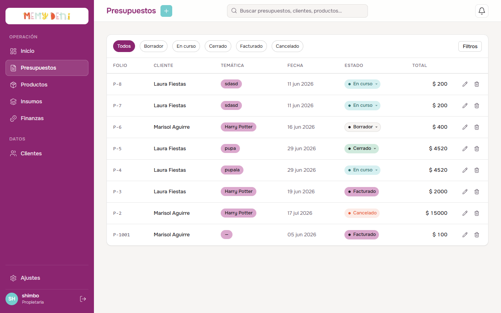
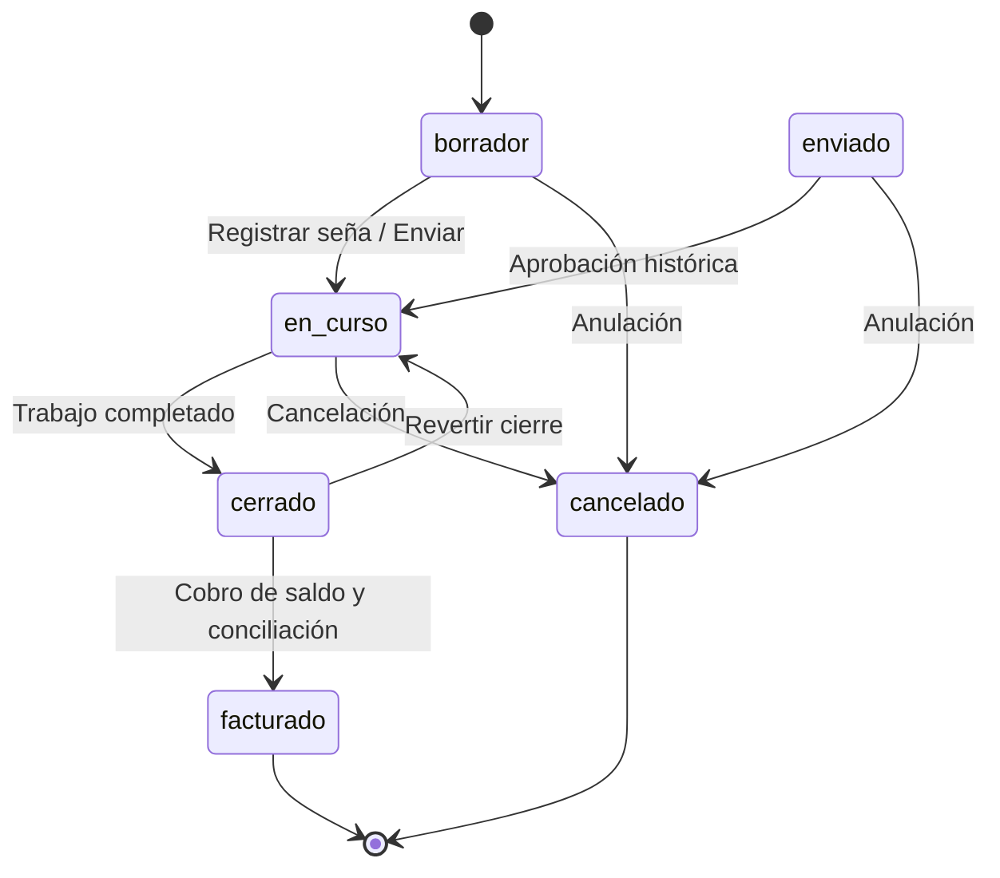
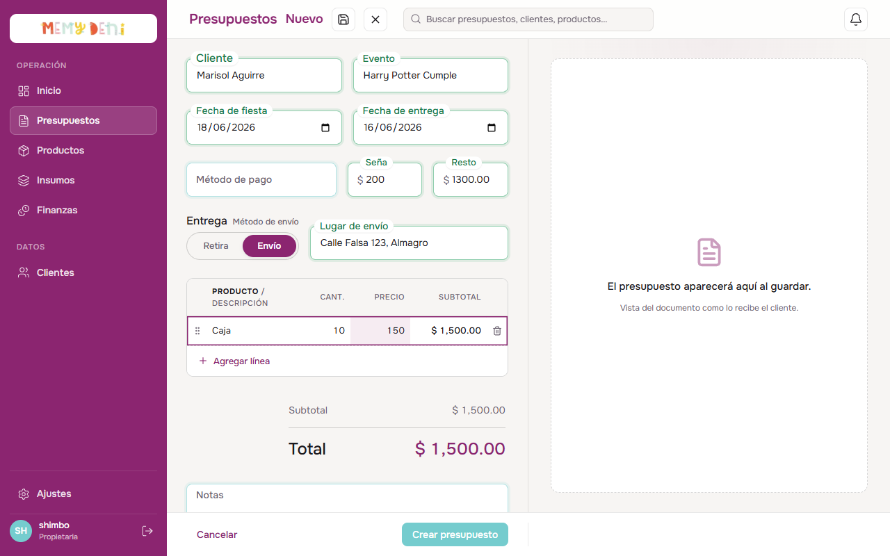

# Flujo de Creación y Estados de Presupuesto
Módulo Comercial · MemyDeni

## Contexto general
El presupuesto es el documento central de la operación comercial en MemyDeni. Conecta a un cliente del catálogo con una lista de productos personalizados, gestiona el cronograma de fechas críticas del evento, define las condiciones logísticas y de pago, y automatiza la contabilidad interna mediante una distribución de ingresos por socio al momento de la facturación. 

Este flujo automatizado reemplaza la gestión manual desestructurada, garantizando consistencia histórica a través de reglas de gobernanza comercial fijas, tales como el congelamiento de precios del catálogo al momento de cotizar y la validación estricta de transacciones de estado.

---

## Accesos y navegación
El usuario interactúa con el flujo comercial en la vista `/presupuestos`:

1. **Crear presupuesto:** Botón "Nuevo presupuesto" en la cabecera superior derecha de la sección. Al pulsarlo, se desliza el editor de presupuestos en pantalla completa (`PresupuestoEditor.vue`) en su estado vacío.
2. **Editar presupuesto:** Al hacer clic en el botón de lápiz o seleccionar la fila de la tabla, se abre el mismo editor con los datos cargados. Si el presupuesto se encuentra en estado `cerrado` o `facturado`, el formulario se bloquea para impedir modificaciones.
3. **Filtros rápidos por estado:** Pestañas en el encabezado de la tabla para segmentar la lista de forma optimista por su estado actual en la máquina de estados.

---

## El Listado de Presupuestos
La vista principal de presupuestos presenta una tabla de cotizaciones estructuradas cronológicamente.

### Estructura de la Tabla de Datos

| Columna | Alineación | Formato / Valor de Ejemplo | Descripción y Reglas Visuales |
| :--- | :--- | :--- | :--- |
| **FOLIO** | Izquierda | `P-8` | Identificador único incremental con nomenclatura `P-${id}`. |
| **CLIENTE** | Izquierda | Laura Fiestas | Nombre del cliente asociado (proviene de la base de datos). |
| **TEMÁTICA** | Izquierda | Harry Potter | Nombre del evento o temática descriptor libre. |
| **ESTADO** | Centro | `Borrador` / `En curso` / `Cerrado` | Badge coloreado e interactivo que permite cambiar el estado optimistamente mediante un menú desplegable personalizado. |
| **ENTREGA** | Izquierda | `Envío` / `Retira` | Vía logística pactada. |
| **FECHA FIESTA** | Izquierda | `08/06/2026` | Fecha local de celebración del evento. |
| **TOTAL** | Derecha (num) | `$ 2,000.00` | Suma calculada de los subtotales de ítems en fuente tabular (`font-variant-numeric: tabular-nums`). |

---

## Modelo de Estados (FSM)
El ciclo de vida del presupuesto sigue una máquina de estados finitos (FSM) con transiciones atómicas validadas en el backend para preservar la integridad financiera:

### Reglas de Transición de Estados
* **`borrador`**: Estado inicial. Totalmente editable. Permite el envío de presupuestos a través de canales dinámicos.
* **`en_curso`**: Presupuesto aprobado. El cliente ha entregado una seña. Sigue siendo editable por si surgen cambios en el diseño.
* **`cerrado`**: Trabajo finalizado en taller. Registra de forma automática la marca de tiempo `fechaFinalizacion`. **Bloquea la edición del formulario.**
* **`facturado`**: Estado terminal. Se ha cobrado el resto pendiente y se ejecuta de manera transaccional la distribución contable por socio. **No admite cambios de ningún tipo.**
* **`cancelado`**: Estado terminal. Anulado por rechazo del cliente. Libera el compromiso de stock.

---

## Formulario de Creación y Edición (PresupuestoEditor)
El editor se compone de un formulario dividido en secciones de diseño denso a la izquierda, y una columna de **Previsualización en Vivo (Live Preview)** a la derecha que refleja el documento final del cliente en tiempo real y permite guardarlo como PDF o compartir su link público.

### Estructura de Secciones del Formulario

#### Sección 1 — Cliente y Evento
* **Cliente:** Campo de entrada `FloatingField` con datalist autocompletable. Requiere un match estricto con un cliente real del sistema (`clienteId > 0`). Si se escribe un nombre que no existe, el campo se pone en rojo y bloquea el guardado.
* **Evento (Temática):** Campo `FloatingField` de texto libre para detallar el motivo o temática del evento.
* **Notas Internas:** Campo de texto multilínea opcional para aclaraciones de producción.

#### Sección 2 — Pago
* **Método de pago:** Selector `FloatingSelect` para elegir la vía financiera (Efectivo, Transferencia, Tarjeta, etc.).
* **Seña:** Campo numérico `FloatingField` (con prefijo `$`). Requiere valores mayores o iguales a cero.
* **Resto:** Campo de solo lectura coloreado dinámicamente en verde que muestra la diferencia a cobrar: `Total - Seña`.

> [!NOTE]
> **Tolerancia a Descuentos y Redondeos:**
> La suma de `Seña` y `Resto` no está validada de forma estricta contra el `Total` de productos. Esto permite al usuario aplicar de forma discrecional descuentos de pago, redondeos o acuerdos rápidos sin que el sistema rechace la cotización.

#### Sección 3 — Entrega
* **Método de envío:** Control segmentado (`SegmentedControl.vue`) accesible para alternar entre `Retira` y `Envío`.
* **Fecha de fiesta & Fecha de entrega:** Inputs de tipo fecha. La fecha de entrega sirve de alerta en la agenda de taller.
* **Lugar de envío:** Dirección completa. Es obligatoria y se despliega dinámicamente solo si el método es `Envío`.

#### Sección 4 — Productos (Tabla de Líneas Spreadsheet)
Diseñada como una planilla densa e interactiva con comportamiento de hoja de cálculo:
* **Autocompletado de Producto:** Al seleccionar o escribir un producto en la celda y salir, se completa su precio unitario configurado y se asigna automáticamente una cantidad inicial de `1` si el casillero estaba vacío.
* **Navegación con teclado:** Al presionar `Enter` en una celda, se confirma el valor. Si no se modificó la celda, un segundo `Enter` hace foco en la celda de la fila inferior. Si no hay fila inferior, se agrega una nueva línea en blanco de forma automática.
* **Prune de filas vacías:** Al hacer click fuera de la tabla (blur general), las filas incompletas o vacías se eliminan automáticamente del formulario para evitar registros con errores.
* **Validación inline:** Si una fila tiene precio o cantidad pero carece de producto, se resalta con bordes rojos y muestra alertas aria de error.
* **Grip de arrastre:** Ícono visible únicamente en hover de fila para reordenamiento manual. La papelera de eliminación rápida queda visible de forma atenuada.

---

## Automatización y Gobernanza del ERP

> [!IMPORTANT]
> **Congelamiento de Precios Pactados:**
> Al agregar un artículo de catálogo en las líneas, el sistema congela el precio unitario del producto en ese instante. Si en el futuro se actualizan los costos de insumos y sube el precio de lista del catálogo, las cotizaciones y presupuestos previos en curso o cerrados conservan su valor original, respetando el acuerdo comercial con el cliente.

> [!NOTE]
> **Trigger Contable de Facturación (Distribución Contable):**
> Al transicionar el estado a `facturado`, el backend ejecuta de forma transaccional una distribución de ingresos neta dividida entre los socios y cuentas configuradas en la base de datos (ej: Meme 40%, Pety 30%, Gastos 30%), registrando simultáneamente:
> * El ingreso del saldo pendiente (`total - seña`).
> * El egreso estimado de materiales basado en la receta (BOM) del producto.
> * El egreso de órdenes de imprenta asociadas al pedido.

> [!IMPORTANT]
> **Generación de PDF con Puppeteer y Supabase Storage:**
> Al cambiar el estado de un presupuesto, el backend levanta de forma asíncrona un proceso de Puppeteer que genera un PDF navegando a la ruta pública `/p/:token?pdf=1` (diseño optimizado para impresión A4 mediante CSS print media queries). El PDF resultante se almacena en el bucket privado de Supabase Storage `presupuestos-pdf`, permitiendo al usuario descargar copias firmadas en cualquier momento.

> [!CAUTION]
> **Control de Salida Limpia (isDirty):**
> Si el usuario intenta salir del editor con cambios sin guardar en los campos o líneas, el sistema evalúa la discrepancia contra el snapshot inicial y despliega un cuadro de diálogo de advertencia `ConfirmDialog` para evitar pérdidas accidentales.

---

## Verificación Visual y Multimedia

### Listado con Nuevo Presupuesto Guardado
Una vez completado el flujo y guardado el borrador, el listado actualiza la tabla mostrando el folio nuevo y el estado correspondiente:

### Video del Recorrido Completo (Walkthrough)
Se ha grabado un video interactivo que reproduce paso a paso todo el flujo de creación del presupuesto desde el inicio hasta su guardado final y retorno al listado:

🎥 **Ver Video del Recorrido:** [flujo_creacion_presupuesto.mp4](file:///d:/Desarrollando/presumemy/docs/MVP/mvp%20correcciones/v3/media/flujo_creacion_presupuesto.mp4)
