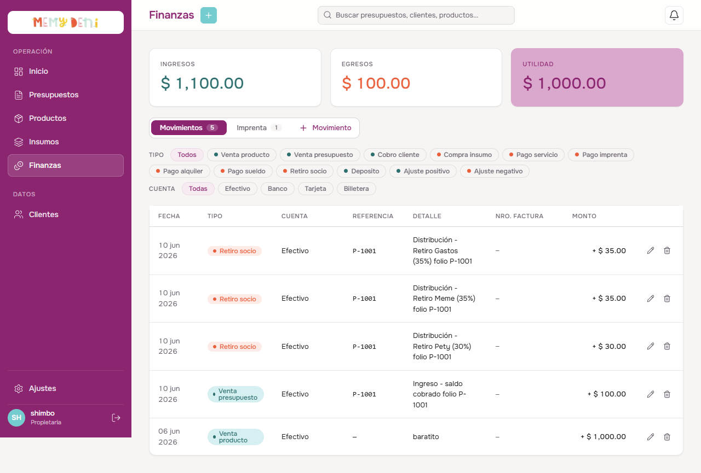
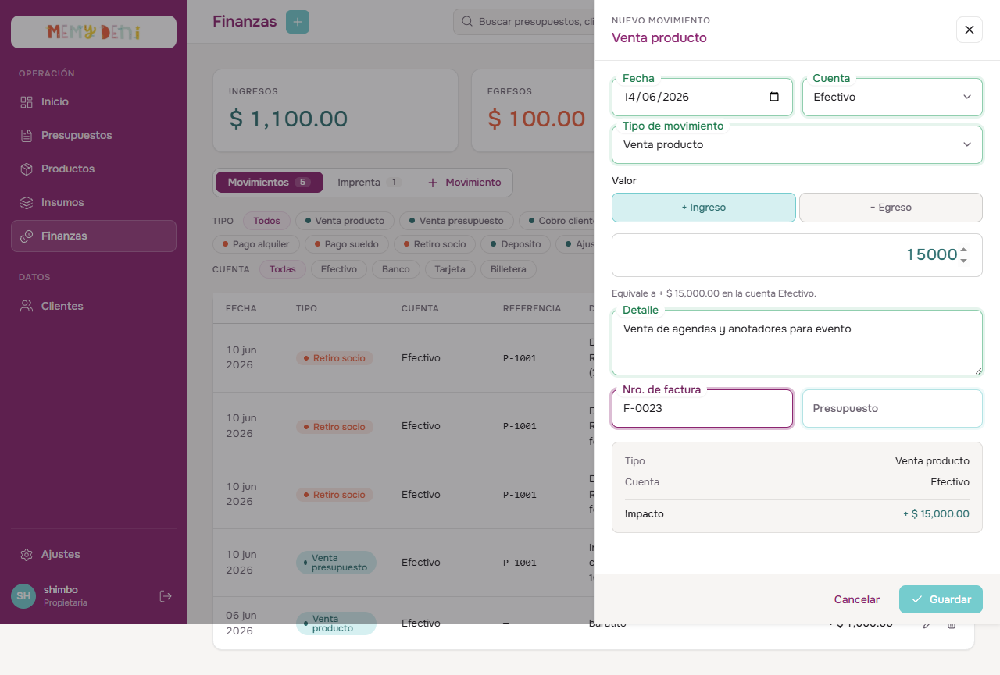
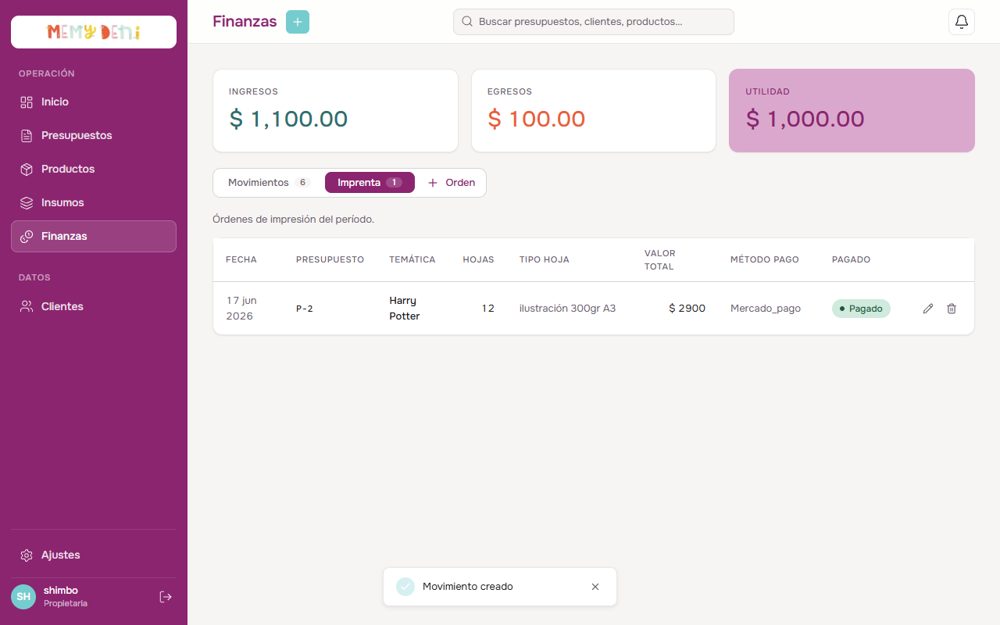
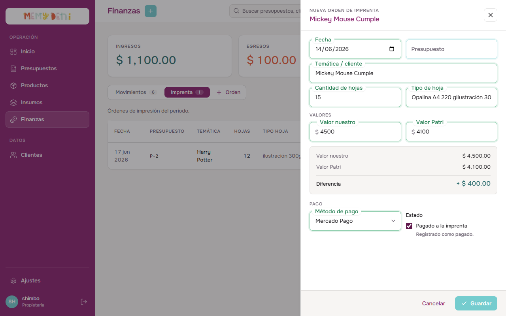
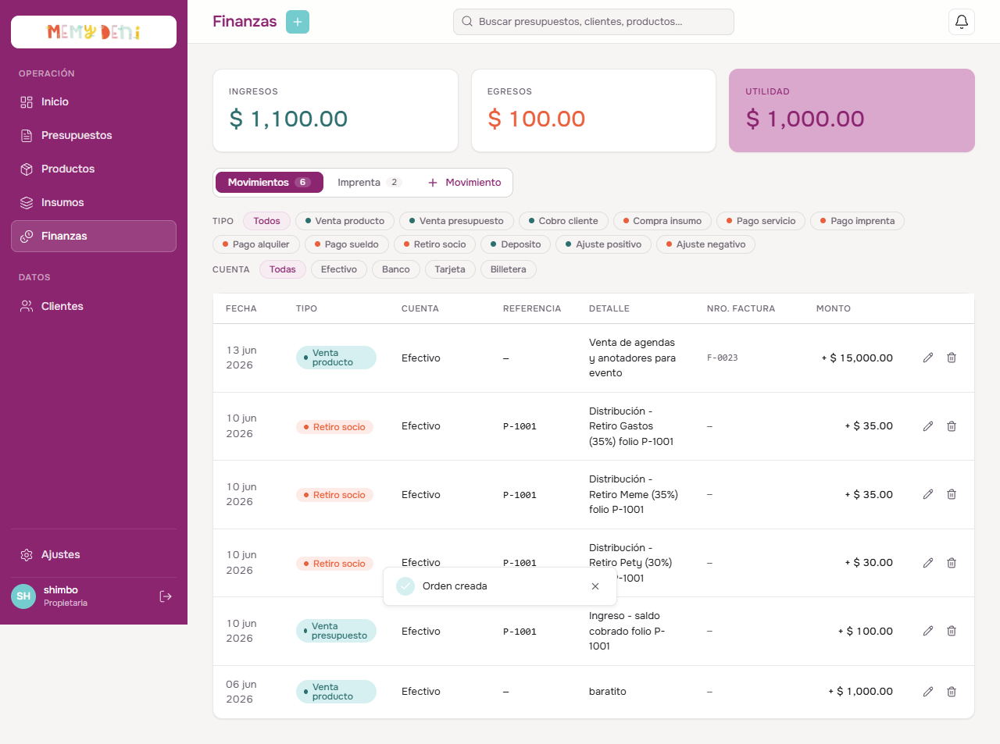

# Flujo del Módulo Finanzas
Módulo Finanzas · MemyDeni

## Contexto general
El módulo de Finanzas actúa como el libro contable de MemyDeni. Registra y totaliza todos los movimientos de ingresos y egresos de dinero (partida simple categorizada), administra el registro de los pliegos enviados a la imprenta tercerizada (*Patri*) y calcula la distribución de utilidades por socio de forma automatizada al momento de la facturación. 

Este módulo reemplaza por completo el registro manual e inestable en cuadernos de taller y las planillas de Excel históricas (*Cuentas 2022/2023/2024/2025*).

---

## Accesos y navegación
El usuario gestiona las finanzas accediendo a la ruta `/finanzas` desde la barra lateral:

* **Ubicación:** Botón "Finanzas" (icono de gráfico o dólar) en la sección superior de la barra lateral.
* **Secciones de la Vista:** Organizada mediante dos pestañas (tabs) superiores:
  1. **Movimientos:** Libro diario centralizado con filtros por tipo de transacción y cuenta bancaria.
  2. **Imprenta:** Registro y control de gastos de impresión y pliegos tercerizados.
* **KPIs Mensuales:** Cabecera con tres tarjetas totalizadoras de rendimiento del período actual: **Ingresos**, **Egresos** y la **Utilidad** neta calculada.

---

## Pestaña 1 — Movimientos (El Libro Diario)
Presenta el listado cronológico de transacciones financieras. Cuenta con filtros interactivos por tipo de transacción y cuenta para facilitar las conciliaciones.

### Estructura de Campos en MovimientoDrawer

| Campo | Componente UI | Valor Ejemplo | Reglas de Validación / Comportamiento |
| :--- | :--- | :--- | :--- |
| **Fecha** | `FloatingField` | `2026-06-14` | **Requerido.** Fecha local del movimiento monetario. |
| **Cuenta** | `FloatingSelect` | Efectivo | **Requerido.** Cuenta afectada (Banco, Mercado Pago, Efectivo, Tarjeta, Billetera). |
| **Tipo de movimiento** | `FloatingSelect` | Venta producto | Categoría del movimiento comercial (mapea columnas históricas). |
| **Signo** | Botonera segmentada | `+ Ingreso` | Alternador de dirección (+ Ingreso / − Egreso). Se preselecciona solo según el tipo. |
| **Valor** | Input numérico nativo | `$ 1,500.00` | **Requerido y positivo (mayor a 0).** Monto nominal del movimiento. |
| **Detalle** | `FloatingField` multilínea | Venta de agendas y anotadores para evento | Concepto descriptor libre del movimiento. |
| **Nro. de factura** | `FloatingField` | `F-0023` | Campo de registro fiscal opcional. |
| **Presupuesto** | `FloatingField` con datalist | `P-8` | Vínculo opcional con un presupuesto emitido para auditoría cruzada. |

> [!NOTE]
> **Autoselección de Signo por Tipo de Movimiento:**
> Al cambiar el selector "Tipo de movimiento", el sistema detecta de forma automática la dirección por defecto del signo (ej. *compra_insumo* activa el signo de Egreso, mientras que *cobro_cliente* activa el signo de Ingreso), optimizando la velocidad de carga para el usuario.

---

## Formulario de Nuevo Movimiento (Drawer)
Al pulsar en "+ Movimiento", se despliega el panel lateral de transacciones que resume en su pie de página el **Impacto Neto** de la operación antes de guardar.

---

## Pestaña 2 — Imprenta (Control de Patri)
Gestiona y audita las piezas gráficas enviadas a la imprenta tercerizada. Compara la estimación de costos interna contra el precio facturado real.

### Estructura de Campos en ImprentaDrawer

| Campo | Componente UI | Valor Ejemplo | Notas / Reglas de Validación |
| :--- | :--- | :--- | :--- |
| **Fecha** | `FloatingField` | `2026-06-14` | Fecha de envío a imprimir. |
| **Presupuesto** | `FloatingField` | `P-8` | Vínculo opcional para asociar el costo de pliegos al pedido del cliente. |
| **Temática / cliente** | `FloatingField` | Mickey Mouse Cumple | **Requerido.** Descriptor libre del motivo o cliente de la orden. |
| **Cantidad de hojas** | `FloatingField` | `15` | **Requerido y positivo.** Cantidad de pliegos impresos. |
| **Tipo de hoja** | `FloatingField` | Ilustración 300gr A3 | Gramaje y tamaño del soporte papel. |
| **Valor nuestro** | `FloatingField` con prefijo | `$ 4,500.00` | **Requerido y positivo.** Costo cobrado u estimado al cliente. |
| **Valor Patri** | `FloatingField` con prefijo | `$ 4,100.00` | **Requerido y positivo.** Costo real facturado por la imprenta Patri. |
| **Método de pago** | `FloatingSelect` | Mercado Pago | Cuenta desde la cual se abona a la imprenta. |
| **Estado** | Checkbox nativo | `true` (Pagado) | Marca si la factura a Patri ya fue saldada. |

---

## Formulario de Nueva Orden de Imprenta (Drawer)
El drawer presenta una sección centralizadora de totales que calcula en tiempo real la diferencia financiera:

> [!NOTE]
> **Auditoría de Desviación de Imprenta (Diferencia):**
> El drawer calcula automáticamente la diferencia:
> $$\text{Diferencia} = \text{Valor nuestro} - \text{Valor Patri}$$
> Si el resultado es positivo (ej. $+\$ 400.00$), el valor se muestra en color verde e indica saldo a favor del taller. Si es negativo, se muestra en rojo, indicando una subestimación del pliego en el presupuesto.

---

## Gobernanza y Reglas Contables del ERP

> [!IMPORTANT]
> **Distribución Transaccional al Facturar:**
> Al cambiar el estado de un presupuesto a `facturado`, el backend ejecuta un bloque atómico contable que:
> 1. Registra el ingreso del saldo pendiente en la cuenta seleccionada.
> 2. Registra el egreso de materiales consumidos según receta (BOM).
> 3. Registra el egreso estimado de imprenta por pliegos asociados.
> 4. Realiza el reparto porcentual y genera los movimientos de retiro a socios (ej. Meme 40%, Pety 30%, Gastos 30%), registrando simultáneamente el egreso de retiro de utilidades con referencia al presupuesto original.

> [!IMPORTANT]
> **Auditoría Inmutable (createdAt):**
> Los movimientos contables en la tabla `transacciones` se consideran registros históricos puros. Por esta razón, cuentan únicamente con marca de tiempo `createdAt` para auditar el momento de inserción y carecen de campo `updatedAt`, impidiendo la alteración temporal de los registros para asegurar la consistencia del libro contable.

---

## Verificación Visual y Multimedia

### Listado de Movimientos con Transacción Guardada
Una vez guardado el movimiento de ingreso, la tabla central de transacciones se actualiza de inmediato ordenándose de forma cronológica, y los totalizadores superiores recalculan la Utilidad neta del período:

### Video del Recorrido Completo (Walkthrough)
Se ha grabado un video interactivo que reproduce el flujo financiero completo:
1. Acceso al listado de Finanzas y visualización de KPIs.
2. Apertura del drawer de Movimientos, registro de un ingreso por venta de producto en efectivo por `$ 1,500.00`, y guardado.
3. Transición a la pestaña de Imprenta y visualización de pliegos.
4. Apertura del drawer de Imprenta, registro de una orden de impresión a *Patri* de `15` pliegos con cálculo automático de diferencia a favor, y guardado.
5. Retorno al listado de movimientos contables y verificación de saldos recalculados.

🎥 **Ver Video del Recorrido:** [flujo_modulo_finanzas.mp4](media/flujo_modulo_finanzas.mp4)

