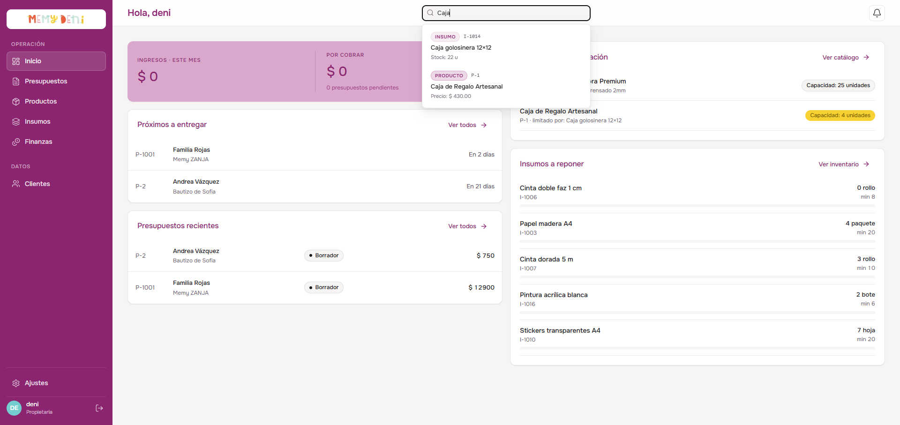
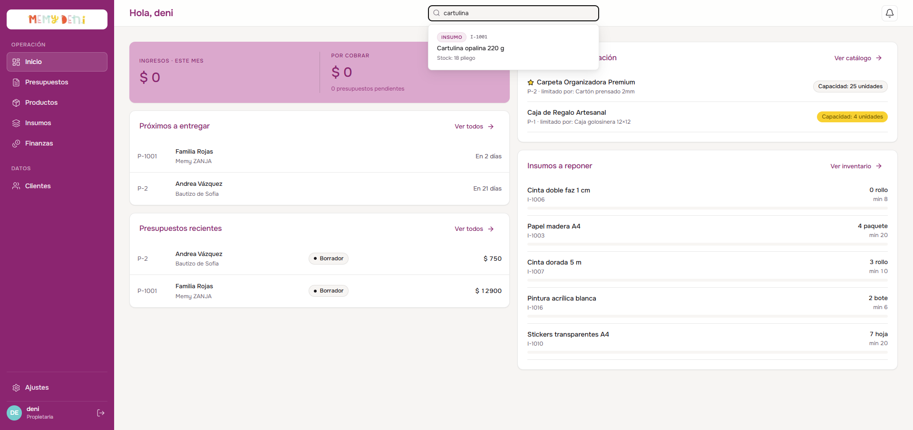

# Flujo de Buscador Global y Deep-linking
Módulo Transversal · MemyDeni — versión fix_v4

## Contexto general
El buscador global del topbar centraliza las consultas y accesos directos del ERP en un único punto de entrada. Permite encontrar de forma rápida insumos, productos, clientes y presupuestos sin necesidad de navegar manualmente por las distintas secciones del sistema, acelerando significativamente el ritmo de trabajo.

El buscador es un componente **transversal**: está disponible en todas las vistas del ERP desde la barra superior (`AppHeader.vue`). Se implementó con debounce y cancelación de peticiones para garantizar eficiencia de red sin resultados desactualizados.

---

## Acceso y ubicación

* **Componente:** `AppHeader.vue` — barra superior del sistema.
* **Ubicación visual:** Campo de texto centrado en la cabecera con el placeholder *«Buscar presupuestos, clientes, productos…»*.
* **Disponible en:** Todas las rutas autenticadas del ERP.



---

## Lógica de búsqueda reactiva

El buscador implementa tres mecanismos de optimización de red trabajando en conjunto:

| Mecanismo | Implementación | Propósito |
| :--- | :--- | :--- |
| **Longitud mínima** | `query.length >= 2` | Evita peticiones innecesarias con teclas sueltas o búsquedas vacías. |
| **Debounce** | `300ms` tras el último keystroke | Agrupa los caracteres mientras el usuario escribe y solo dispara la petición cuando hace una pausa, reduciendo las llamadas al backend. |
| **AbortController** | `controller.abort()` antes de cada nueva petición | Cancela activamente la petición anterior si el usuario sigue escribiendo, evitando que una respuesta tardía sobreescriba resultados más nuevos. |

```typescript
// Pseudocódigo de la lógica de búsqueda reactiva en AppHeader.vue
let abortController: AbortController | null = null

const buscar = debounce(async (query: string) => {
  if (query.length < 2) {
    resultados.value = []
    return
  }
  
  // Cancelar petición anterior si existe
  abortController?.abort()
  abortController = new AbortController()

  const data = await $fetch('/api/search', {
    query: { q: query },
    signal: abortController.signal
  })
  resultados.value = data
}, 300)
```

---

## Despliegue de resultados

Al escribir 2 o más caracteres y transcurrido el debounce de 300ms, se despliega un **panel flotante** de resultados organizados por categoría bajo el campo de búsqueda.



### Estructura de resultados por categoría

Los resultados se agrupan y etiquetan visualmente con un badge de categoría:

| Categoría | Badge | Dato principal | Dato secundario |
| :--- | :--- | :--- | :--- |
| **Insumo** | `INSUMO` verde | Nombre del insumo | `Stock: N unidades` o `Stock: N pliegos` |
| **Producto** | `PRODUCTO` azul | Nombre del producto | Precio final de venta |
| **Cliente** | `CLIENTE` violeta | Nombre completo del cliente | Canal de contacto principal |
| **Presupuesto** | `PRESUPUESTO` naranja | Folio + temática del evento | Estado actual del presupuesto |

> [!NOTE]
> **Ordenamiento de resultados:**
> Los resultados se ordenan dentro de cada categoría por relevancia de coincidencia. Las categorías con más resultados no desplazan a las demás; cada una tiene un límite de 3-5 resultados para mantener el panel compacto y legible.

---

## Navegación por teclado

El panel de resultados es completamente navegable con el teclado sin necesidad de usar el ratón:

| Tecla | Acción |
| :--- | :--- |
| `↓` (Flecha abajo) | Mueve el foco al siguiente elemento de la lista. Si está en el último, no avanza. |
| `↑` (Flecha arriba) | Mueve el foco al elemento anterior. Si está en el primero, regresa al campo de texto. |
| `Enter` | Ejecuta la acción de navegación del resultado actualmente enfocado. |
| `Escape` | Cierra el panel flotante y limpia el texto del campo de búsqueda. |

> [!IMPORTANT]
> **Accesibilidad del panel:**
> El panel de resultados implementa los atributos ARIA necesarios para compatibilidad con lectores de pantalla: `role="listbox"` en el contenedor, `role="option"` en cada resultado y `aria-selected` en el elemento enfocado actualmente.

---

## Deep-linking de edición directa

Al seleccionar un resultado (con clic o con `Enter`), el sistema realiza una redirección inyectando el código de la entidad correspondiente en el query string de la URL. Las vistas receptoras detectan este parámetro al montar y abren automáticamente el drawer u overlay de edición correspondiente.

### Tabla de redirecciones por categoría

| Categoría | Código ejemplo | Query string generado | Vista receptora | Componente que se abre |
| :--- | :--- | :--- | :--- | :--- |
| **Insumo** | `I-1001` | `/insumos?edit=I-1001` | `InsumosView.vue` | `InsumoDetalle.vue` (overlay fullscreen) |
| **Producto** | `P-2` | `/productos?edit=P-2` | `ProductosView.vue` | `ProductoDetalle.vue` (overlay lateral) |
| **Cliente** | `C-7` | `/clientes?edit=C-7` | `ClientesView.vue` | `ClienteDrawer.vue` (panel lateral derecho) |
| **Presupuesto** | `P-1001` | `/presupuestos?edit=P-1001` | `PresupuestosView.vue` | `PresupuestoEditor.vue` (pantalla completa) |

### Implementación del router push por categoría

```typescript
// Navegación al seleccionar un resultado del buscador
const navegarAResultado = (resultado: ResultadoBusqueda) => {
  // Cerrar el panel de búsqueda
  mostrarResultados.value = false
  query.value = ''

  switch (resultado.tipo) {
    case 'insumo':
      router.push({ name: 'insumos', query: { edit: resultado.codigo } })
      break
    case 'producto':
      router.push({ name: 'productos', query: { edit: resultado.codigo } })
      break
    case 'cliente':
      router.push({ name: 'clientes', query: { edit: resultado.codigo } })
      break
    case 'presupuesto':
      router.push({ name: 'presupuestos', query: { edit: resultado.folio } })
      break
  }
}
```

---

## Comportamiento de las vistas receptoras

Cada vista que puede recibir un deep-link del buscador implementa la detección del query param en el hook `onMounted`:

| Vista | Hook de detección | Comportamiento al detectar el param |
| :--- | :--- | :--- |
| `InsumosView.vue` | `onMounted` — lee `route.query.edit` | Si el código coincide con un insumo activo, abre `InsumoDetalle` pasando el ID correspondiente y borra el param del query string. |
| `ProductosView.vue` | `onMounted` — lee `route.query.edit` | Si el código coincide con un producto activo, abre el overlay `ProductoDetalle`. |
| `ClientesView.vue` | `onMounted` — lee `route.query.edit` | Si el código coincide con un cliente activo, abre `ClienteDrawer` en modo edición. |
| `PresupuestosView.vue` | `onMounted` — lee `route.query.edit` | Si el folio coincide, carga el presupuesto y abre `PresupuestoEditor`. |

> [!CAUTION]
> **Limpieza del query string:**
> Tras abrir el elemento correspondiente, las vistas ejecutan `router.replace({ query: {} })` para limpiar el query string de la URL. Esto evita que al recargar la página se intente abrir nuevamente el mismo elemento, y mantiene la URL limpia para compartir o registrar en historial del navegador.

---

## Casos de borde y mensajes de estado

| Caso | Condición | Comportamiento |
| :--- | :--- | :--- |
| **Sin resultados** | La búsqueda no retorna ningún resultado | El panel muestra el mensaje `«Sin resultados para "X"»`. |
| **Búsqueda muy corta** | `query.length < 2` | El panel permanece cerrado. No se dispara ninguna petición al backend. |
| **Error de red** | La petición falla o es cancelada inesperadamente | El panel muestra el mensaje `«Error al buscar. Intentá de nuevo.»` en tono coral. |
| **Campo vacío** | El usuario borra todo el texto | El panel se cierra y los resultados previos se descartan. |

---

## Verificación visual y multimedia

### Pasos del walkthrough completo

El recorrido del flujo del buscador cubre:
1. Foco en el campo de búsqueda desde el Dashboard — visualización del placeholder.
2. Escritura de «cart» — espera del debounce de 300ms y apertura del panel con resultados de insumos y productos.
3. Navegación por teclado con flechas ↑/↓ — visualización del foco activo en cada resultado.
4. `Enter` en el resultado de insumo — redirección a `/insumos?edit=I-1001` y apertura del overlay.
5. Retorno al Dashboard — nueva búsqueda de un nombre de cliente.
6. Clic directo en el resultado de cliente — redirección a `/clientes?edit=C-X` y apertura del drawer.
7. Tecla `Escape` para cerrar el panel sin navegar.

🎥 **Ver video del recorrido:** [flujo_buscador_global.mp4](media/flujo_buscador_global.mp4)
