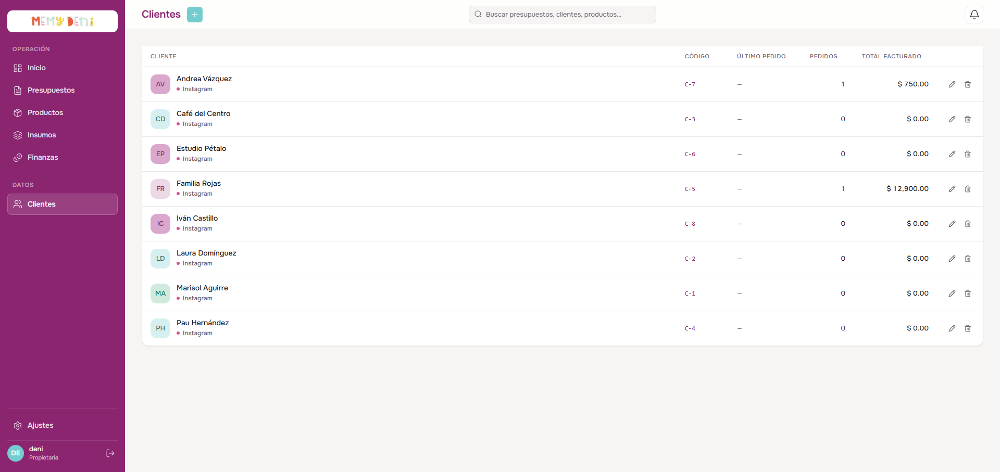
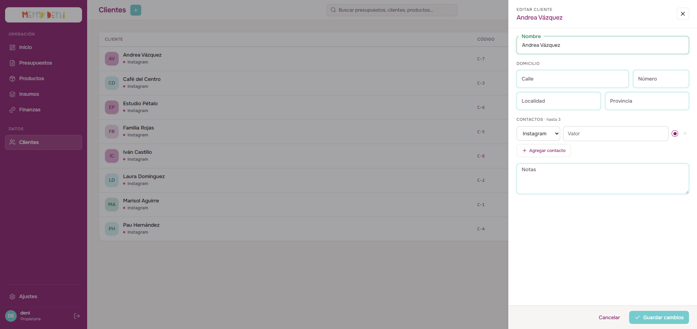

# Flujo de Creación de Cliente
Módulo Comercial · MemyDeni — versión fix_v4

## Contexto general
El flujo de creación y edición de clientes permite registrar y actualizar a las personas o entidades que interactúan comercialmente con MemyDeni. El microERP mantiene un diseño minimalista enfocado en la agilidad de carga: no contempla campos de facturación compleja (identificaciones tributarias, razones sociales) porque el negocio opera en el registro artesanal informal.

Para lograr una arquitectura flexible y extensible, los datos de contacto viven en una tabla relacional independiente (`cliente_contactos`, relación $1:N$), lo que permite que un cliente tenga múltiples canales de comunicación sin redundancias ni cambios en la estructura principal de la base de datos.

Fix_v4 incorpora un drawer más estrecho (400px), una tabla de clientes rediseñada con avatar de color hash dinámico, acciones de fila inline (sin columna fija), y unifica el campo de domicilio `localidad` entre frontend y backend (Epic D).

---

## Accesos y navegación
El usuario puede interactuar con el flujo de clientes a través de los siguientes accesos en la vista `/clientes`:

1. **Crear cliente:** Botón "Crear nuevo" con ícono `+` (plus) ubicado en la cabecera superior derecha. Al pulsarlo, se despliega el panel lateral derecho (`ClienteDrawer.vue`) en estado vacío.
2. **Editar cliente:** Botón "Editar" al final de la fila correspondiente en la tabla. Despliega el panel lateral con los datos del cliente precargados en los campos de edición.
3. **Eliminar cliente:** Botón "Eliminar" al final de la fila. Solicita confirmación en pantalla y, al aceptar, realiza una desactivación lógica (`activo = false`). Esto oculta al cliente de futuras búsquedas y autocompletados, pero conserva todo su historial comercial intacto (presupuestos y facturación previa).

> [!NOTE]
> **Acciones inline — sin columna de acciones fija (fix_v4):**
> En la versión fix_v4 se eliminó la columna de acciones (ícono lápiz / ícono basurero) que ocupaba espacio de forma permanente. Los botones "Editar" y "Eliminar" ahora aparecen como botones de acción simples al final de la fila, alineados a la derecha, optimizando el ancho disponible para datos en tablas densas.

---

## El listado de clientes
La vista principal del módulo comercial presenta una tabla estructurada de forma densa y limpia, optimizada para la lectura rápida.




### Estructura de la tabla de datos

| Columna | Alineación | Formato / Valor de ejemplo | Descripción y reglas visuales |
| :--- | :--- | :--- | :--- |
| **CLIENTE** | Izquierda | Valentina Gómez<br>`• Instagram: @vale.gomez` | Avatar circular con iniciales en color hash dinámico (paleta de 8 colores asignada por hash del nombre). Debajo del nombre, en `--ink-muted`, aparece el canal de contacto principal con su dot de color y el valor del canal. |
| **CÓDIGO** | Izquierda | `C-2` | Código identificador secuencial con nomenclatura `C-${id}`, generado automáticamente por la base de datos. No editable. |
| **ÚLTIMO PEDIDO** | Izquierda | `08/06/2026` / `—` | Fecha en formato local de la última cotización confirmada. Muestra `—` si el cliente no registra pedidos activos. |
| **PEDIDOS** | Derecha (num) | `12` | Cantidad total de presupuestos en estado `en_curso`, `cerrado` o `facturado`. Fuente tabular (`font-variant-numeric: tabular-nums`). |
| **TOTAL FACTURADO** | Derecha (num) | `$ 1,250.00` | Suma histórica acumulada de presupuestos en curso o facturados. Formato de moneda sin sufijo `MXN` en tablas densas. |
| *(Acciones)* | Derecha | `Editar` · `Eliminar` | Botones de acción simples al final de la fila. Sin columna reservada permanente. |

### Avatar de color hash dinámico (fix_v4)

El sistema asigna un color de fondo al avatar circular basándose en el hash del nombre del cliente. La paleta cuenta con **8 colores** predefinidos del design system, lo que garantiza que:

* El mismo cliente siempre recibe el mismo color (determinístico).
* Los colores son visualmente distinguibles entre sí.
* No se requiere almacenar el color en la base de datos: se computa en el frontend en tiempo de render.

```js
// Lógica de asignación de color (pseudocódigo)
const AVATAR_COLORS = ['--violet-500', '--teal-500', '--coral-500', '--amber-500',
                       '--blue-500', '--green-500', '--pink-500', '--indigo-500']

function getAvatarColor(name: string): string {
  const hash = [...name].reduce((acc, char) => acc + char.charCodeAt(0), 0)
  return AVATAR_COLORS[hash % AVATAR_COLORS.length]
}
```

---

## Formulario de creación y edición (ClienteDrawer)
El panel lateral derecho se abre con una transición suave de 220ms y un ancho fijo de **400px** (reducido de 520px en fix_v4 para mejor acomodación en pantallas estrechas). Utiliza una capa de fondo traslúcida (scrim) con `z-index: 80` y el panel tiene `z-index: 81`.



### Paso 1 — Identidad y domicilio

Se compone de campos basados en el componente reutilizable `FloatingField` (label flotante animada tipo "wave", foco violeta, bordes coloreados por estado de validación, label tipo píldora).

| Campo | Componente / Tipo | Requerido | Valor ejemplo | Notas / Reglas de validación |
| :--- | :--- | :--- | :--- | :--- |
| **Nombre** | `FloatingField` (texto) | **Sí** | Andrea Vázquez | Validado por Zod (`min(1)`). Al perder el foco vacío, el borde se tiñe de rojo (`--coral-500`) y aparece alerta inline con `role="alert"`. |
| **Calle** | `FloatingField` (texto) | No | Av. San Martín | Nombre de la calle para entregas. Opcional. |
| **Número** | `FloatingField` (texto) | No | 1420 | Altura física de la dirección. Opcional. |
| **Localidad** | `FloatingField` (texto) | No | Villa Urquiza | Localidad, municipio o alcaldía. Unificado con el campo `localidad` del backend en fix_v4 (Epic D). Reemplaza el campo `ciudad` de versiones anteriores. |
| **Provincia** | `FloatingField` (texto) | No | CABA | Estado o provincia. Opcional. |

> [!IMPORTANT]
> **Unificación del campo de domicilio — fix_v4 (Epic D):**
> El campo de domicilio era `ciudad` en el frontend (versiones anteriores) y `localidad` en el backend. Fix_v4 resuelve esta discrepancia renombrando el campo a `localidad` en toda la capa de UI, sincronizando frontend y backend con el mismo nombre de columna en la base de datos. Cualquier referencia a `ciudad` en código anterior es obsoleta.

---

### Paso 2 — Contactos dinámicos
Los canales de contacto se gestionan en una lista repetible directamente dentro del formulario. El sistema permite registrar **hasta 3 contactos** por cliente.

| Elemento | Control / Componente | Opciones / Formato | Reglas de operación |
| :--- | :--- | :--- | :--- |
| **Tipo de canal** | Select clásico | `Instagram` (default), `WhatsApp`, `Mail`, `Otros` | Selector directo mapeado al enumerado del backend. |
| **Valor de contacto** | Input de texto clásico | `@andreav.fiestas` | Dirección, teléfono o handle. Si el tipo está seleccionado pero el valor está vacío, la validación Zod arroja error al guardar. |
| **Principal** | Botón de selección circular (Radio) | Activo / Inactivo | Solo puede haber un canal principal (`esPrincipal: true`). Al marcar otro, el anterior se desactiva automáticamente. |
| **Eliminar contacto** | Botón con ícono X (cruz) | Hover en tono coral | Borra la fila. Se deshabilita si queda solo un contacto. Si se elimina el principal, el primer contacto restante asume la propiedad automáticamente. |
| **Agregar contacto** | Botón dashed con ícono `+` | "Agregar contacto" | Añade una nueva fila con tipo `Instagram` y valor vacío. Se deshabilita al alcanzar el límite de 3 contactos. |

---

### Paso 3 — Notas internas
Un campo de notas de texto multilínea opcional para anotaciones y especificaciones operativas del equipo.

* **Notas:** Campo `FloatingField` multilínea (textarea). Placeholder de uso interno: *"Información interna · solo visible para tu equipo"*. No aparece en el documento del cliente ni en el presupuesto compartido.

---

## Reglas de validación y gobernanza del negocio

> [!IMPORTANT]
> **Validación en tiempo real y accesibilidad:**
> Los campos clave como **Nombre** están asociados a Zod schemas en el frontend (`web/src/schemas/clientes.ts`).
> Para garantizar la accesibilidad (WCAG 2.2):
> * Todos los inputs y selectores tienen IDs descriptivos únicos (`cl-nombre`, `cl-calle`, `cl-localidad`, `cl-notas`, etc.) y etiquetas `<label>` vinculadas explícitamente mediante el atributo `for`.
> * Las alertas de error de validación utilizan elementos con `role="alert"` asociados a los inputs correspondientes a través de `aria-describedby` y `aria-invalid`.

> [!NOTE]
> **Regla de contacto principal en presupuestos:**
> Al confeccionar un presupuesto para un cliente determinado, el sistema recupera el canal de contacto marcado como principal (`esPrincipal: true`). Si existe, el editor del presupuesto puede sugerir la vía de envío del documento (por ejemplo, redirección directa para enviar cotizaciones por WhatsApp o Instagram).

> [!CAUTION]
> **Advertencia de cambios pendientes:**
> Si el usuario intenta cerrar el drawer haciendo clic en el scrim, presionando `Escape` o pulsando "Cancelar" con modificaciones en los campos (`dirty = true`), el sistema bloquea el cierre y despliega el `ConfirmDialog` con el mensaje: *¿Salir sin guardar? Tenés cambios pendientes en este cliente. Si salís ahora, vas a perderlos.* El usuario puede volver a la edición o descartar los cambios.

---

## Campos de auditoría e historial de base de datos

| Campo | Origen | Notas |
| :--- | :--- | :--- |
| `id` / `codigo` | Auto-incremental | El código se compone del prefijo `C-` seguido del ID secuencial. No editable. |
| `activo` | Soft delete | `false` al eliminar. El cliente no aparece en autocompletados ni listados activos, pero su historial se conserva. |
| `createdAt` | Automático | Timestamp UTC de creación del registro. |
| `updatedAt` | Automático | Timestamp UTC de última modificación. |

---

## Verificación visual y multimedia

### Listado completo de clientes
Vista del módulo con los 8 clientes registrados, avatares de color hash y columnas actualizadas (fix_v4):


### Drawer abierto — edición de cliente
Panel lateral a 400px con los campos de identidad, domicilio y contacto de Instagram precargados:


### Video del recorrido completo (walkthrough)
Se ha grabado un video interactivo que reproduce paso a paso todo el flujo de creación de un cliente, desde el listado inicial hasta el guardado final y retorno a la tabla con el nuevo registro:

🎥 **Ver video del recorrido:** [flujo_creacion_cliente.mp4](media/flujo_creacion_cliente.mp4)
