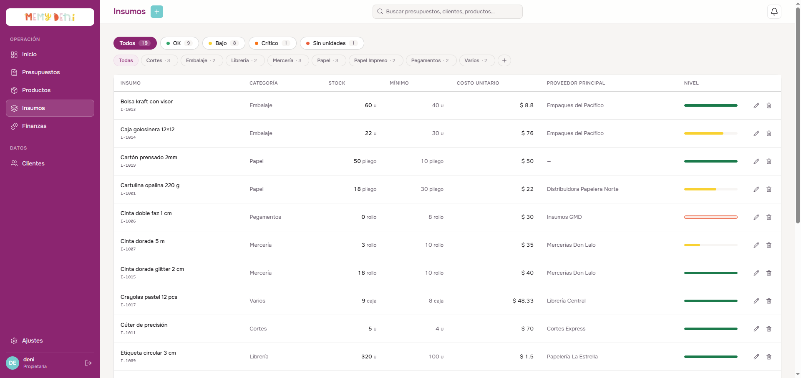
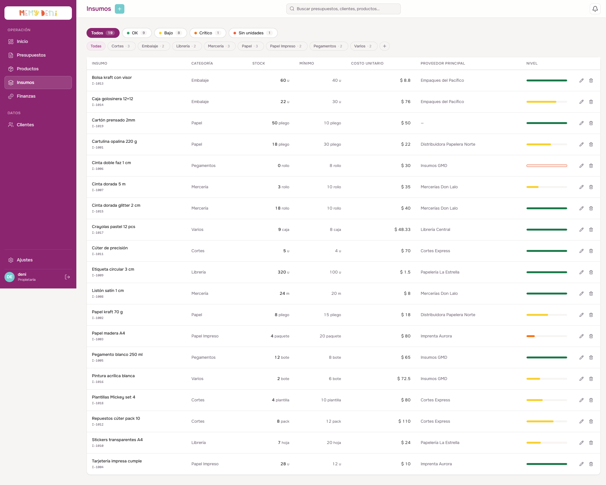
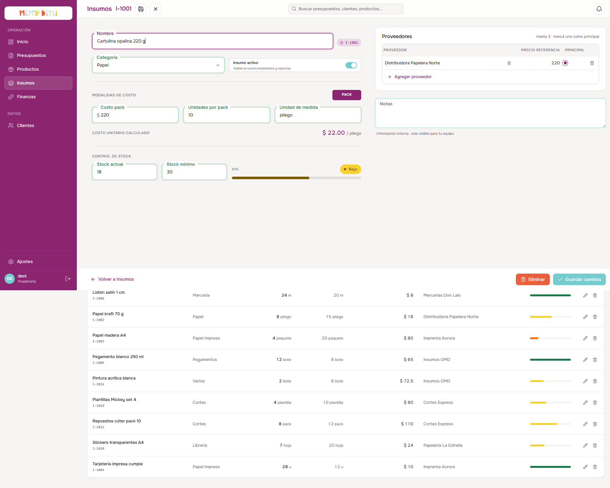

# Flujo de Creación y Edición de Insumo
Módulo Inventario · MemyDeni — versión fix_v4

## Contexto general
Un insumo representa una materia prima en el taller que se adquiere en presentaciones comerciales (packs, rollos, paquetes) y se fracciona o consume por unidades individuales al fabricar productos. El flujo de creación y edición captura la información de identidad del insumo, gestiona el control de inventario y establece la lógica de costeo que alimenta de manera directa la receta o Estructura de Materiales (BOM) de los productos del catálogo.

Para evitar la pérdida accidental de datos, el sistema implementa un control de modificaciones reactivo (*dirty tracking*) que bloquea el cierre del formulario si existen cambios pendientes sin guardar.

En **fix_v4** se incorporaron filtros de nivel de stock en el listado, un nuevo switch de modalidad de costo (PACK / SIMPLE) con el patrón `.checkbox-wrapper-10`, y una sección de Control de Stock con barra de progreso semántica y badge de nivel.

---

## Accesos y navegación
El usuario puede interactuar con el flujo de insumos en la vista `/insumos`:

1. **Crear insumo:** Botón «Crear nuevo» en la cabecera superior derecha. Abre el overlay fullscreen (`InsumoDetalle.vue`) con campos vacíos.
2. **Editar por doble clic:** Al hacer doble clic sobre cualquier fila del listado, se abre el overlay con los datos del insumo correspondiente. La fila aplica `cursor: pointer` y `user-select: none`.
3. **Editar por acción:** Botón con ícono de lápiz al extremo derecho de cada fila. Abre el mismo overlay de edición.
4. **Desde dashboard:** Al hacer clic en un insumo del widget «Insumos a reponer», el sistema navega a `/insumos?edit=I-X` y abre el overlay automáticamente.

---

## El listado de insumos

El listado centraliza todos los insumos disponibles con sus niveles de stock y costo unitario actualizado.





### Filtros de nivel de stock (fix_v4)

Una fila de pastillas con conteo en badge permite filtrar por nivel de inventario de forma reactiva:

| Pill | Condición de activación | Color |
| :--- | :--- | :--- |
| **Todos** | Sin filtro — muestra todos los insumos activos | Neutro |
| **OK** | `stockActual >= stockMinimo` | Verde |
| **Bajo** | `stockActual >= stockMinimo * 0.5` y `stockActual < stockMinimo` | Naranja/ocre |
| **Crítico** | `stockActual > 0` y `stockActual < stockMinimo * 0.5` | Rojo coral |
| **Sin unidades** | `stockActual == 0` | Rojo intenso |

### Filtros de categoría (inline editables)

Una segunda fila de pills permite filtrar por categoría de insumo. Incluye el botón **«Agregar categoría»** para crear nuevas categorías directamente desde el listado sin salir del módulo (Tarea 1 de fix_v4):

| Categoría disponible | Ejemplo de insumos |
| :--- | :--- |
| Cortes | Papel de seda, papel madera |
| Embalaje | Bolsas kraft, cajas golosineras |
| Librería | Stickers, papel madera A4 |
| Mercería | Cintas, elásticos |
| Papel | Cartulinas, opalina |
| Papel Impreso | Pliegos impresos |
| Pegamentos | Cinta doble faz, cola vinílica |
| Varios | Insumos misceláneos |

### Estructura de la tabla de datos

| Columna | Alineación | Formato / Valor ejemplo | Descripción y reglas visuales |
| :--- | :--- | :--- | :--- |
| **INSUMO** | Izquierda | Cartulina opalina 220 g `· I-1001` | Nombre completo con código correlativo en tono muted debajo. |
| **CATEGORÍA** | Izquierda | Papel | Categoría del insumo con enlace a su filtro. |
| **STOCK** | Izquierda | `18 pliego` | Cantidad física actual con unidad de medida. |
| **MÍNIMO** | Izquierda | `30` | Umbral mínimo de seguridad configurado. |
| **COSTO UNITARIO** | Derecha (num) | `$ 22.00` | Costo unitario calculado. Usa `font-variant-numeric: tabular-nums`. |
| **PROVEEDOR PRINCIPAL** | Izquierda | Distribuidora Papelera Norte | Nombre del proveedor marcado como principal en la ficha. |
| **NIVEL** | Centro | `Bajo` / `OK` / `Sin unidades` | Badge semántico con color según el nivel de stock actual. |

---

## Formulario de creación y edición (InsumoDetalle overlay)

Al activarse el flujo, se renderiza un overlay de pantalla completa organizado en dos columnas: la columna principal izquierda con los datos del insumo y la columna derecha con proveedores y notas.



### Sección identidad

| Campo | Componente / Tipo | Requerido | Valor ejemplo | Notas / Reglas de validación |
| :--- | :--- | :--- | :--- | :--- |
| **Nombre** | Input de título inline | **Sí** | Cartulina Opalina 220 g | Nombre del material (marca, gramaje y medidas). Validado por Zod (`min(1)`). |
| **Categoría** | `FloatingSelect` con inline edit | **Sí** | Papel | FK → `CategoriaInsumo`. Permite agregar categorías nuevas sin salir del overlay. |
| **Insumo activo** | Toggle switch (`.checkbox-wrapper-10`) | No | `true` | `role="switch"`, `aria-checked`. Si se desactiva, el insumo desaparece de autocompletados y BOM. |

### Sección modalidad de costo (switch PACK / SIMPLE — fix_v4)

El switch de modalidad utiliza el patrón `.checkbox-wrapper-10` (flip switch) para alternar entre dos modos de ingreso de costos:

| Modo | Activación | Campos visibles | Costo unitario |
| :--- | :--- | :--- | :--- |
| **PACK** | Botón «PACK» activo (fondo oscuro) | Costo pack, Unidades por pack, Unidad de medida | Autocalculado — de solo lectura |
| **SIMPLE** | Botón «SIMPLE» activo (fondo oscuro) | Costo unitario, Unidad de medida | Editable directamente por el usuario |

#### Campos en modo PACK

| Campo | Componente / Tipo | Requerido | Valor ejemplo | Notas |
| :--- | :--- | :--- | :--- | :--- |
| **Costo pack** | `FloatingField` (Número, prefijo `$`) | No | `$ 220.00` | Valor monetario total del paquete comercial. Debe ser ≥ 0. |
| **Unidades por pack** | `FloatingField` (Número) | No | `10` | Cantidad de unidades dentro del paquete. |
| **Unidad de medida** | `FloatingField` (Texto) | No | `pliego` | Define cómo se consumirá en la BOM (pliego, m, rollo, u). |
| **Costo unitario calculado** | Texto de solo lectura | — | `$ 22.00 / pliego` | Autocalculado. No editable. Se muestra debajo de los tres campos como referencia canónica. |

**Fórmula del costo unitario:**

$$\text{Costo unitario} = \frac{\text{Costo pack}}{\text{Unidades por pack}}$$

*Ejemplo:* $\$ 220.00 \div 10\text{ pliegos} = \$ 22.00\text{ por pliego}$

> [!NOTE]
> **Propagación al BOM:**
> Este valor `costo_unitario` es el que consume la Estructura de Materiales (BOM) en el catálogo de productos para determinar el subtotal de insumos por receta:
> $$\text{Subtotal de insumo en BOM} = \text{Cantidad consumida} \times \text{Costo unitario}$$
> Modificar el costo unitario en el BOM de un producto es un cambio **local y aislado** que no afecta este valor maestro del inventario.

### Sección control de stock

| Campo | Componente / Tipo | Requerido | Valor ejemplo | Notas |
| :--- | :--- | :--- | :--- | :--- |
| **Stock actual** | `FloatingField` (Número) | No | `18` | Cantidad física disponible en el taller. |
| **Stock mínimo** | `FloatingField` (Número) | No | `30` | Umbral de seguridad. Activa alertas cuando el stock actual cae por debajo. |
| **Barra de progreso** | Indicador visual | — | `60%` en naranja | Representa `(stockActual / stockMinimo) * 100`. Color semántico según nivel. |
| **Badge de nivel** | Badge reactivo | — | `Bajo` / `OK` / `Sin unidades` | Se calcula de forma reactiva en cada cambio de stock. |

> [!IMPORTANT]
> **Niveles y colores de stock:**
> * **Sin unidades:** `stockActual === 0` → badge rojo, barra vacía.
> * **Crítico:** `stockActual > 0` y `stockActual < stockMinimo * 0.5` → badge rojo coral.
> * **Bajo:** `stockActual >= stockMinimo * 0.5` y `stockActual < stockMinimo` → badge naranja/ocre.
> * **OK:** `stockActual >= stockMinimo` → badge verde, barra completa.

### Columna derecha — Proveedores

Se despliega una tabla interna que permite vincular **hasta 3 proveedores** con sus respectivos precios de referencia de mercado:

| Elemento | Control | Comportamiento |
| :--- | :--- | :--- |
| **Proveedor** | `<select>` con lista de proveedores registrados | Selector de los proveedores existentes en el sistema. |
| **Precio referencia** | Input numérico | Precio cobrado por ese proveedor específico. Solo referencial, no afecta el costo unitario calculado. |
| **Principal** | Radio button circular | Solo uno puede marcarse como principal. Al seleccionar otro, el anterior se desactiva automáticamente. |
| **Eliminar proveedor** | Botón `×` con hover coral | Se deshabilita si queda solo un proveedor para garantizar consistencia mínima. |
| **Agregar proveedor** | Botón dashed con ícono `Plus` | Se deshabilita al alcanzar el límite de 3 proveedores. |

### Columna derecha — Notas

* **Notas:** Campo `textarea` de texto libre para especificaciones de compras o producción. Placeholder: *«Información interna · solo visible para tu equipo»*.

---

## Barra de acciones del pie

| Acción | Tipo | Comportamiento |
| :--- | :--- | :--- |
| **Volver a insumos** | Botón con flecha ← | Regresa al listado. Si hay cambios sin guardar (`dirty === true`), despliega `ConfirmDialog` de confirmación. |
| **Eliminar** | Botón coral | Solo visible en modo edición. Solicita confirmación y ejecuta soft delete (`activo = false`). |
| **Crear insumo / Guardar cambios** | Botón primario (`btn-primary`) con ícono `Check` | Deshabilitado (`disabled`, opacidad 50%) si no hay cambios (`!dirty`). Se habilita al editar cualquier campo. |

> [!CAUTION]
> **Confirmación de salida con cambios pendientes:**
> Si el usuario intenta salir del overlay con cambios sin guardar, el sistema evalúa el flag `dirty` y despliega el `ConfirmDialog` con el mensaje: *«¿Salir sin guardar? Tenés cambios pendientes. Si salís ahora, vas a perderlos.»*

---

## Integración con el catálogo de productos (BOM)

Una vez creado y guardado el insumo, el sistema le asigna su código secuencial único (ej. `I-1021`) y lo añade reactivamente a la tabla general de inventario.

El insumo queda disponible en el sistema para que cualquier producto del catálogo que lo requiera en su receta o Estructura de Materiales (BOM) calcule su costo unitario proporcional en base a la cantidad fraccionada consumida.

> [!NOTE]
> **Deep-link desde dashboard:**
> Cuando un insumo aparece en el widget «Insumos a reponer» del Dashboard y el usuario hace clic, el sistema navega a:
> ```typescript
> router.push({ name: 'insumos', query: { edit: i.codigo } })
> ```
> La vista `InsumosView.vue` detecta el parámetro `edit` en el query string al montar y abre automáticamente el overlay del insumo correspondiente.

---

## Verificación visual y multimedia

### Pasos del walkthrough completo

1. Apertura del listado de insumos — visualización de filtros de stock y categoría.
2. Filtro por «Crítico» — visualización de los insumos con stock insuficiente.
3. Doble clic en un insumo — apertura del overlay en modo edición.
4. Cambio de modalidad de PACK a SIMPLE — verificación del cambio de campos.
5. Modificación del stock actual — visualización del cambio de badge y barra de progreso.
6. Guardado de cambios — retorno al listado con el valor actualizado.
7. Creación de un nuevo insumo desde cero — completar todos los campos y guardar.

🎥 **Ver video del recorrido:** [flujo_creacion_insumo.mp4](media/flujo_creacion_insumo.mp4)
