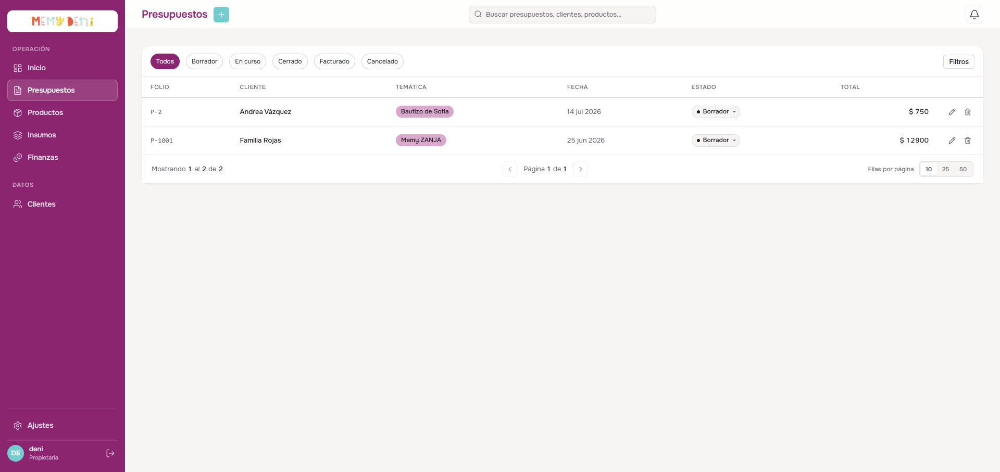
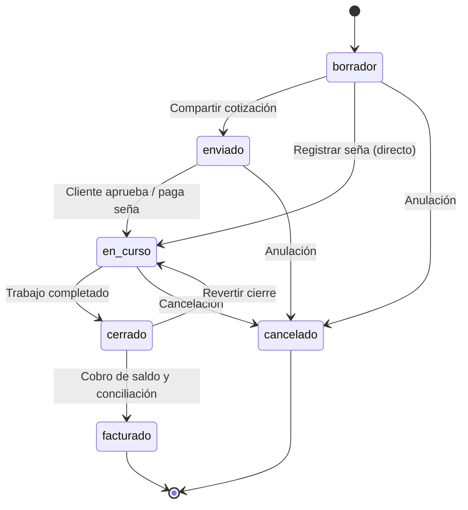
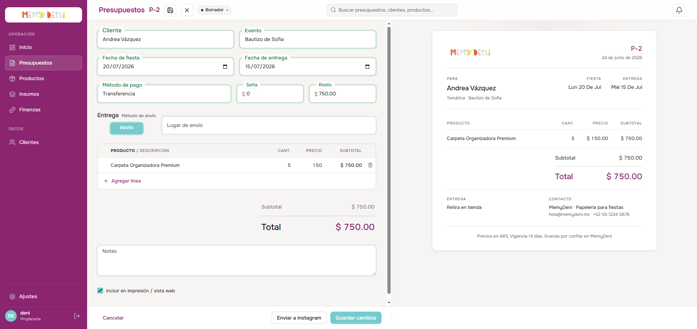
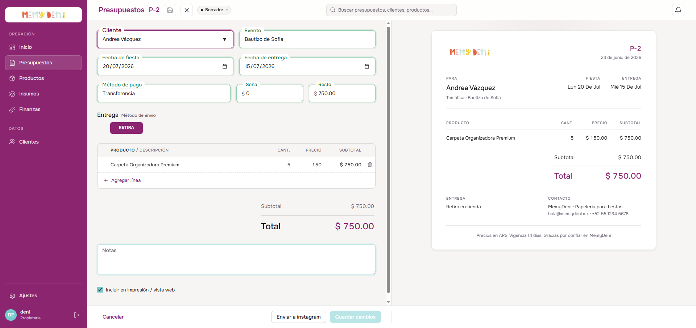

# Flujo de Creación y Estados de Presupuesto
Módulo Comercial · MemyDeni — versión fix_v4

## Contexto general
El presupuesto es el documento central de la operación comercial en MemyDeni. Conecta a un cliente del catálogo con una lista de productos personalizados, gestiona el cronograma de fechas críticas del evento, define las condiciones logísticas y de pago, y automatiza la contabilidad interna mediante una distribución de ingresos por socio al momento de la facturación.

Este flujo reemplaza la gestión manual desestructurada, garantizando consistencia histórica a través de reglas de gobernanza comercial fijas: congelamiento de precios del catálogo al cotizar y validación estricta de transiciones de estado. Fix_v4 incorpora paginación reactiva en el listado, un Live Preview lateral tipo documento imprimible, un flip switch para método de envío con aparición dinámica del campo de destino, y el botón de envío a Instagram.

---

## Accesos y navegación
El usuario interactúa con el flujo comercial en la vista `/presupuestos`:

1. **Crear presupuesto:** Botón "Nuevo presupuesto" en la cabecera superior derecha. Al pulsarlo se abre `PresupuestoEditor.vue` en pantalla completa con el formulario vacío y el Live Preview en blanco.
2. **Editar presupuesto:** Botón "Editar" al final de la fila de la tabla. Abre el editor con los datos cargados. Si el presupuesto está en estado `cerrado` o `facturado`, el formulario se bloquea en modo lectura.
3. **Filtros rápidos por estado:** Pestañas en el encabezado de la tabla para segmentar la lista de forma optimista por estado actual.

---

## El listado de presupuestos
La vista principal presenta una tabla cronológica de cotizaciones con paginación reactiva incorporada en fix_v4.




### Estructura de la tabla de datos

| Columna | Alineación | Formato / Valor de ejemplo | Descripción y reglas visuales |
| :--- | :--- | :--- | :--- |
| **FOLIO** | Izquierda | `P-8` | Identificador único incremental con nomenclatura `P-${id}`. |
| **CLIENTE** | Izquierda | Laura Fiestas | Nombre del cliente asociado (proviene de la base de datos). |
| **TEMÁTICA** | Izquierda | Harry Potter | Nombre del evento o temática, campo de texto libre. |
| **ESTADO** | Centro | `Borrador` / `En curso` / `Cerrado` | Badge coloreado e interactivo. Al hacer clic despliega un menú con las transiciones disponibles según la FSM. |
| **ENTREGA** | Izquierda | `Envío` / `Retira` | Vía logística pactada con el cliente. |
| **FECHA FIESTA** | Izquierda | `08/06/2026` | Fecha local de celebración del evento. |
| **TOTAL** | Derecha (num) | `$ 2,000.00` | Suma calculada de los subtotales de ítems en fuente tabular (`font-variant-numeric: tabular-nums`). |
| **ACCIONES** | Derecha | `Editar` | Botón de acción al final de la fila. Sin columna de ícono fija. |

### Paginación reactiva (fix_v4)

El listado incorpora un componente de paginación en el pie de la tabla con los siguientes controles:

| Control | Tipo | Comportamiento |
| :--- | :--- | :--- |
| **Anterior / Siguiente** | Botones | Navegan entre páginas. "Anterior" se deshabilita en página 1; "Siguiente" se deshabilita en la última. |
| **Contador de páginas** | Texto | Muestra `Página X de Y` calculado dinámicamente según la cantidad de registros y el tamaño de página activo. |
| **Selector de filas** | `<select>` | Permite elegir entre **10, 25 y 50** filas por página. Cambiar la opción reinicia la tabla a la página 1. |

> [!NOTE]
> El componente de paginación es reactivo: al cambiar los filtros de estado mediante las pestañas superiores, el conteo de páginas y el cursor se recalculan automáticamente sin recargar la ruta.

---

## Modelo de estados (FSM)
El ciclo de vida del presupuesto sigue una máquina de estados finitos con transiciones atómicas validadas en el backend para preservar la integridad financiera.

> [!IMPORTANT]
> **Cambio en fix_v4 — ruta directa borrador → en_curso:**
> El estado `enviado` ya no es el paso obligatorio previo a `en_curso`. Al registrar una seña directamente desde un borrador, la FSM transiciona a `en_curso` de forma inmediata, omitiendo el paso intermedio. Esto refleja el flujo real del negocio donde el cliente aprueba verbalmente y paga la seña en el mismo acto.



### Reglas de transición de estados

| Estado | Color del badge | Edición | Descripción |
| :--- | :--- | :--- | :--- |
| `borrador` | Gris neutro | Completa | Estado inicial. Totalmente editable. |
| `enviado` | Azul | Completa | Cotización compartida con el cliente. Paso opcional desde fix_v4. |
| `en_curso` | Violeta / Púrpura | Parcial | Presupuesto aprobado con seña registrada. Sigue editable ante cambios de diseño. |
| `cerrado` | Verde | **Bloqueada** | Trabajo finalizado. Registra `fechaFinalizacion` automáticamente. |
| `facturado` | Verde oscuro | **Bloqueada** | Estado terminal. Ejecuta distribución contable transaccional. |
| `cancelado` | Coral / Rojo | **Bloqueada** | Estado terminal. Anulado por rechazo del cliente. |

---

## Encabezado del editor (fix_v4)
El editor de presupuesto en pantalla completa tiene un encabezado de navegación contextual que muestra:

| Elemento | Posición | Detalle |
| :--- | :--- | :--- |
| **Módulo** | Izquierda | Texto fijo `Presupuestos` en `--ink-muted`. |
| **Folio activo** | Izquierda (junto al módulo) | `P-2`, `P-8`, etc. En negrita, separado por `/`. |
| **Ícono de guardado** | Centro-izquierda | Ícono de disquete (`floppy disk`). Se activa / opaca según el estado `isDirty`. |
| **Badge de estado** | Centro | Badge interactivo con el estado actual. Al hacer clic despliega el menú FSM para cambiar de estado sin salir del editor. |
| **Botón X (cerrar)** | Derecha | Cierra el editor. Si hay cambios pendientes, dispara `ConfirmDialog`. |

---

## Formulario de creación y edición (PresupuestoEditor)
El editor se divide en dos columnas: **formulario** a la izquierda y **Live Preview** a la derecha.


### Sección 1 — Cliente y evento

| Campo | Componente / Tipo | Requerido | Valor ejemplo | Notas |
| :--- | :--- | :--- | :--- | :--- |
| **Cliente** | `FloatingField` con datalist | **Sí** | Laura Fiestas | Requiere match estricto con un cliente real (`clienteId > 0`). Campo en rojo si el nombre no existe en el sistema. |
| **Temática** | `FloatingField` (texto) | No | Harry Potter | Texto libre descriptor del evento o motivo del pedido. |
| **Notas internas** | `FloatingField` (textarea) | No | "Ajustar paleta a lavanda" | Solo visible para el equipo. No aparece en el documento del cliente ni en el Live Preview. |

### Sección 2 — Pago

| Campo | Componente / Tipo | Requerido | Valor ejemplo | Notas |
| :--- | :--- | :--- | :--- | :--- |
| **Método de pago** | `FloatingSelect` | No | Transferencia | Opciones: Efectivo, Transferencia, Tarjeta, Otros. |
| **Seña** | `FloatingField` numérico (prefijo `$`) | No | `$ 500.00` | Permite 0. Al guardarse con seña > 0 desde `borrador`, la FSM avanza directamente a `en_curso`. |
| **Resto** | Campo solo lectura | — | `$ 1,500.00` | Calculado: `Total - Seña`. Coloreado en verde cuando hay saldo pendiente. |

> [!NOTE]
> **Tolerancia a descuentos y redondeos:**
> La suma de `Seña` y `Resto` no se valida de forma estricta contra el `Total` de productos. Esto permite aplicar descuentos de pago, redondeos o acuerdos rápidos sin que el sistema rechace la cotización.

### Sección 3 — Entrega y método de envío (fix_v4)

El control de entrega fue rediseñado para fix_v4. Se reemplazó el `SegmentedControl.vue` anterior por el flip switch `.segmented` variante `checkbox-wrapper-10`, organizado **verticalmente** dentro de su columna:

```
┌─────────────────────────────────────────────┐
│  Entrega · Método de envío                  │
│                                             │
│       [ RETIRA ●──────────○ ENVÍO ]         │
│                                             │
└─────────────────────────────────────────────┘
```

El switch está centrado horizontalmente (`align-self: center`) para minimizar el ancho de la columna izquierda en la grilla y dejar el espacio completo disponible para el input contiguo.




| Campo | Condición de visibilidad | Tipo | Requerido | Notas |
| :--- | :--- | :--- | :--- | :--- |
| **Método de envío** (flip switch) | Siempre visible | Toggle `RETIRA` / `ENVÍO` | No | Valor por defecto: `RETIRA`. |
| **Lugar de envío** | Solo cuando switch = `ENVÍO` | `FloatingField` (texto) | Sí (condicional) | Aparece dinámicamente a la derecha del switch al activar `ENVÍO`. Desaparece y se vacía al volver a `RETIRA`. |
| **Fecha de fiesta** | Siempre visible | `<input type="date">` | No | Fecha de celebración del evento. Aparece en el Live Preview y en el PDF. |
| **Fecha de entrega** | Siempre visible | `<input type="date">` | No | Alerta interna de taller. No aparece en el documento del cliente. |

> [!IMPORTANT]
> **Visibilidad condicional del campo "Lugar de envío":**
> Al seleccionar `ENVÍO`, el campo de dirección aparece de forma animada a la derecha del switch dentro de la misma fila de la grilla. Al volver a `RETIRA`, el campo se oculta y su valor se borra del estado local (no se persiste en el backend si el método final es `RETIRA`).

### Sección 4 — Productos (tabla de líneas spreadsheet)

Diseñada como una planilla densa e interactiva con comportamiento de hoja de cálculo:

| Columna | Tipo | Descripción |
| :--- | :--- | :--- |
| **Grip** | Ícono arrastre | Visible en hover de fila. Permite reordenamiento manual por drag-and-drop. |
| **Producto** | Input con autocompletado | Al seleccionar un producto del catálogo, el precio unitario se completa automáticamente y la cantidad se inicializa en `1`. |
| **Cantidad** | Input numérico | Mínimo `1`. |
| **Precio unitario** | Input numérico (prefijo `$`) | Congelado al momento de agregar el ítem. Editable manualmente. |
| **Subtotal** | Solo lectura | `Cantidad × Precio unitario`. Fuente tabular. |
| **Eliminar** | Botón papelera | Visible (atenuado) en hover de fila. Elimina la línea de forma inmediata. |

* **Navegación con teclado:** `Enter` confirma el valor de la celda. Un segundo `Enter` sin cambios mueve el foco a la fila inferior. Si no hay fila inferior, agrega una nueva línea en blanco.
* **Prune de filas vacías:** Al perder el foco general (blur), las filas incompletas se eliminan automáticamente.
* **Validación inline:** Fila con precio o cantidad pero sin producto → bordes rojos y alerta `role="alert"`.

### Sección 5 — Opciones adicionales (fix_v4)

| Campo | Tipo | Descripción |
| :--- | :--- | :--- |
| **Incluir en impresión / vista web** | Checkbox | Controla si el presupuesto aparece en la vista pública compartible. Desmarcado por defecto en borradores. |

---

## Live Preview lateral (fix_v4)
El panel derecho del editor muestra en tiempo real la previsualización del presupuesto como documento imprimible. Se actualiza de forma reactiva con cada cambio en el formulario sin necesidad de guardar.

> [!NOTE]
> **Contenido del Live Preview:**
> * Logo de MemyDeni (imagen desde `assets/memydeni-logo.png`).
> * Folio activo (`P-X`) y fecha de emisión.
> * Nombre y canal de contacto del cliente.
> * Fechas: fiesta y entrega (si aplica).
> * Tabla de productos: descripción, cantidad, precio unitario y subtotal.
> * Total general y monto de seña.
> * Notas para el cliente (campo separado de notas internas).

---

## Footer del editor — acciones de distribución (fix_v4)

| Botón | Posición | Acción |
| :--- | :--- | :--- |
| **Guardar** | Footer izquierda | Persiste el estado actual del formulario en el backend. |
| **Enviar a Instagram** | Footer derecha | Genera el presupuesto en formato imagen y lo comparte a través del mecanismo de sharing nativo del sistema operativo (Web Share API o equivalente). Internamente usa Puppeteer para renderizar el PDF desde la ruta pública `/p/:token?pdf=1`. |

> [!CAUTION]
> **Enviar a Instagram genera el PDF asíncrono:**
> La acción "Enviar a Instagram" primero guarda el presupuesto si hay cambios pendientes (`isDirty`), luego dispara la generación asíncrona del PDF mediante Puppeteer. El botón muestra un estado de carga mientras espera la URL firmada del bucket de Supabase Storage antes de abrir el sheet de compartir.

---

## Automatización y gobernanza del ERP

> [!IMPORTANT]
> **Congelamiento de precios pactados:**
> Al agregar un artículo de catálogo en las líneas, el sistema congela el precio unitario del producto en ese instante. Si en el futuro se actualizan los costos de insumos y sube el precio de lista del catálogo, las cotizaciones previas en curso o cerradas conservan su valor original, respetando el acuerdo comercial con el cliente.

> [!NOTE]
> **Trigger contable de facturación (distribución contable):**
> Al transicionar el estado a `facturado`, el backend ejecuta de forma transaccional una distribución de ingresos neta dividida entre los socios y cuentas configuradas en la base de datos (Meme 40%, Pety 30%, Gastos 30%), registrando simultáneamente:
> * El ingreso del saldo pendiente (`total - seña`).
> * El egreso estimado de materiales basado en la receta (BOM) del producto.
> * El egreso de órdenes de imprenta asociadas al pedido.

> [!IMPORTANT]
> **Generación de PDF con Puppeteer y Supabase Storage:**
> Al compartir o facturar un presupuesto, el backend levanta de forma asíncrona un proceso de Puppeteer que genera un PDF navegando a la ruta pública `/p/:token?pdf=1` (diseño optimizado para impresión A4 mediante CSS print media queries). El PDF resultante se almacena en el bucket privado de Supabase Storage `presupuestos-pdf`, permitiendo al usuario descargar copias firmadas en cualquier momento.

> [!CAUTION]
> **Control de salida limpia (isDirty):**
> Si el usuario intenta salir del editor con cambios sin guardar en los campos o líneas, el sistema evalúa la discrepancia contra el snapshot inicial y despliega un cuadro de diálogo de advertencia `ConfirmDialog` para evitar pérdidas accidentales.

---

## Campos de auditoría e historial de base de datos

| Campo | Origen | Notas |
| :--- | :--- | :--- |
| `id` / `folio` | Auto-incremental | El folio se compone del prefijo `P-` seguido del `id` del registro. |
| `estado` | FSM | Persiste el estado actual. El historial de transiciones no se registra en esta versión. |
| `fechaCreacion` | Automático | Timestamp UTC de creación del borrador inicial. |
| `fechaFinalizacion` | Automático (trigger) | Asignado por el backend al transicionar a `cerrado`. |
| `preciosCongelados` | Snapshot | JSON con los precios de cada línea al momento de cotizar. |
| `activo` | Soft delete | `false` al cancelar. Los registros cancelados se ocultan del listado activo pero se conservan en historial. |

---

## Verificación visual y multimedia

### Listado con paginación activa
El listado con los controles de paginación visibles y el selector de filas por página:


### Editor completo con Live Preview y switch de envío
Vista del editor `P-2` con el formulario activo, el flip switch en modo `RETIRA` y el panel de Live Preview a la derecha:


### Switch en modo Envío con campo de destino
Al activar el flip switch en `ENVÍO`, aparece dinámicamente el input "Lugar de envío" a la derecha:


### Drawer de información de envío
Panel lateral con el detalle de entrega del presupuesto:



### Video del recorrido completo (walkthrough)
Se ha grabado un video interactivo que reproduce paso a paso todo el flujo de creación del presupuesto desde el inicio hasta su guardado final, la paginación y el envío a Instagram:

🎥 **Ver video del recorrido:** [flujo_creacion_presupuesto.mp4](media/flujo_creacion_presupuesto.mp4)
