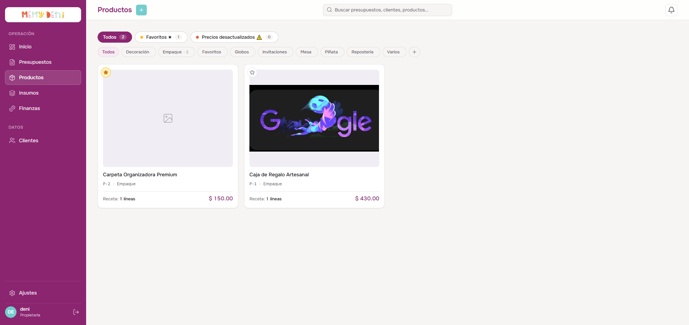
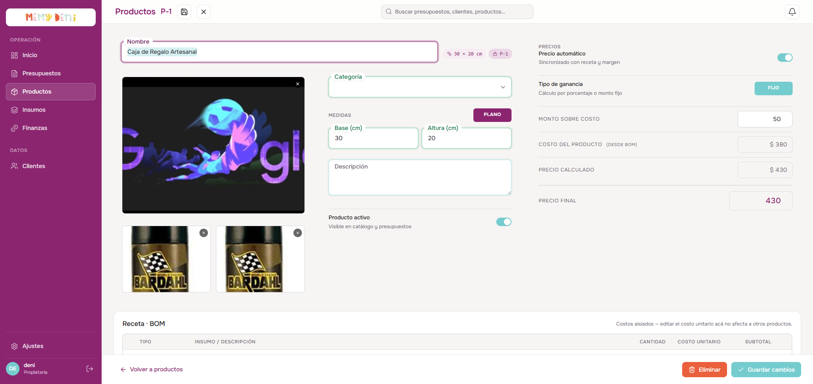

# Flujo de Creación y Receta de Producto
Módulo Catálogo · MemyDeni — versión fix_v4

## Contexto general
Un producto representa la unidad final vendible dentro del catálogo de MemyDeni. Su costo base puede ingresarse de forma manual o calcularse dinámicamente mediante una receta de materiales o BOM (*Bill of Materials*). El precio de venta final se determina aplicando un margen configurable (por porcentaje o monto fijo) sobre el costo del producto, con previsualización en tiempo real.

En **fix_v4** el formulario de producto fue rediseñado con soporte para **hasta 3 fotos con drag & drop**, un switch de **medidas estructuradas** (JSONB) con los modos PLANO y CUERPO que formatea automáticamente el badge de dimensiones, y un panel de precios reorganizado con toggle de precio automático y selector de tipo de ganancia.

Para asegurar la integridad comercial, el sistema congela los costos al momento de cotizar: modificar precios en el catálogo no altera presupuestos previos en curso o cerrados.

---

## Accesos y navegación
El usuario gestiona el catálogo desde la sección `/productos`:

1. **Crear producto:** Botón «Crear nuevo» en la cabecera superior derecha. Abre el overlay `ProductoDetalle.vue` con campos vacíos.
2. **Editar producto:** Clic en cualquier tarjeta de producto del grid, o en el botón de edición rápida que aparece en hover. Abre el overlay con los datos cargados.
3. **Filtros por categoría:** Fila de pastillas (pills) en el listado para filtrar por categoría. Hacer clic en una pill activa la filtra; hacer clic de nuevo la desactiva (toggle) volviendo a mostrar todo el catálogo.

---

## El listado de productos

El catálogo se presenta en una cuadrícula (*grid*) de tarjetas visuales densas que resumen la ficha técnica del producto.

### Elementos de la tarjeta de producto

| Elemento | Representación | Valor ejemplo | Reglas visuales |
| :--- | :--- | :--- | :--- |
| **Foto principal** | Miniatura (thumb) cuadrada | Imagen del producto | Si hay múltiples fotos, se muestra la primera. Si no hay fotos, se muestra un placeholder vectorial neutro. |
| **Favorito** | Estrella ★ en la esquina superior izquierda | `★` activo (dorado) / `☆` inactivo | Los productos marcados como favoritos aparecen ordenados al inicio del grid. |
| **Código** | Badge | `P-1` | Código secuencial autogenerado por el sistema. |
| **Nombre** | Texto principal | Caja de Regalo Artesanal | Nombre comercial del producto. |
| **Categoría** | Texto muted | Embalaje | Categoría asignada. |
| **Precio final** | Texto grande violeta | `$ 430` | Precio de venta aprobado manualmente. |
| **Alerta de precio** | Badge amarillo `⚠` | `Precio desactualizado` | Aparece si el costo de los insumos del BOM aumentó y el precio final quedó por debajo del precio calculado. |

---

## Formulario de creación y edición (overlay ProductoDetalle)

Al activarse el flujo, se despliega el overlay `ProductoDetalle.vue` con dos zonas: la columna principal izquierda con datos básicos y BOM, y la columna derecha con el panel de precios.

### Paso 1 — Identidad, fotos y medidas

| Campo | Componente / Tipo | Requerido | Valor ejemplo | Notas / Reglas de validación |
| :--- | :--- | :--- | :--- | :--- |
| **Nombre** | Input de título inline | **Sí** | Caja de Regalo Artesanal | Nombre comercial del producto. Campo requerido. |
| **Categoría** | `FloatingSelect` con inline edit | **Sí** | Embalaje | FK → `CategoriaProducto`. El selector permite agregar categorías nuevas al vuelo (Tarea 1 fix_v4). |
| **Fotos** | Cargador múltiple (hasta 3) | No | — | Soporta hasta 3 imágenes locales. Se muestran como thumbnails mini debajo de la foto principal. Permite reordenar con drag & drop para definir la foto principal. |
| **Descripción** | `FloatingField` multilínea | No | Caja kraft con papel de seda... | Detalle de acabados y recomendaciones de producción. |
| **Producto activo** | Toggle switch | No | `true` (Activo) | Si se desactiva, el producto no aparece en los autocompletados de presupuestos ni en el catálogo público. |

#### Medidas estructuradas (fix_v4) — switch PLANO / CUERPO

Las medidas se almacenan como objeto JSONB en la base de datos. El switch de modalidad `.medidas-toggle-group` (flip switch) permite elegir entre dos tipos de medición:

| Modo | Activación | Campos visibles | Formato de badge resultante |
| :--- | :--- | :--- | :--- |
| **PLANO** | Botón «PLANO» activo | Base (cm) + Altura (cm) | `30 × 20 cm` |
| **CUERPO** | Botón «CUERPO» activo | Base (cm) + Altura (cm) + Profundidad (cm) | `30 × 20 × 15 cm` |

> [!NOTE]
> **Persistencia estructurada:**
> Las medidas se guardan en la columna `medidas` de la tabla `productos` como un objeto JSONB: `{ tipo: 'plano', base: 30, altura: 20 }` o `{ tipo: 'cuerpo', base: 30, altura: 20, profundidad: 15 }`. El badge de medidas del overlay y del grid del catálogo se formatea automáticamente desde este objeto en el frontend.

---

### Paso 2 — Receta BOM (lista de materiales)

Si el toggle **«Costo por receta»** (`tieneBom`) está activado:
1. El campo **Costo del producto** en el panel de precios se bloquea en modo lectura.
2. El costo se calcula de forma automática como la sumatoria de las líneas:
   $$\text{Costo del producto} = \sum_{i=1}^{n} (\text{Cantidad}_i \times \text{Costo unitario}_i)$$
3. La sección BOM se expande debajo del formulario de datos básicos.

#### Estructura de la tabla de receta (BOM)

| Columna | Control UI | Valor ejemplo | Comportamiento y reglas |
| :--- | :--- | :--- | :--- |
| **Tipo** | Selector nativo | `Insumo` / `Cameo` / `Embalaje` / `Extra` | Clasificación del costo. El tipo `Extra` permite texto libre en el siguiente campo. |
| **Insumo / Descripción** | Selector con autocompletado | Cartulina opalina 220 g | Autocompleta desde el catálogo de insumos activos. En tipo `Extra`, permite escritura libre. |
| **Cantidad** | Input numérico | `2.50` | Proporción o cantidad física requerida por unidad de producto fabricada. |
| **Costo unitario** | Input numérico | `$ 22.00` | Inicializado desde `insumos.costo_unitario` al seleccionar. **Editable localmente** sin afectar el catálogo de insumos. |
| **Subtotal** | Solo lectura | `$ 55.00` | Calculado automáticamente: `Cantidad × Costo unitario`. |

> [!IMPORTANT]
> **Regla de aislamiento de costos de receta:**
> Al seleccionar un insumo en el BOM, el costo unitario se inicializa con el valor actual de `insumos.costo_unitario`. El usuario puede modificar libremente este valor dentro de la tabla BOM. Esta modificación es **atómica y local**: afecta únicamente la receta de este producto específico. No altera el costo maestro del inventario ni afecta a otros productos que usen el mismo insumo.
>
> El subtítulo de la sección BOM lo deja explícito: *«Costos aislados — editar el costo unitario acá no afecta a otros productos»*.

---

### Paso 3 — Panel de precios (columna derecha)

El panel lateral derecho concentra toda la lógica de precios y márgenes del producto.

| Control | Tipo | Comportamiento |
| :--- | :--- | :--- |
| **Precio automático** | Toggle switch | Si está activo: el campo «Precio final» se sincroniza automáticamente con el precio calculado cada vez que cambia el costo o el margen. Si está inactivo: el usuario puede ingresar un precio final diferente al calculado. |
| **Tipo de ganancia** | Flip switch FIJO / PORCENTAJE | Alterna entre los dos modos de cálculo del precio. |
| **Costo del producto** | Texto de solo lectura (si hay BOM) | Muestra el costo total calculado desde la receta, o el valor ingresado manualmente si `tieneBom = false`. |
| **Precio calculado** | Texto de solo lectura | Resultado de la fórmula según el tipo de ganancia activo. |
| **Precio final** | Input numérico editable | Precio de venta oficial aprobado por el usuario. Dispara alerta si es menor al precio calculado. |

#### Modo PORCENTAJE (%)

$$\text{Precio calculado} = \text{Costo del producto} \times \left(1 + \frac{\text{Margen (\%)}}{100}\right)$$

*Ejemplo:* Para un costo de $\$ 380.00$ y un margen del $13.2\%$:
$$\text{Precio calculado} = \$ 380.00 \times 1.132 = \$ 430.00$$

#### Modo MONTO FIJO ($)

$$\text{Precio calculado} = \text{Costo del producto} + \text{Ganancia fija}$$

*Ejemplo:* Para un costo de $\$ 380.00$ y una ganancia fija de $\$ 50.00$:
$$\text{Precio calculado} = \$ 380.00 + \$ 50.00 = \$ 430.00$$

---

### Paso 4 — Validaciones del precio final

| Estado de validación | Condición | Nivel visual | Comportamiento |
| :--- | :--- | :--- | :--- |
| **Sin precio** | `precio_final` es nulo, vacío o `0` | Advertencia | El producto puede guardarse pero no podrá ser cotizado sin un precio aprobado. |
| **Bajo margen** | `precio_final < precio_calculado` | Crítico (rojo) | Indica que el producto se ofrece con una ganancia inferior a la esperada. El campo se resalta en coral. |
| **Precio desactualizado** | Costo del BOM aumentó tras la última edición | Advertencia amarilla (`⚠`) | El badge aparece en la tarjeta del grid del catálogo como recordatorio de revisar el precio. |
| **Margen OK** | `precio_final >= precio_calculado` | Normal (verde) | Margen comercial saludable y validado. Sin indicadores de alerta. |

---

## Integración y gobernanza del ERP

> [!NOTE]
> **Inmutabilidad de costos y congelamiento:**
> Cuando un producto se añade a un presupuesto, el valor registrado en `precioUnitario` del detalle es el `precio_final` configurado en ese instante. Si en el futuro los insumos aumentan y la receta incrementa su costo calculado, **los presupuestos emitidos en el pasado no se verán alterados ni recalculados**, protegiendo los acuerdos previos con clientes.

> [!CAUTION]
> **Borrado lógico y auditoría:**
> Al pulsar «Eliminar», el sistema ejecuta un soft delete (`activo = false`) en lugar de borrar físicamente el registro. Esto preserva la integridad de los presupuestos históricos que contienen ese producto, impidiendo que apunten a registros inexistentes, a la vez que oculta el producto del catálogo activo y de los autocompletados de nuevos presupuestos.

---

## Verificación visual y multimedia

### Pasos del walkthrough completo

1. Apertura del catálogo de productos — visualización del grid con favoritos y badges.
2. Filtro por categoría «Embalaje» — visualización reactiva del listado.
3. Clic en una tarjeta — apertura del overlay de edición.
4. Cambio de modo de medidas de PLANO a CUERPO — visualización del campo «Profundidad» animado.
5. Carga de una segunda foto — reordenamiento con drag & drop.
6. Activación del BOM — agregar una línea de insumo y verificar el cálculo automático del subtotal y costo total.
7. Cambio de tipo de ganancia de PORCENTAJE a FIJO — verificar el recálculo del precio.
8. Guardado del producto — retorno al grid con la tarjeta actualizada.

🎥 **Ver video del recorrido:** [flujo_creacion_producto.mp4](media/flujo_creacion_producto.mp4)
