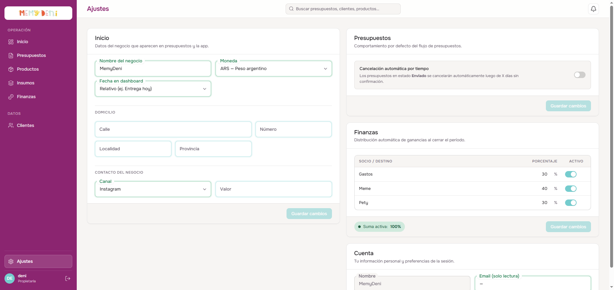
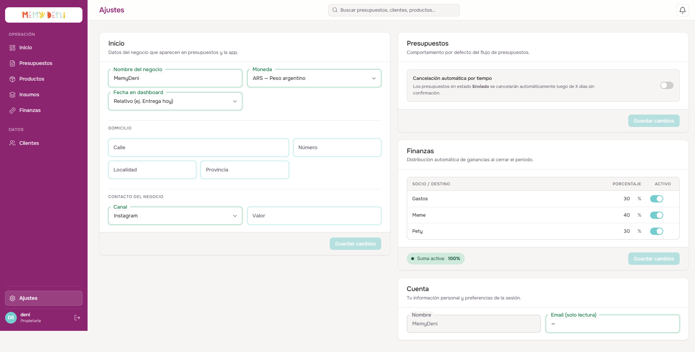

# Flujo del Módulo de Ajustes
Configuración General · MemyDeni

## Contexto general
El módulo de Ajustes centraliza los parámetros operativos, la identidad corporativa y las reglas de gobernanza del negocio MemyDeni.

A través de este módulo, las propietarias configuran la información básica del negocio (que se inyecta dinámicamente en los documentos PDF e interfaces públicas de clientes), definen las reglas automáticas de vencimiento del ciclo comercial de los presupuestos y configuran la matriz financiera de distribución de ingresos (reparto de utilidades por socio y fondos de reinversión) al momento de la facturación.

En **fix_v4** se realizaron correcciones de integridad críticas: unificación del campo de domicilio de `ciudad` a `localidad`, validación `.strict()` en el backend para rechazar propiedades desconocidas, y sanitización con `.trim()` sobre todos los valores string del objeto JSONB.

---

## Accesos y navegación
El acceso al módulo de Ajustes está integrado directamente en la barra lateral principal:

* **Ubicación:** Botón «Ajustes» (icono de engranaje) ubicado al final de la barra lateral, justo encima del avatar del usuario activo.
* **Segmentación:** A diferencia de las vistas operativas, no se encuentra agrupado en submenú, lo que brinda acceso inmediato a la administración del ERP.

---

## Interfaz general y diseño bilateral

La pantalla de Ajustes está organizada en un diseño bilateral de **dos columnas** (`aj-stack`) que divide las responsabilidades operativas en bloques densos e independientes. Cada bloque cuenta con su propio pie de página y botón de guardado autónomo, lo que permite realizar modificaciones específicas sin interferir con otras áreas.

| Columna | Bloques contenidos | Función de guardado |
| :--- | :--- | :--- |
| **Izquierda** | Identidad del negocio · Presupuestos · Cuenta | `saveConfig` → `PUT /api/ajustes/configuracion` |
| **Derecha** | Finanzas (distribución de socios) | `saveSocios` → `PUT /api/ajustes/distribucion` |

> [!NOTE]
> **Dirty tracking por bloque:**
> Al modificar cualquier valor dentro de un bloque, se activa un chip de estado **Sin guardar** en el encabezado del bloque (`configDirty = true` o `sociosDirty = true`) y se habilita el botón de guardado correspondiente. Los cambios de la columna izquierda y la derecha se persisten de forma completamente independiente.

---

## Bloque 1 — Identidad del negocio (Columna izquierda)

Define la información identitaria y la configuración de contacto del negocio. Sus valores se inyectan en toda la aplicación y en las cotizaciones emitidas a los clientes.

### Estructura de campos de identidad

| Campo | Componente UI | Tipo de dato | Valor ejemplo | Reglas de validación / comportamiento |
| :--- | :--- | :--- | :--- | :--- |
| **Nombre del negocio** | `FloatingField` | `string` | `MemyDeni` | **Requerido.** Nombre público de la marca comercial. Aparece en el header de la app. |
| **Email** | `FloatingField` | `string` email | `memydeni@gmail.com` | Email de contacto del negocio (no confundir con el email de cuenta de usuario). |
| **Teléfono** | `FloatingField` | `string` | `+54 11 1234-5678` | Teléfono de contacto del negocio. |
| **Domicilio — Calle** | `FloatingField` | `string` | `Av. Corrientes` | Nombre de la arteria vial. Se aplica `.trim()` en backend. |
| **Domicilio — Número** | `FloatingField` | `string` | `1234` | Altura domiciliaria. |
| **Domicilio — Localidad** | `FloatingField` | `string` | `Almagro` | **fix_v4:** Unificado como `localidad` (antes `ciudad`). Se aplica `.trim()` en backend. |
| **Domicilio — Provincia** | `FloatingField` | `string` | `Buenos Aires` | Provincia / estado federativo. |

> [!IMPORTANT]
> **Fix_v4 — Unificación de `localidad` (Epic D):**
> El campo de domicilio fue renombrado de `ciudad` a `localidad` en el formulario de la UI, en el esquema Zod del frontend y en el schema de validación del backend. La API utiliza `.strict()` sobre el objeto JSONB de domicilio, lo que significa que cualquier petición que envíe la propiedad `ciudad` (nombre antiguo) será **rechazada con error 400**. Esta corrección garantiza consistencia entre la base de datos, la API y la interfaz.

> [!CAUTION]
> **Sanitización estricta del backend:**
> El backend aplica `.strict()` al validar el objeto `domicilio`, rechazando cualquier campo desconocido. Adicionalmente, se aplica `.trim()` sobre todos los valores `string` del objeto antes de persistirlo en la columna JSONB de la tabla `config`. Esto previene que espacios adicionales o valores con basura corrompan los datos de configuración.

---

## Bloque 2 — Presupuestos (Columna izquierda)

Establece la política de caducidad temporal de las cotizaciones emitidas, liberando el ciclo comercial de presupuestos abandonados.

### Cancelación automática por tiempo

Gestionado mediante un toggle (`ToggleSwitch`):

* **Estado inactivo (`false`):** Los presupuestos enviados no tienen caducidad automática y permanecen válidos de forma indefinida.
* **Estado activo (`true`):** Despliega dinámicamente un campo condicional para ingresar los **Días de espera**.

### Campo condicional de vencimiento

| Campo condicional | Control UI | Tipo de dato | Valor ejemplo | Reglas y efecto en FSM |
| :--- | :--- | :--- | :--- | :--- |
| **Días de espera** | Input numérico con unidad `días` | `integer` | `7` | **Requerido si el toggle está activo.** Debe ser un entero positivo. Indica los días de validez de la oferta desde su emisión. |

> [!IMPORTANT]
> **Proceso en segundo plano (cron job):**
> Si la cancelación automática está activa, un proceso periódico del backend evalúa diariamente los presupuestos en estado `enviado`. Si la diferencia entre la fecha actual y la fecha de última actualización del presupuesto supera los días de espera configurados, el sistema cambia automáticamente su estado a `cancelado` y añade la nota interna: *«Cancelado: Tiempo de confirmación excedido»*. El usuario verá el presupuesto en estado cancelado la próxima vez que acceda al módulo.

---

## Bloque 3 — Finanzas (Columna derecha)

Este bloque gestiona los porcentajes de distribución automática de la utilidad neta de cada pedido al transicionar a estado `facturado`. La distribución se ejecuta como parte del bloque atómico contable del módulo de Finanzas.

### Estructura de la tabla de distribución

| Campo / Columna | Control UI | Tipo de dato | Valor ejemplo | Comportamiento en el ERP |
| :--- | :--- | :--- | :--- | :--- |
| **Socio / Destino** | Input texto inline | `string` | `Meme` | Nombre del socio o destino (fondo de gastos, reinversión, etc.). |
| **Porcentaje** | Input numérico inline | `Decimal` | `40` | Porcentaje de la utilidad correspondiente. Se muestra con símbolo `%`. |
| **Activo** | Switch inline (`.aj-switch`) | `boolean` | `true` | Define si la fila participa de la suma activa de reparto. Las filas inactivas no se incluyen en el cálculo. |

### Regla de suma de control

Para asegurar la consistencia contable, el pie del bloque calcula la **Suma activa** en tiempo real:

$$\text{Suma activa} = \sum_{i \in \text{activos}} \text{Porcentaje}_i$$

| Estado de la suma | Indicador visual | Acción del botón de guardado |
| :--- | :--- | :--- |
| **Suma = 100%** | Chip verde — suma válida | Habilitado → `PUT /api/ajustes/distribucion` |
| **Suma ≠ 100%** | Chip coral — suma inválida | **Bloqueado** — no se puede guardar |

> [!CAUTION]
> **Bloqueo de guardado con suma inválida:**
> Si la suma de porcentajes de socios activos no es exactamente `100%`, el botón «Guardar cambios» del bloque Finanzas queda **bloqueado**. El sistema muestra una alerta en color coral con el texto del total actual (ej. `Total: 70%`). Este bloqueo es intencional: impedir estados de reparto inconsistentes que afectarían la distribución automática al facturar presupuestos.

---

## Bloque 4 — Cuenta (Columna izquierda)

Muestra la información de sesión de la propietaria en la instancia activa del ERP. Sus campos se inicializan a partir de los metadatos de Supabase Auth.

| Campo | Componente UI | Tipo de dato | Fuente | Comportamiento |
| :--- | :--- | :--- | :--- | :--- |
| **Nombre** | `FloatingField` deshabilitado | `string` | `user_metadata.full_name` de Supabase | Solo lectura. No editable desde la UI del ERP. |
| **Email** | `FloatingField` de solo lectura | `string` email | `user.email` de Supabase Auth | Solo lectura. Float persistente, campo no enfocable. |

> [!NOTE]
> **Gestión de credenciales fuera del ERP:**
> La modificación de la contraseña o el email de acceso debe realizarse directamente en el panel de Supabase Auth o a través del flujo de recuperación de contraseña. El módulo de Ajustes no expone ningún formulario de cambio de credenciales.

---

## Verificación visual y multimedia

### Vista completa de Ajustes con ambas columnas

El diseño bilateral agrupa los bloques de configuración en dos columnas independientes con sus propios botones de guardado:

### Interfaz general de Ajustes

La vista de Ajustes en su estado inicial con datos ya configurados:

### Video del recorrido completo (Walkthrough)

Se ha grabado un video interactivo que reproduce el caso de uso completo de administración:
1. Navegación a la sección de Ajustes desde la barra lateral.
2. Edición del campo **Localidad** del domicilio (fix_v4) y verificación del guardado exitoso con `saveConfig`.
3. Activación del toggle de cancelación automática revelando el campo de días de espera y configurando `10` días.
4. Modificación de porcentajes de socios en la columna derecha: desactivar una fila para producir una suma de `70%` y verificar el bloqueo de guardado en coral.
5. Reactivar la fila para alcanzar `100%` y confirmar el guardado exitoso con `saveSocios`.
6. Verificación del bloque Cuenta con los datos de Supabase Auth en modo solo lectura.

🎥 **Ver video del recorrido:** [flujo_modulo_ajustes.mp4](media/flujo_modulo_ajustes.mp4)
