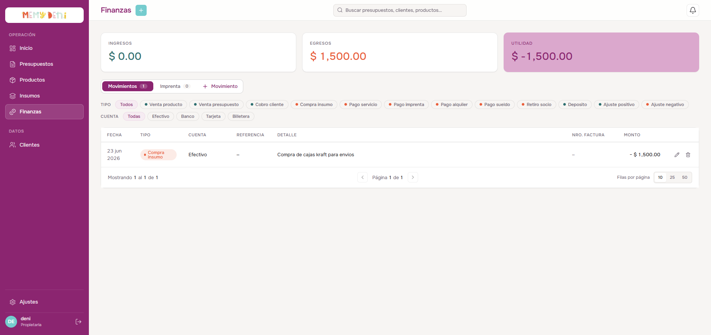

# Flujo del Módulo Finanzas
Módulo Finanzas · MemyDeni

## Contexto general
El módulo de Finanzas actúa como el libro contable de MemyDeni. Registra y totaliza todos los movimientos de ingresos y egresos de dinero (partida simple categorizada), administra el registro de los pliegos enviados a la imprenta tercerizada (*Patri*) y calcula la distribución de utilidades por socio de forma automatizada al momento de la facturación.

Este módulo reemplaza por completo el registro manual en cuadernos de taller y las planillas de Excel históricas (*Cuentas 2022/2023/2024/2025*). En **fix_v4** se incorporaron filtros reactivos de cuenta y tipo de transacción como pills horizontales, paginación configurable y la tarjeta de Utilidad con semáforo visual negativo.

---

## Accesos y navegación
El usuario gestiona las finanzas accediendo a la ruta `/finanzas` desde la barra lateral:

* **Ubicación:** Botón «Finanzas» en la sección superior de la barra lateral.
* **Secciones de la vista:** Organizadas mediante dos pestañas superiores:
  1. **Movimientos:** Libro diario centralizado con filtros por tipo de transacción y cuenta bancaria.
  2. **Imprenta:** Registro y control de gastos de impresión y pliegos tercerizados a *Patri*.
* **KPIs mensuales:** Cabecera con tres tarjetas totalizadoras del período actual: **Ingresos**, **Egresos** y **Utilidad** neta calculada.

---

## Cabecera de KPIs

Las tres tarjetas se calculan para el período mensual activo. Muestran la sumatoria de transacciones ya registradas.

| Tarjeta | Cálculo | Estado especial |
| :--- | :--- | :--- |
| **Ingresos** | Suma de todas las transacciones con signo positivo del mes | Sin estado especial |
| **Egresos** | Suma de todas las transacciones con signo negativo del mes (valor absoluto) | Sin estado especial |
| **Utilidad** | `Ingresos − Egresos` | Si el resultado es negativo, la tarjeta cambia su color de fondo a **magenta/coral** como alerta visual de período deficitario |

> [!IMPORTANT]
> **Semáforo de utilidad negativa:**
> La tarjeta de Utilidad aplica una clase CSS condicional cuando `utilidad < 0`. Esto provee un indicador visual de alerta inmediato sin necesidad de leer el signo del número. El color de fondo pasa del fondo neutro estándar al token `--coral-500` (magenta/coral del design system).

---

## Pestaña 1 — Movimientos (El Libro Diario)

Presenta el listado cronológico de transacciones financieras. Cuenta con filtros interactivos por tipo de transacción y cuenta para facilitar las conciliaciones.

### Filtros de tipo de transacción

Los filtros se renderizan como **pills horizontales con punto de color** a la izquierda del label. Al seleccionar una pill, la tabla filtra de forma reactiva sin recargar la página.

| Pill | Código del tipo | Dirección por defecto | Color del punto |
| :--- | :--- | :--- | :--- |
| Todos | `(ninguno)` | — | Neutro |
| Venta producto | `venta_producto` | Ingreso | Verde |
| Venta presupuesto | `venta_presupuesto` | Ingreso | Verde |
| Cobro cliente | `cobro_cliente` | Ingreso | Verde |
| Compra insumo | `compra_insumo` | Egreso | Coral |
| Pago servicio | `pago_servicio` | Egreso | Coral |
| Pago imprenta | `pago_imprenta` | Egreso | Coral |
| Pago alquiler | `pago_alquiler` | Egreso | Coral |
| Pago sueldo | `pago_sueldo` | Egreso | Coral |
| Retiro socio | `retiro_socio` | Egreso | Coral |
| Deposito | `deposito` | Ingreso | Azul |
| Ajuste positivo | `ajuste_positivo` | Ingreso | Verde |
| Ajuste negativo | `ajuste_negativo` | Egreso | Coral |

### Filtros de cuenta

Pills horizontales sin punto de color que filtran por la cuenta bancaria/efectivo del movimiento:

| Pill | Valor de cuenta |
| :--- | :--- |
| Todas | `(ninguno)` |
| Efectivo | `efectivo` |
| Banco | `banco` |
| Tarjeta | `tarjeta` |
| Billetera | `billetera` |

> [!NOTE]
> Los filtros de tipo y cuenta son **independientes y acumulables**: se puede aplicar «Pago imprenta» + «Banco» simultáneamente para ver únicamente los pagos a Patri realizados por transferencia bancaria.

### Estructura de columnas de la tabla

| Columna | Tipo de dato | Valor ejemplo | Notas |
| :--- | :--- | :--- | :--- |
| **FECHA** | `date` ISO-8601 | `14 jun 2026` | Formateada en localización es-AR. Columna de ordenamiento primario. |
| **TIPO** | `string` (enum) | `Venta producto` | Renderizado como badge coloreado según la dirección del movimiento. |
| **CUENTA** | `string` (enum) | `Efectivo` | Capitalizada, sin badge adicional. |
| **REFERENCIA** | `string` | `P-12` | Número de presupuesto o código de orden vinculado. Puede estar vacío. |
| **DETALLE** | `string` | `Venta de agendas evento` | Concepto libre del movimiento. Truncado con ellipsis si es muy largo. |
| **NRO. FACTURA** | `string` | `F-0023` | Número de comprobante fiscal opcional. |
| **MONTO** | `Decimal` | `$ 1,500.00` / `− $ 800.00` | Los egresos anteponen `− $` y el importe se colorea con `--coral-500`. |
| **Acciones** | — | Lápiz · Basurero | Botón editar (abre drawer precargado) y botón eliminar con confirmación. |

### Paginación

La tabla incorpora paginación reactiva al pie:

* **Selector de tamaño de página:** `10`, `25` y `50` filas por vista.
* **Indicador de página:** `Página X de Y` calculado sobre el total de registros filtrados.
* **Navegación:** Botones anterior / siguiente.

> [!NOTE]
> La paginación se reinicia a la página 1 cada vez que se aplica o cambia un filtro de tipo o cuenta, evitando estados inconsistentes de navegación.

---

## Formulario de Movimiento (MovimientoDrawer)

Al pulsar «+ Movimiento», se despliega el panel lateral de transacciones.

### Estructura de campos

| Campo | Componente UI | Tipo de dato | Valor ejemplo | Reglas de validación / comportamiento |
| :--- | :--- | :--- | :--- | :--- |
| **Fecha** | `FloatingField` date | `date` | `2026-06-14` | **Requerido.** Fecha local del movimiento monetario. |
| **Tipo** | `FloatingSelect` | `string` enum | `Venta producto` | **Requerido.** Selecciona el tipo de transacción de la lista canónica. |
| **Cuenta** | `FloatingSelect` | `string` enum | `Efectivo` | **Requerido.** Cuenta afectada. Opciones: Efectivo, Banco, Tarjeta, Billetera. |
| **Categoría** | `FloatingSelect` | `string` | `Ventas` | Agrupación contable secundaria, opcional. |
| **Valor** | Input numérico | `Decimal` | `1500.00` | **Requerido y positivo (> 0).** El monto siempre se envía como valor absoluto. |
| **Detalle** | `FloatingField` multilínea | `string` | `Venta de agendas para evento` | Concepto libre del movimiento. |
| **Nro. de factura** | `FloatingField` | `string` | `F-0023` | Campo de registro fiscal **opcional**. |

> [!IMPORTANT]
> **Regla de valor absoluto (fix_v4):**
> Los importes de egresos **siempre se envían y almacenan como valores positivos** en la base de datos. El backend aplica `Math.abs()` al recibir el valor y determina el signo según el `tipo` de la transacción (si es egreso, el servidor lo multiplica por `−1` al calcular los KPIs). Esto evita inconsistencias causadas por doble negación en el frontend.

> [!NOTE]
> **Refresco de KPIs reactivo:**
> Al crear, editar o eliminar cualquier transacción, el frontend ejecuta de forma inmediata `store.fetch()` para sincronizar las tres tarjetas de KPIs y el dashboard principal sin necesidad de recargar la página.

---

## Pestaña 2 — Imprenta (Control de Patri)

Gestiona y audita las piezas gráficas enviadas a la imprenta tercerizada. Compara la estimación de costos interna contra el precio facturado real por *Patri*.

### Estructura de campos del ImprentaDrawer

| Campo | Componente UI | Tipo de dato | Valor ejemplo | Notas / Reglas de validación |
| :--- | :--- | :--- | :--- | :--- |
| **Fecha** | `FloatingField` date | `date` | `2026-06-14` | Fecha de envío a imprimir. |
| **Presupuesto** | `FloatingField` | `string` | `P-8` | Vínculo opcional al presupuesto del cliente. |
| **Temática / cliente** | `FloatingField` | `string` | `Mickey Mouse Cumple` | **Requerido.** Descriptor libre del motivo o cliente de la orden. |
| **Cantidad de hojas** | `FloatingField` | `integer` | `15` | **Requerido y positivo.** Cantidad de pliegos impresos. |
| **Tipo de hoja** | `FloatingField` | `string` | `Ilustración 300gr A3` | Gramaje y tamaño del soporte papel. |
| **Valor nuestro** | `FloatingField` con prefijo `$` | `Decimal` | `4500.00` | **Requerido y positivo.** Costo cobrado u estimado al cliente. |
| **Valor Patri** | `FloatingField` con prefijo `$` | `Decimal` | `4100.00` | **Requerido y positivo.** Costo real facturado por la imprenta. |
| **Método de pago** | `FloatingSelect` | `string` enum | `Banco` | Cuenta desde la cual se abona a la imprenta. |
| **Estado** | Checkbox nativo | `boolean` | `true` (Pagado) | Marca si la factura a Patri ya fue saldada. |

### Fórmula de diferencia de imprenta

El drawer calcula en tiempo real la desviación entre el costo estimado y el costo real:

$$\text{Diferencia} = \text{Valor nuestro} - \text{Valor Patri}$$

> [!NOTE]
> **Auditoría de desviación de imprenta:**
> Si $\text{Diferencia} > 0$ (ej. $+\$ 400{,}00$), el valor se muestra en color verde e indica saldo a favor del taller. Si $\text{Diferencia} < 0$ (ej. $-\$ 200{,}00$), se muestra en color coral, indicando una subestimación del pliego en el presupuesto original del cliente.

---

## Gobernanza y reglas contables del ERP

> [!IMPORTANT]
> **Distribución transaccional al facturar:**
> Al cambiar el estado de un presupuesto a `facturado`, el backend ejecuta un bloque atómico contable que:
> 1. Registra el ingreso del saldo pendiente en la cuenta seleccionada.
> 2. Registra el egreso de materiales consumidos según receta (BOM) de cada ítem del presupuesto.
> 3. Registra el egreso estimado de imprenta por pliegos asociados al pedido.
> 4. Realiza el reparto porcentual configurado en Ajustes y genera movimientos de retiro a socios (ej. Meme 40%, Pety 30%, Gastos 30%), registrando simultáneamente el egreso de retiro de utilidades con referencia al presupuesto original.

> [!IMPORTANT]
> **Auditoría inmutable (`createdAt`):**
> Los movimientos contables en la tabla `transacciones` se consideran registros históricos puros. Por esta razón, cuentan únicamente con marca de tiempo `createdAt` para auditar el momento de inserción y **carecen de campo `updatedAt`**, impidiendo la alteración temporal de los registros para asegurar la consistencia del libro contable.

> [!CAUTION]
> **Eliminación de transacciones:**
> La acción de eliminar un movimiento no está sujeta a soft-delete; borra el registro físicamente de la tabla `transacciones`. Antes de confirmar la eliminación, el sistema presenta un diálogo de confirmación explícita. Esta operación **no es reversible** y afecta de forma inmediata los KPIs mensuales.

---

## Verificación visual y multimedia

### Vista completa del módulo con KPIs activos

La cabecera de tres tarjetas totaliza el período mensual activo. Los filtros de pills y la tabla paginada componen la vista principal del libro diario:

### Listado de movimientos con transacción guardada

Una vez guardado el movimiento de ingreso, la tabla se actualiza de inmediato ordenándose de forma cronológica y los totalizadores superiores recalculan la Utilidad neta del período:

### Video del recorrido completo (Walkthrough)

Se ha grabado un video interactivo que reproduce el flujo financiero completo:
1. Acceso al listado de Finanzas y visualización de KPIs del período.
2. Aplicación de filtros de tipo «Venta producto» + cuenta «Efectivo» de forma acumulativa.
3. Apertura del drawer de Movimientos, registro de un ingreso por venta de producto en efectivo por `$ 1,500.00`, y guardado.
4. Verificación del refresco automático de los KPIs superiores.
5. Transición a la pestaña de Imprenta y visualización de órdenes registradas.
6. Apertura del drawer de Imprenta, registro de una orden de `15` pliegos a *Patri* con cálculo automático de diferencia a favor, y guardado.
7. Retorno al listado de movimientos y verificación de saldos recalculados en las tarjetas de KPI.

🎥 **Ver video del recorrido:** [flujo_modulo_finanzas.mp4](media/flujo_modulo_finanzas.mp4)
