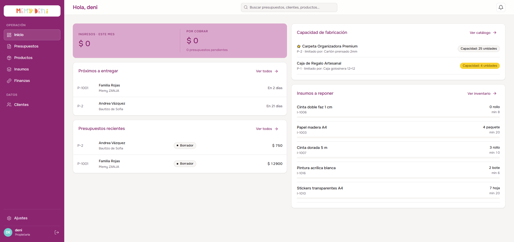
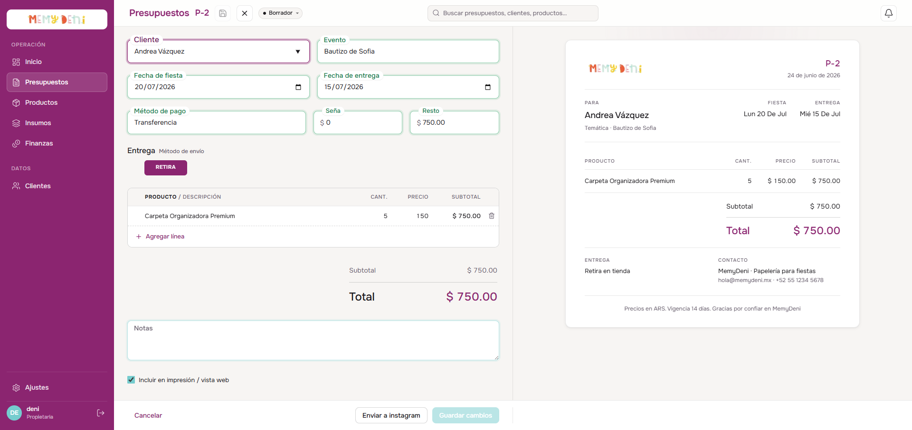
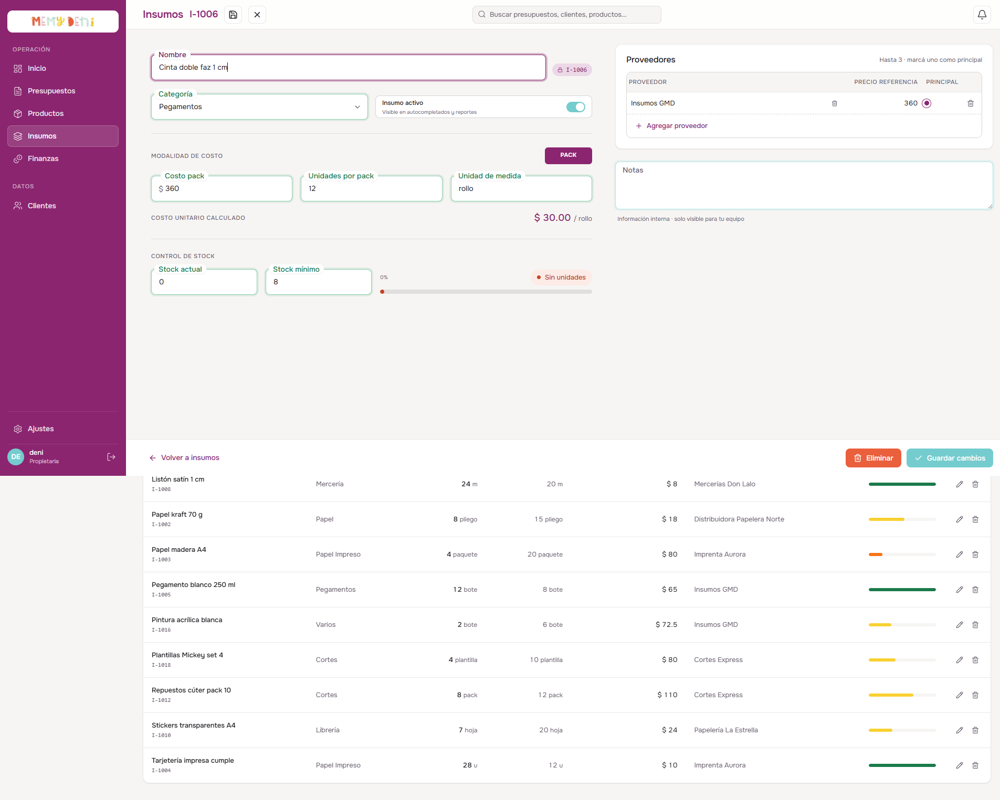

# Flujo de Navegación desde Inicio (Dashboard)
Panel de Inicio · MemyDeni — versión fix_v4

## Contexto general
El panel de inicio (Dashboard) actúa como el centro de mando operativo de MemyDeni. Consolida de forma visual el estado de salud financiera del negocio, los presupuestos urgentes con su fecha límite, los insumos críticos que requieren reposición y la capacidad productiva disponible del taller, todo en un solo vistazo.

En **fix_v4** el Dashboard fue rediseñado desde un layout de columna única a un **grid de 2 columnas** que maximiza la densidad informativa sin saturar al usuario. La columna izquierda gestiona el flujo comercial y de entregas; la columna derecha cubre producción y abastecimiento.

Para potenciar la eficiencia en la toma de decisiones, el Dashboard mantiene su diseño interactivo bidireccional: las listas de **Presupuestos recientes** e **Insumos a reponer** sirven como accesos directos (*deep links*). Al hacer clic en un elemento, el sistema redirige al módulo correspondiente y abre de forma inmediata el editor del registro seleccionado, precargando la información necesaria.

---

## Accesos y navegación
El Dashboard es el panel central de MemyDeni:
* **Acceso inicial:** Es la pantalla de aterrizaje por defecto una vez que el usuario inicia sesión correctamente a través del portal de autenticación de Supabase.
* **Barra lateral (Sidebar):** Botón «Inicio» (con ícono de tablero de control) ubicado en la parte superior del menú, permite volver a esta vista desde cualquier módulo.

---

## Interfaz general — layout de 2 columnas (fix_v4)

El Dashboard fue reestructurado en un grid de **2 columnas** con tarjetas de información integradas. La columna izquierda concentra el flujo comercial y la columna derecha la capacidad operativa del taller.




### Cabecera — Indicadores (KPIs) consolidados

Los KPIs financieros se presentan en un único bloque horizontal en la parte superior izquierda del panel:

| Indicador | Fuente de datos | Valor ejemplo | Comportamiento |
| :--- | :--- | :--- | :--- |
| **Ingresos · este mes** | Transacciones del mes actual | `$ 15,250.00` | Sumatoria de todas las transacciones activas de tipo ingreso del período en curso. |
| **Por cobrar** | Presupuestos activos | `$ 8,400.00` | Total de presupuestos en estado `enviado` o `en_curso`. El subindicador muestra la cantidad de cotizaciones pendientes: `0 presupuestos pendientes`. |

> [!NOTE]
> El indicador de «Insumos bajos» que en v3 aparecía como una tercera tarjeta de KPI fue eliminado de la cabecera. Esta información ahora se presenta de forma más detallada en el widget «Insumos a reponer» en la columna derecha.

---

## Columna izquierda — Flujo comercial y entregas

### Widget 1A — Próximos a entregar

Presenta los presupuestos con fecha de entrega más próxima para planificación urgente del taller. El widget muestra hasta 5 presupuestos en estado activo (`en_curso` o `cerrado`) ordenados de forma ascendente por `fechaEntrega`.

| Columna | Tipo de dato | Valor ejemplo | Notas |
| :--- | :--- | :--- | :--- |
| **Folio** | Identificador | `P-1001` | Código correlativo del presupuesto. |
| **Cliente** | Nombre de cliente | Familia Rojas | Nombre comercial del cliente vinculado. |
| **Temática** | Texto libre | Memy ZANJA | Descripción del evento o motivo. |
| **Tiempo restante** | Relativo calculado | `En 2 días` / `En 21 días` | Diferencia entre `fechaEntrega` y la fecha actual, expresada en días relativos legibles. |

> [!IMPORTANT]
> **Cálculo de urgencia:**
> El tiempo restante se calcula dinámicamente en el frontend comparando `fechaEntrega` con `new Date()`. La presentación relativa (`«En N días»`) facilita la toma de decisiones del taller sin necesidad de interpretar fechas absolutas.

### Widget 1B — Presupuestos recientes

Presenta una lista de las últimas 5 cotizaciones creadas en el ERP para un seguimiento comercial rápido. Los presupuestos en estados terminales (`facturado`, `cancelado`) no aparecen en este listado.

| Columna | Tipo de dato | Valor ejemplo | Notas y reglas visuales |
| :--- | :--- | :--- | :--- |
| **Folio** | Identificador único | `P-1002` | Código correlativo del presupuesto en el ERP. |
| **Cliente** | Nombre de cliente | Carolina Herrera | Muestra el nombre comercial. Si no está asignado, indica *Sin cliente*. |
| **Temática** | Texto libre | Cumpleaños Toy Story | Detalle del motivo del evento. |
| **Estado** | Badge de estado | `Borrador` | Badge coloreado según la máquina de estados (FSM). |
| **Total** | Monto nominal | `$ 4,500.00` | Valor monetario total del presupuesto. |

#### Lógica de navegación — Deep link a presupuesto

Al hacer clic en cualquier fila de la tabla de Presupuestos recientes, el sistema ejecuta una redirección al listado comercial, inyectando el folio del presupuesto como parámetro en el query string de la URL:

```typescript
router.push({ name: 'presupuestos', query: { edit: p.folio } })
```

Esto traslada al usuario a `/presupuestos?edit=P-XXXX`. El módulo comercial procesa la URL y despliega el editor de presupuesto con todos los datos cargados:



> [!NOTE]
> **Carga dinámica de detalles (lazy fetching):**
> El listado general del Dashboard no incluye las líneas de presupuesto detalladas para optimizar el tráfico de red. Al abrir la ficha desde la URL, el componente `PresupuestosView.vue` detecta el parámetro `edit` en el query string y realiza una petición `GET /api/presupuestos/:id` para cargar el desglose completo antes de renderizar el editor.

---

## Columna derecha — Producción y abastecimiento

### Widget 2A — Capacidad de fabricación

Muestra cuántas unidades de cada producto del catálogo activo se pueden fabricar con las existencias actuales de insumos en inventario, calculado a partir de la receta BOM de cada producto.

| Elemento UI | Representación | Valor ejemplo | Reglas |
| :--- | :--- | :--- | :--- |
| **Nombre del producto** | Texto | Carpeta Organizadora Premium | Nombre del producto con icono de favorito si aplica. |
| **Código de producto** | Texto muted | `P-2` | Código secuencial autogenerado. |
| **Insumo limitante** | Texto muted | `limitado por: Cartón prensado 2mm` | El insumo del BOM con el menor ratio stock/cantidad consumida. |
| **Capacidad** | Badge | `Capacidad: 25 unidades` | Cantidad máxima fabricable con el stock actual. |

> [!IMPORTANT]
> **Semáforo de capacidad:**
> Si la capacidad calculada es menor a **10 unidades**, el badge de capacidad se renderiza en tono amarillo/ocre como alerta preventiva. Si el insumo limitante tiene `stock = 0`, el badge se muestra en rojo coral indicando producción bloqueada.

### Widget 2B — Insumos a reponer

Muestra los insumos cuyo stock actual está por debajo del umbral mínimo configurado. Reemplaza al antiguo widget de «Insumos bajos» con una tabla más densa que incluye la unidad de medida y el mínimo de seguridad.

| Elemento UI | Representación | Valor ejemplo | Reglas de alerta |
| :--- | :--- | :--- | :--- |
| **Nombre** | Texto | Cinta doble faz 1 cm | Nombre del insumo con código en segundo plano. |
| **Código** | Texto muted | `I-1006` | Código identificador del insumo. |
| **Stock actual** | Valor + unidad | `0 rollo` | Cantidad física disponible en taller con su unidad de medida. |
| **Mínimo** | Texto muted | `min 8` | Stock mínimo de seguridad configurado en el overlay del insumo. |

#### Lógica de navegación — Deep link a insumo

Al pulsar sobre cualquier fila de la tabla de Insumos a reponer, se ejecuta una transición hacia el módulo de inventarios inyectando el código del insumo en el query string:

```typescript
router.push({ name: 'insumos', query: { edit: i.codigo } })
```

El usuario es redirigido a `/insumos?edit=I-XXXX`. La vista de Insumos detecta el parámetro y abre automáticamente el overlay de edición con los catálogos y proveedores precargados:



> [!IMPORTANT]
> **Consistencia relacional y auditoría:**
> Cualquier cambio guardado en la ficha abierta (en presupuestos o insumos) actualiza el registro en Supabase PostgreSQL modificando el campo `updatedAt`. Al retornar al Dashboard, el store de Pinia se refresca automáticamente, recalculando los KPIs y actualizando los widgets de capacidad e insumos.

---

## Reglas de refresco del Dashboard

| Evento | Trigger de refresco | Widgets afectados |
| :--- | :--- | :--- |
| Cambio de estado de presupuesto | Store `useDashboard.fetch()` | KPI «Por cobrar», Presupuestos recientes, Próximos a entregar |
| Actualización de stock de insumo | Store `useDashboard.fetch()` | Insumos a reponer, Capacidad de fabricación |
| Facturación de presupuesto | Backend + Store `useDashboard.fetch()` | KPI «Ingresos», todos los widgets |

---

## Verificación visual y multimedia

### Resumen del recorrido completo

Un walkthrough completo del Dashboard debe cubrir:
1. Acceso al Dashboard tras iniciar sesión — visualización de los 4 widgets con datos reales.
2. Clic en un presupuesto reciente → navegación a `/presupuestos?edit=P-X` → verificación del editor abierto con datos precargados.
3. Retorno al Dashboard.
4. Clic en un insumo de la lista de Insumos a reponer → navegación a `/insumos?edit=I-X` → verificación del overlay de insumo abierto.
5. Retorno al Dashboard → verificación de que los widgets permanecen actualizados.

🎥 **Ver video del recorrido:** [flujo_navegacion_dashboard.mp4](media/flujo_navegacion_dashboard.mp4)
